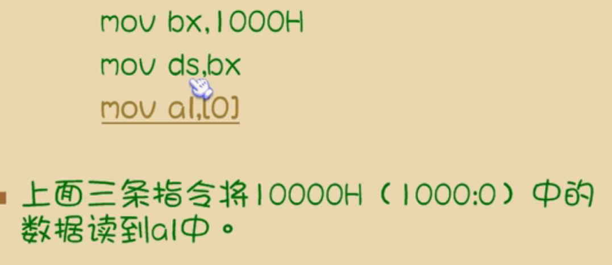

# 基础知识

-   汇编语言的组成
    -   汇编指令（机器码的组记符）
    -   伪指令（编译器执行）
    -   其他符号（编译器识别）
-   CPU对存储器的读写
    -   地址总线
        -   cpu通过地址总线制定存储单元
        -   地址总线限制了地址空间大小：N跟地址总线：$2^N$个地址
    -   控制总线：读/写
        -   多少跟控制总线决定了cpu对外部有多少种控制
    -   数据总线：读/写的数据
        -   决定了cpu和外界的数据传输速度
-   BIOS：主板和各类接口卡 提供的软件系统

# 寄存器

## cpu概述

-   由 运算器，控制器，寄存器 构成
-   内部总线：连接cpu内部器件
-   外部总线：连接cpu和其他器件

## 8086寄存器

-   过去的寄存器是8位。8086开始了16位，20位地址总线，一个寄存器可以存一个字

-   通用寄存器
    -   AX可以分为AH，AL（H：高位，L：低位）
    -   BX，CX，DX同上
    -   SP
    
-   段寄存器
    -   物理地址 = 段地址 * 16 + 段内偏移
    
        
    
        段寄存器不能用立即数赋值
    
    -   记法：`2000:1F60`表示`2000段`的`1F60`中
    
    -   CS，DS，SS，ES
    
-   IP

## 几条汇编指令

```asm
;指令 地址 数据
```

### mov

```asm
mov ax, 18		; AX = 18
mov 寄存器, 数据
mov 寄存器, 寄存器
mov 寄存器, 内存
mov 内存, 寄存器
mov 段寄存器, 寄存器
```

### add & sub

```asm
add ax, 18			; AX += 18
add 寄存器, 数据
add 寄存器, 寄存器
add 寄存器, 内存
add 内存, 寄存器
; sub同add
```

## cpu提供的栈机制

-   将一段内存当栈使用
    -   段寄存器SS：存放栈顶的段地址
    -   寄存器SP：存放栈顶元素的偏移地址
    -   SS：SP指向栈顶元素

### push & pop

```asm
; 均以字为单位
push	ax	; 将ax的数据入栈
; SP = SP - 2
; 将ax数据送入SS:SP地址处

pop	ax;		; pop到ax里
; 将数据送入SS:SP
; SP += 2
```

# 程序结构

```asm
assume cs:codesg			; 将段寄存器和某一个段进行联系
codesg segment				; XXX segment 一个段的名称

start:  
	mov ax, 0x2
    add ax, ax
    add ax, ax

    mov ax, 0x4c00
    int 21h				; 程序返回

codesg ends					; XXX ends 	一个段结束
end							; 汇编结束
```


# div

-   当除数是1字节时，被除数必须2字节，被除数在ax寄存器，除数在bl中
-   商1B在al，余数在ah

# Int 13h

-   功能2h
-   功能描述：读扇区
-   入口参数：
    -   AH = 2H
    -   AL = 扇区数
    -   CH = 磁道号
    -   CL = 扇区号
    -   DH = 磁头号
    -   DL = 驱动器：$[0, 0x7f]$：软盘；$[0x80,0xff]$：硬盘
    -   ES:BX = 缓冲区地址
-   出口参数：
    -   CF = 0：操作成功
    -   AH = 0
    -   AL = 传输的扇区数，否则，AH = 状态代码