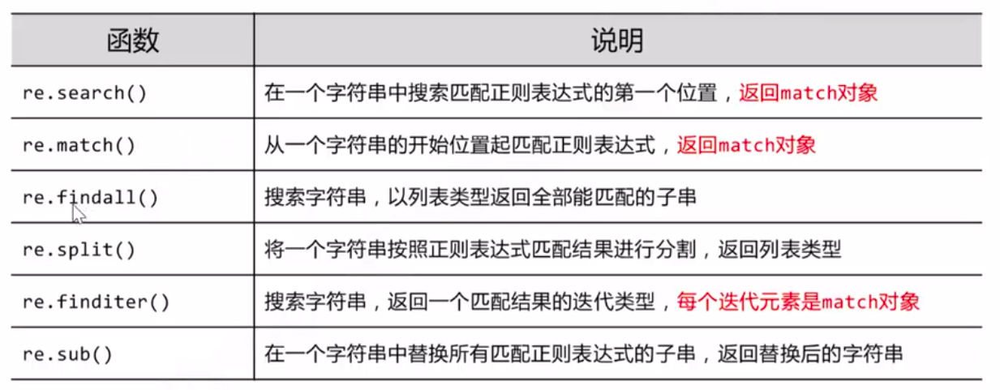

# 概述

需要的库：

```python
import urllib.request, urllib.error     # 指定URL，获取网页数据
from bs4 import BeautifulSoup           # 网页解析，获取数据
import re                               # 正则
import xlwt                             # excel操作
import sqlite3                          # SQLite数据库操作
```

框架

```python
def mian():
    baseurl = "......"
    savepath = "......"
	datalist = getData(baseurl) #1. 爬取网页
	#2. 解析数据
	#3. 保存数据
def getData(baseurl):
    #...... 其中也有逐一解析数据
    	html = askURL(url)
    #......
	return datalist
def askURL(url):
    得到一个url的内容
    return html
def saveData(savepath):
    ......
```

# 获取网页

用`urllib2`库获取页面

```python
import urllib.request
```

```python
# 获取一个 post 请求
response = urllib.request.urlopen("网址")
print(response.read()) # 网页内容
print(response.decode('utf-8')) #解码

print(response.status) #状态码 200成功 418发现是爬虫 404
print(response.getheaders) #得到header的all内容
print(response.getheader("Serber")) #得到一个内容
```

```python
# 获取一个 post 请求
# 测试网址：http://httpbin.org/post
# 需要提交表单
import urllib.parse #解析器
data = bytes(urllib.sparse.urlencode({"hello":"world"}),encoding="utf-8")
response = urllib.request.urlopen("http://httpbin.org/post",data=data)
print(response.read().decode("utf-8"))
```

```python
# 超时处理
try:
    response = urllib.request.urlopen("http://www.baidu.com",timeout=1)
    print(response.read().decode("utf-8") )
except urllib.error.URLError as e:
    print("time out!")
```

```python
# 伪装不是爬虫
url = "https://httpbin.org/post"

headers = {
    # network->打开百度->红色按钮->先找到request headers, 看最下面找user-agent
    "User-Agent":"Mozilla/5.0 (X11; Linux x86_64) AppleWebKit/537.36 (KHTML, like Gecko) Chrome/87.0.4280.88 Safari/537.36"
}
data = bytes(urllib.parse.urlencode({"hello":"world"}),encoding="utf-8")

# 返回一个请求对象
req = urllib.request.Request(url=url, data=data, headers=headers, method="POST" )
response = urllib.request.urlopen(req)
print(response.read().decode("utf-8") )
```

# 文档解析

`bs4`的`BeautifulSoup4`将HTML转换成一个树形结构，`node`都是对象，有四种：`tag`（标签），`NavigableString`（内容），`BeautigulSoup`（表示整个文档），`Comment`

```python
from bs4 import BeautifulSoup           # 网页解析，获取数据
```

```python
# 得到树形结构
file = open("./百度.html", "rb")
html = file.read().decode("utf-8")
bs = BeautifulSoup(html, "html.parser")
```

```python
print(bs.title) # 按照标签找第一个
print(bs.title.string) # 标签里的内容
print(bs.title.attrs) # 标签里的属性
# 注释 也是.string，但输出不包含内容
print(bs) #打印整个文档
```

## 文档的遍历

```python
print(bs.head.contents) # 返回一个字典
print(bs.head.contents[1])
```

## 文档的搜索

1. 标签解析 + 2. 正则搜索

```python
# find_all() 字符串过滤，找完全匹配的标签
t_list = bs.find_all("a")
print(t_list)

# 根据参数/特点找
t_list = bs.find_all(id="head")
for item in t_list:
    print(item)
    
# 根据text参数
t_list = bs.find_all(text="百度一下，你就知道")
for item in t_list:
    print(item)
t_list = bs.find_all(text=["百度一下，你就知道", "地图"])
for item in t_list:
    print(item)
import re
t_list = bs.find_all(text=re.compile("\d"))
for item in t_list:
    print(item)
   
# limit参数
find_all(.... limit=3) #最多返回3个
```

```python
# search() 正则
import re
t_list = bs.find_all(re.compile("a")) #有'a'的
print(t_list)
```

```python
# 方法：传入一个方法，根据函数要求
def name_is_exists(tag):
    return tag.has_attr("name")
t_list = bs.find_all(name_is_exists)
for item in t_list:
    print(item)
```

```python
CSS选择器
print(bs.select("title"))
print(bs.select(".mnav"))   #类名
print(bs.select("#u1"))     #id
print(bs.select("a[class='bri']"))
print(bs.select("head > title"))
```

###  Re库



```python
import re
pat = re.compile("AA") #正则表达式模式对象
m = pat.search("CBAA")
print(m) #只找第一个
```

```python
m = pat.search("asd", "Aasd") #左边是模式
print(m)
```

```python
print(re.findall("a","asdasd")) #左边是规则，打印符合的子串
```

```python
print(re.sub("a", "A", "abcd")) #找到a，替换为b
```

# 保存数据

## Excel表保存

```python
import xlwt
```

```python
workbook = xlwt.Workbook(encoding="utf-8") #创建workbook对象
worksheet = workbook.add_sheet("sheet1") #创建工作表
#参数：cell_overwite_ok=True 覆盖写
worksheet.write(0,0,"hello") #参数：行，列，内容
workbook.save("student.xls") #保存
```

## Sqlite数据库保存

```python
import sqlite3
```

```python
conn = sqlite3.connect("test.db") #打开文件，如果没有创建
```

```python
c = conn.cursor() #获取游标
sql = ""
c.execute(sql) #执行sql语句
conn.commit() #提交操作
```

```python
conn.close() #关闭连接
```

# 数据可视化

## flask

核心：`werkzeug`（路由分发） + `jinjia2`

```python
from flask import Flask
```

客户端发出请求，`flask`做路由分发（URL请求和serve的处理函数的对应关系）

```python
app = Flask(__name__)

@app.route('/')	#路由解析，通过用户访问的路径匹配响应的函数，不可重复
def hello_world():
    return 'Hello World!'
#前两行由werkzeug做，最后return由jinjia2做

if __name__ == '__main__':
    app.run()
#生成了一个网站
```

开启`debug`模式：

```python
app.run(debug=true)
```

传递参数：

```python
@app.route('/<name>')   #<name>中的name是变量，可以传到函数的参数
def welcome(name):
    return '你好, %s'%name
```

```python
@app.route('/user/<int:id>') #整形参数
def welcome2(id):
    return '你好,%d'%id+'号'
```

```python
@app.route('/user/<float:id>') #float参数
```

返回`html`

```python
@app.route('/html')
def index2():
    return render_template("index.html")
#index.html的路径："./templates/index.html"
```

动态`html`：

```python
import datetime
@app.route('/html2')
def index3():
    time = datetime.date.today()
    return render_template("index2.html", var = time)
#html中：{{ var }}
```

```python
#html中用列表：可以搞if和for（不是html，是jinjia2）

    {{ data }}

```

表单提交

```shell
/chengxu/python/flask_
```

## echats

## worldcloud

# 一些概念

## http

### 请求方式

-   get
    -   比较便捷，给服务器的参数就在网址中
    -   不安全，参数长度有限
-   post
    -   安全
    -   参数数据整体没有限制
    -   可以上传文件
-   put
-   delete
-   head

### 发送网络请求

-   需要将一定的数据给服务器，在请求头`requestheader`中
-   返回一些数据，在`response`

-   `requestheaders`
    -   `Accept`：接受的文本的格式
    -   `Accept-Encoding`：压缩编码格式
    -   `Accept-Language`：语言
    -   `Connection`：长连接 / 短
    -   `Cookie`
    -   `Host`：域名
    -   `Referer`：上一个访问的网页
    -   `User-Agent`浏览器和用户信息
-   `responseheaders`
    -   `cache-control`：数据大小
    -   `connection`：长连接 / 短
    -   `connection-Encoding`
    -   `connection-Type`：返回文本的格式
    -   `Date`：发送的时间
    -   `Server`：服务器的信息
    -   `Set-Cookie`

## 爬虫分类

-   通用爬虫：多用于搜索引擎
-   聚焦爬虫：
    -   增量式：从第一页爬到最后一页
    -   深度爬虫：
        -   静态数据：html, css
        -   动态数据：js代码，加密js
    -   聚焦爬虫不遵守`robots.txt`

## 基本原理

1.  获取要爬取网页的`url`
2.  使用`python`发送请求
3.  解析
4.  数据保存