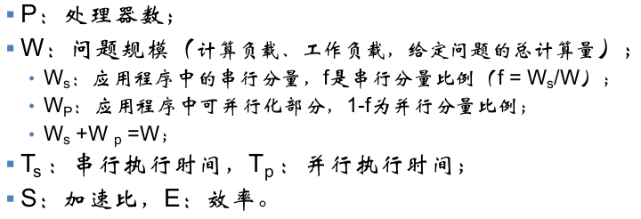
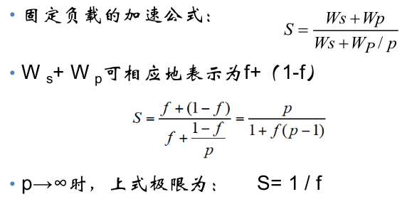
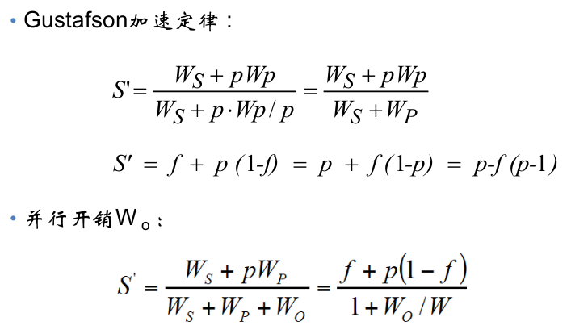
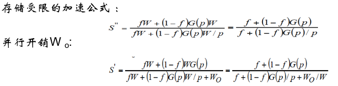
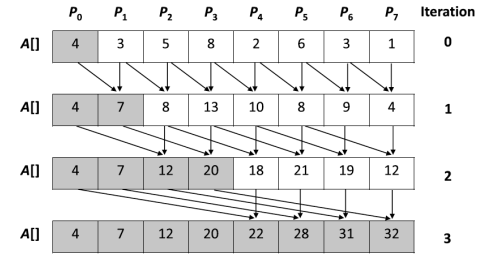
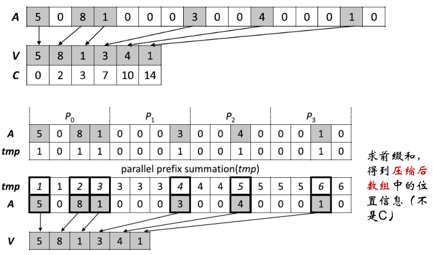
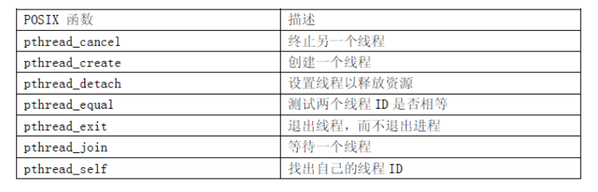
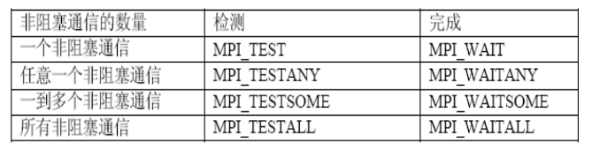

# 绪论

## 基本概论

-   用多个处理器同时解决一个问题

## 常规并行化方法

-   域分解：对数据进行分解
-   任务分解：面向对象分工
-   流水线：面向过程分工
    -   指令级流水线

## 性能

### 计算度度量

-   工作负载
    -   计算执行时间
    -   FLOPS：浮点计算能力：每秒完成的浮点计算数量
    -   指令数目：MIPS
-   并行计算执行时间
    -   $t_p=t_{comp}+t_{paro}+t_{comm}=计算时间+并行开销时间+互相通信时间$

### 并行计算性能指标

-   加速比：串行执行时间与并行执行时间之比
    $$
    S(n)=\frac{t_s}{t_p}
    $$
    
-   计算通信比：
    $$
    \frac{t_{comp}}{t_{comm}}
    $$
    
-   效率：E = S(n) / n（n是cpu数）

    -   也有可能超过1

-   代价 cost = 执行时间 * 所使用处理器数

    -   串行计算：cost = 执行时间
    -   并行计算：$cost = t_p * n = \frac{t_s}{S(n)} * n = t_s/E$

### 内存系统对性能的影响

-   容量C
-   延迟L：读取一个字所需时间
-   带宽B：1秒内传送的字节数

### 加速比性能定律



-   Amdahl定律

    

-   Gustafson定律：问题规模放大

    

-   Sun and Ni定律：问题规模放大有限制

    

# 并行计算硬件环境

## PRAM模型

-   内容

    -   每个处理器可以同时读取共享内存的数据到自己的寄存器
    -   每个处理器同时计算，存在本地寄存器
    -   每个处理器同时将数据写入共享内存（潜在冲突）

-   基于PRAM模型的并行算法设计

    -   前缀求和

        

    -   数组压缩

        

        -   有则1，无则0
        -   前缀求和
        -   压缩

## 处理器

### SIMD

-   Flynn分类
    -   SISD：单指令流单数据流
    -   MISD：多指令流单数据流
    -   SIMD：单指令流多数据流：一个指令同时触发多个处理单元处理同一组数据
        -   支持向量化数据并行
    -   MIMD：多指令流多数据流

### 多核处理器

-   双核技术 VS 超线程技术
    -   双核是真正意义上的双处理器
        -   不会发生资源冲突
        -   每个线程拥有自己的缓存、寄存器和运算器
    -   一个3.2GHz Smithfiled在性能上并非等同于3.2GHz P4 with HT 的2倍
        -   HT 使处理器的性能至少提升了1/3
        -   双核的性能相当于2块 non-HT 处理器
    -   双核技术与HT技术在性能上的对比

### GPU

-   将更多元件用于数据处理，而不是控制和存储
-   GPU 编程模型
    -   GPU可以视为大规模 并行协处理器
    -   SPMD（单程序多数据）模式，数据并行
-   APU：集成了高性能串行和并行处理内核

## 互联网络

-   静态互联网络：处理单元间有固定连接的一类网络
    -   一维线性阵列：每个节点只与左右相连（二近邻连接）
    -   二维网孔
        -   2-D网孔：每个节点只与上下左右 近邻相连
        -   llliac网孔：垂直方向上带环绕，水平方向蛇状
        -   2-D环绕：垂直水平均带环绕
    -   二叉树
        -   传统：根容易称为瓶颈
        -   胖二叉树：从叶到根，通路变宽
    -   超立方
-   动态网络：用交换开关构成，可按应用程序的要求动态地改变连接
    -   总线
    -   交叉开关

## 内存访问模式

-   共享存储访问
    -   UMA：均匀存储访问：每个处理器访问同一块地方
    -   NUMA：非均匀存储访问：每个处理器能快速访问自己的本地存储，远程存储用bus连接，慢
-   分布式存储访问
    -   每个物理节点有自己私有的存储空间,各物理节点通过高速网络连接
    -   运行在不同物理节点的任务,不能直接访问其他物理节点的存储空间，相互数据交换通过消息传递实现
-   多层混合并行计算

## 并行计算系统体系结构

-   PVP
    -   含有为数不多、功能强大的定制向量处理器（VP）
    -   通常不使用高速缓存，而是用大量向量寄存器及指令缓存
-   SMP
    -   多个处理器通过总线或交叉开关连接到共享存储器
    -   多个处理器可等同访问共享存储器、I/O设备和操作系统服务
    -   扩展性有限
-   MPP
-   集群技术
-   集群计算系统体系结构

# 多线程并行程序

## 基本概念

-   线程与进程的区别
    -   进程：资源分配的实体
    -   线程：调度执行的基本单元
    -   调度：同一进程中线程的切换不会引起进程切换，避免昂贵的系统调用
    -   并发性：
        -   同一个进程里的一个线程等待，该进程的其他线程还能运行
    -   拥有资源：
        -   进程：单位
        -   线程：无自己的资源，但是可以访问隶属进程的
    -   系统开销：
        -   进程：大
        -   线程：只需要保存少量寄存器的内容，同步和通信也更加方便
        -   线程创建时开销小很多
-   线程层次
    -   用户级线程：在用户层通过线程库来实现，不会系统调用
    -   核心机线程：系统调用，核心实现
    -   硬件线程：线程在硬件执行资源上的表现形式
    -   一个线程 一般 都包括 上面 三个层次的表现：
        -   用户级线程通过操作系统作为核心级线程实现
        -   再通过硬件相应的接口作为硬件线程来执行
-   线程池
    -   维护多个线程，等着 调度器 分配任务
    -   避免了创建销毁线程的代价

## 共享存储访问

-   缓存一致性
    -   保证高速缓存存储器中数据与主存中相同机制
-   竞态条件
    -   临界区
    -   忙等
    -   互斥锁

## 多线程算法实例

-   L3 cahe 行 为 64B
-   cache一致性与伪共享
-   避免false sharing

## PThread 多线程



-   条件变量

    -   `pthread_cond_init`：初始化

        ```c++
        pthread_cond_init(&cond, NULL);
        ```

    -   `pthread_cond_wait`：阻塞

        ```c++
        pthread_cond_wait(&cond, &mutex);
        ```

    -   `pthread_cond_timedwait`：到指定时间时，即使条件没发动，也解除阻塞

        ```c++
        pthread_cond_timedwait(&cond, &mutex, const structtimespec * abstime);
        ```

    -   `pthread_cond_signal`：唤醒一个被`cond`阻塞的线程

        ```c++
        pthread_cond_signal(&cond);
        ```

    -   `pthread_cond_broadcast`：唤醒all被`cond`阻塞的线程

        ```c++
        pthread_cond_broadcast(&cond);
        ```

    -   `pthread_cond_destroy`：释放

        ```c++
        pthread_cond_destroy(&cond);
        ```

    -   唤醒丢失问题

# OpenMp

## 概述

-   Fork-Join模型
    -   在开始执行的时候,只有主线程程存在
    -   派生( Fork )线程，派生( Fork )线程
    -   并行代码结束执行后,派生线程退出或者挂起，控制流程回到单独的主线程中(Join)

## 编译制导语句

-   编译器编译程序的时候，识别特定的注释

    -   `#pragma omp parallel for`

-   并行域：所有线程都运行一遍

    -   `#pragma omp parallel for`之后的`{}`里的程序多线程并行
    -   具体格式：`#pragma omp parallel [clause[[,]clause]...]newline`

-   共享任务：多个线程一起运行完一个程序

    -   `for`具体格式：`#pragma omp for [clause[[,]clause]...] newline`

    -   `Sections`：

        ```c++
        #pragma omp sections [ clause[[,]clause]...] newline
        {
        [#pragma omp section newline]
        ...
        [#pragma omp section newline]
        ...
        }
        ```

    -   `single`：

    -   `parallel for`：一个并行域包含一个独立的for语句

-   同步：

    -   `master`制导语句
        -   只有主线程执行，其他线程等主线程完事
        -   `#pragma omp master newline`
    -   `critical`制导语句
        -   同时只能有一个线程执行
        -   `#pragma omp critical [name] newline`
    -   `barrier`制导语句
        -   同步all线程，快的等慢的
        -   `#pragma omp barrier newline`
    -   `atomic`制导语句
        -   原子操作
        -   `#pragma omp atomic newline`
    -   `flush`制导语句
        -   缓存刷新
        -   `#pragma omp flush (list) newline`
    -   `ordered`制导语句
        -   按循环次序进行，同一时间只能一个线程执行
        -   `#pragma omp ordered newline`

-   数据域

    -   数据共享属性子句
        -   `private(list)`：一个线程一个
        -   `shared(list)`：线程池组共享
        -   `default(shared | none)`：自己定义缺参的作用范围
        -   `firstprivate(list)`：开始的时候给个初值，之后private
        -   `lastprivate(list)`：最后的时候返回给原始变量
        -   `reduction(operator:list)`
    -   `threadprivate`编译制导语句
        -   每个线程对该变量复制一份私有拷贝，最后变量的值和主线程的一样
        -   `#pragma omp threadprivate (list) newline`

## 库函数与环境变量

-   `omp.h`

# 异构并行计算

## 指令集

## 异构并行计算平台

-   异构
    -   计算机系统中同时包括多种不同架构的处理器
    -   对应不同的指令集
-   并行
    -   异构计算环境本身要求应用程序支持并行计算
-   为什么要异构计算？
    -   不同处理器架构适合不同类型的计算问题
    -   为特定应用设计更优架构的处理器
-   平台
    -   CPU + 协处理器
    -   协处理器类型
        -   高性能计算：GPU等
        -   半定制计算芯片：FPGA
        -   专用计算芯片：ASIC
        -   神经网络芯片：NPU
-   GPU
    -   大部分单元做计算
    -   SIMT：单指令多线程 并行
    -   适合与大规模并行的向量计算
-   FPGA：Field-Programmable Gate Array：现场可编程阵列


## 编程环境与编程模型

# MPI

-   一种标准：接口定了

-   基本接口

    -   开始与结束

        -   ```c
            MPI_Init(&argc, &argv);
            // 通过argc, argv得到命令行参数
            ```
    ```
            
        -   ```c
            MPI_Finalize();
    ```
    
-   进程身份标识
    
    -   通信域：缺参的通信域：`MPI_COMM_WORLD`
    
        -   ```c
            // &size = 进程数
            MPI_Comm_size(MPI_COMM_WORLD, &size)
            ```
    ```
        
        -   ```c
            // &myrank = 每个进程编号 ，是一个int，不同进程的值不同
            MPI_Comm_rank(MPI_COMM_WORLD, &myrank)
    ```
    
-   发送与接受消息
    
        -   ```c
            MPI_Send(&N, 1,	MPI_INT, j, num, MPI_COMM_WORLD);
            // N：发送缓冲区地址，即发送的内容
        // 1：发送个数(信息大小)，MPI_INT：数据类型
    // j：目标进程id
            // num：消息标签
            // MPI_COMM_WORLD：通信域
            ```
            
        -   ```c
            MPI_Recv(&N, 1, MPI_INT, j, num, MPI_COMM_WORLD, &status);
            // N：接受缓冲区地址，即把接受消息存这里
            // status：返回信息 结构体MPI_Status指针
            ```

-   点到点通信：一对一发送

    -   ```c
        MPI_Send(buffer, count, datatype, destination, tag, communicator);
        MPI_Recv(address, count, datatype,source, tag, communicator, status);
        // tag标签：用于处理通信先后关系,标签相同就收
        ```

-   组通信

    -   一对多

        -   广播

            ```c
            MPI_Bcast(Address, Count, Datatype, Root, Comm)
            // 标号是Root的进程发相同的消息 给 Comm通信子中all进程
            ```

        -   `Scatter`：将向量数据分段发送到各进程中

            ```c
            MPI_Scatter(SendAddress, SendCount, SendDatatype, 
                        RecvAddress, RecvCount, RecvDatatype,
                        Root, Comm)
            // 给所有Comm里的进程 各发送一个不同的消息，包括自己
            // 消息按标号有序在sendAddress里存放
            ```

        -   `Scatterv`

            ```c
            MPI_Scatterv(Sendbuf, SendCount, displs, sendtype, 
                         Recvbuf,RecvCount, RecvDatatype, 
                         Root, Comm);
            // root给各个进程发个数不等的数据
            // displs：数组，每个相对于sendbuf的位移 
            ```

        -   `Gather`

            ```c
            MPI_Gather (SendAddress, SendCount, SendDatatype,
                        RecvAddress, RecvCount, RecvDatatype, 
                        Root, Comm)
            // 接受各个进程的消息，包括自己
            ```

        -   `Gatherv`

            ```c
            MPI_Gatherv (SendAddress, SendCount, SendDatatype,
                        RecvAddress, RecvCount, displs, recvtype, 
                        Root, Comm)
            // 接受各个进程的消息，包括自己
            ```

        -   `Allgather`

            ```c
            MPI_Allgather (SendAddress, SendCount, SendDatatype,
                           RecvAddress, RecvCount, RecvDatatype, Comm)
            // 每个进程都从其他进程收集数据
            ```

        -   归约`Reduce`

            ```c
            // 所有进程给同一个进程发，接受进程对收到的消息归约处理
            // 有MAX, MIN, SUM, PROD, LAND, BAND, LOR, BOR, LXOR, BXOR, MAXLOC, MINLOC
            MPI_REDUCE(inbuf, result, count, datatype, op, 
                       root, comm)
            ```

        -   `Allreduce`

            ```c
            MPI_ALLREDUCE(inbuf, result, count, datatype, op, 
                      	  comm)
                      	  // all进程都获得结果
            ```

        -   `Reduce_scatter`：将归约结果散播到All进程

            ```c
            MPI_Reduce_scatter(sendbuf, recvbuf, counts, type, op, comm)
            ```

        -   `MPI_Scan`：每个进程对排在前面的进程归约操作

            ```
            MPI_Reduce_scan(sendbuf, recvbuf, counts, type, op, comm)
            ```

        -   `MPI_Alltoall`

            ```c
            MPI_Alltoall(void* sendbuf, int sendcount, MPI_Datatype sendtype,
            			void* recvbuf, int recvcount, MPI_Datatype recvtype, 
            			MPI_Comm comm)
            // 每个进程将第i块数据发给第i个进程，同时从第j个进程收放到第j块
            ```

        -   `MPI_Barrier`

-   阻塞通信模式
    -   标准通信模式：`MPI_send`
    -   缓存通信模式
        -   `MPI_Bsend`：由用户直接对通信缓冲区申请、使用、释放
        -   `MPI_BUFFER_ATTACH`：把缓冲区给MPI
        -   `MPI_BUFFER_DETHCH`：收回缓冲区
    -   同步通信模式

        -   `MPI_Ssend`：同步通信模式开始随意，但是同步发送必须等接受进程开始后

    -   就绪通信模式
        -   `MPI_Rsend`：接受进程需要先开始

-   非阻塞通信

-   ```c
    int MPI_Isend(void* buf, int count, MPI_Datatype datatype, int dest, int tag, MPI_Comm comm, MPI_Request *request)
    ```

-   非阻塞通信的完成

    

-   捆绑发送接受

    ```c
    MPI_Sendrecv(void *sendbuf, int sendcount, MPI_Datatype sendtype, 
                 int dest, int sendtag,
                 void *recvbuf, int recvcount, MPI_Datatype recvtype, 
                 int source, int recvtag,
                 MPI_Comm comm, MPI_Status *status)
    ```

    

-   非阻塞通信的取消

    ```c
    int MPI_Cancel(MPI_Request *request) #取消
    ```

    ```c
    int MPI_Test_cancelled(MPI_Status status, int *flag)
    // 返回结果flag = true则成功
    ```

-   非阻塞通信对象释放

    ```c
    int MPI_Request_free(MPI_Request * request)
    ```

-   重复非阻塞通信

## MPI_Sendrecv和虚进程

## 虚拟进程拓扑

-   在很多程序中，进程的线性排列不能充分反映进程间在逻辑上的通信模型

# MPI多级混合编程

## 多级混合编程概述

-   多级并行计算系统
    -   

