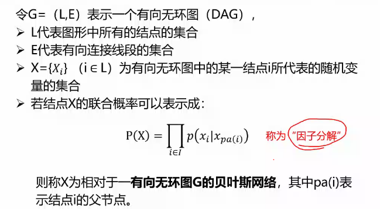
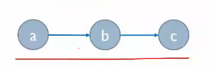

-   映射：每个x只有一个y
    -   单射：x不同则y不同（有反函数）
    -   满射：A -> B，B用完了
    -   双射：单射+满射，一一对应

# 代数系统

|     代数系统      | 封闭 | 可结合 | 有幺元 | 有逆元 | 可交换 |
| :---------------: | :--: | :----: | :----: | :----: | :----: |
|       广群        |  1   |        |        |        |        |
|       半群        |  1   |   1    |        |        |        |
|      独异点       |  1   |   1    |   1    |        |        |
|        群         |  1   |   1    |   1    |   1    |        |
| 阿贝尔群 / 交换群 |  1   |   1    |   1    |   1    |   1    |

## 环和域

|      |    $<A, +, *>$    |                            |                     |
| :--: | :---------------: | :------------------------: | :-----------------: |
|  环  | $<A, +>$ 是交换群 |      $<A, *>$ 是半群       | $*$ 对于 $+$ 可分配 |
|  域  | $<A, +>$ 是交换群 | $<A-{\theta}, *>$ 是交换群 | $*$ 对于 $+$ 可分配 |

-   环的性质
    -   +的幺元是\*的零元，记为$\theta$（证明：$a*(\theta+\theta)=a*\theta$，分配，消去）
    -   可以定义+的-，可以用*提出或分配
    -   整环的无零因子条件 <==> 乘法消去律(c!=0, a\*c=b\*c, 则a=b)
-   特殊环
    -   交换环：$<A,*>$ 可交换
    -   含幺环：$<A,*>$ 有幺元
    -   整环：$<A, *>$ 是可交换独异点，且无零因子
-   域的性质
    -   一定是整环 (证明：先证明是可交换独异点，然后证明无0因子)
    -   有限整环是域 (证明：双射证明有逆元)

## 格和布尔代数

-   **偏序集**：一个集合A以及在A上的一个偏序关系<=所组成的序偶 <A, <= >
    -   偏序关系
        -   自反：a <= a
        -   反对称：若a <= b，b <= a，则a = b 
        -   传递
-   **格**

    -   **定义**
        -   $<A, \le>$是偏序集，若任意a, b属于A，{a, b}都有上确界和下确界，则$<A, \le>$是格
        -   上确界记作$a\vee b$，下确界记作$a\wedge b$，$<A, \or, \and>$是格诱导的代数系统
    -   **子格**
        + $B\subseteq A$，且$B\neq \phi$
        + 上确界和下确界运算在B上封闭（是在A中的上确界下确界运算）
        + 性质：子格是格
    -   基本性质（都是说$\or, \and$运算）
    
        + 保序性：若$a\le b$且$c\le d$，则$a\vee c\le  b\vee d$，$a\wedge c\le b\wedge d$
    
        + 交换律，结合律，幂等律，吸收律：$a \or (a \and b) = a = a \and (a \or b)$
    -   **另一个定义**：若$<A, \or, \and>$中，$\or, \and$都满足交换性，结合性，吸收性，则A上存在偏序关系是格
        -   证明引理：如果满足吸收性，则满足幂等性
    -   性质
        -   **伪分配律**
            -   $a \or (b \and c) <= (a \or b) \and (a \or c)$
            -   $(a \and b) \or (a \and c) <= a \and (b \or c)$
        -   **格的两种定义的关系**：$a <= b$    <=>    $a \and b = a$    <=>    $a \or b = b$
        -   $a <= c$    <=>    $a \or (b \and c) <= (a \or b) \and c$
    -   **格同态和格同构**
        -   格同态：两个格$<A_1, <=_1>$到 $<A_2, <=_2>$，存在一个映射f：
            -   $f(a \or_1 b) = f(a) \or_2 f(b)$，还有$\and$的
        -   格同构：当映射是双射时
        -   格同态性质：$<A_1, <=_1>$到 $<A_2, <=_2>$的格同态，如果 $x <=_1 y$，则 $f(x) <=_2 f(y)$
        -   双射f是格同构    <=>    任意的a, b，有$a<=_1b<=>f(a)<=_2f(b)$
-   **分配格**

    -   定义：交和并互相可分配

        -   定理：如果交对并可分配，则并对交可分配，反之也成立
        -   链一定是分配格

    -   性质：如果$a \and b = a \and c, a \or b = a \or c$，则$b = c$

    -   两种特殊的结构（图中应该没有箭头）

        ```mermaid
        graph TB
            a0 --> b0 --> e0
        	a0 --> c0 --> e0
        	a0 --> d0 --> e0
        	
        	a1 --> b1 --> e1
        	a1 --> c1 --> d1 --> e1
        ```

        -   有这两种结构就不是分配格
        -   $M_5$(左边)是模格，有$N_5$(右边)就不是模格
        
    -   **模格**

        -   定义：格，当$b <= a$，有$a \and (b \or c) = b \or (a \and c)$
        -   定理：格是模格    <=>    不存在满足下面条件的u, v, w：$v<u且u \or w = v \or w, u \and w = v \and w$

-   **有补格**

    -   **全上/下界**：格，存在元素a，<=任意元素，则为全下界，记为0（全上界为1）
    -   **有界格**：格，存在全上界和全下界
    -   **补元**：有界格，对于一个元素a，存在b，使得：$a \or b=1, a \and b=0$，则b为a的补元
    -   **有补格**：有界格，每个元素都有补元
    -   **有补分配格**：将$a$的补元记为$\overline a$
        -   定理：有界分配格中，如果一个元素有补元，则唯一
    
-   **布尔格**

    -   定义
        -   **布尔格**：有补分配格
        -   **布尔代数**：由布尔格诱导的代数系统$<A, \or, \and, ->$
        -   **有限布尔代数**：有限个元素
        -   **同构**：两个布尔代数，存在双射f，三种运算均……
        -   **原子**：一个格，有全下界0，如果有元素a盖住0，则a为原子
    -   定理
        -   一个具有全下界0的 有限格，则对于任何一个非零元素b，至少存在一个原子a，$a<=b$
        -   布尔格中，$b \and \overline c = 0$    <=>    $b<=c$
        -   有限布尔代数，b是任意非0元素，ak是所有满足ai<=b的所有原子，则$b=a1 \or ...$
        -   且上面是表示成原子的并的唯一形式
        -   布尔格，原子a和非零元素b，$a<=b$和$a<=\overline b$有且仅有一个成立
        -   **Stone表示定理**：S是布尔格$<A, <=>$中所有原子的集合，则$<A, \or, \and,->$和$<S的幂集, \cup, \cap, ~>$同构，有两个推论：
            -   有限布尔格的元素个数必定是$2^n$，n是原子个数
            -   任何一个具有$2^n$个元素的有限布尔代数都是同构的

-   **布尔表达式**

    -   定义
        -   **布尔表达式**
            -   $<A, \or, \and, ->$是一个**布尔代数**
            -   A中任意一个元素是~
            -   任何变元是~
            -   如果a, b是~，则，取非，上确界，下确界也是
            -   有限次使用
        -   **含n元的布尔表达式**
        -   **布尔函数**：从$A^n$到$A$的函数，如果能用一个n元布尔表达式表示，则是布尔函数
        -   **析取范式**：$a \and \widetilde x_i \and ...$的并（其中，a是A中一个元素，$\widetilde x_i$是$x_i$或$\overline{x_i}$）(可以写成$E(x_1,x_2)=m_{01}+m_{10}=\sum_{1,2}$)
    -   定理
        -   对于两个元素0,1的布尔代数，任何一个从$\{0,1\}^n$到$\{0,1\}$的函数都是布尔函数
        -   布尔表达式一定能写成析取范式

# 图

## 支配，覆盖、独立、匹配

-   **支配集**：无向图中，一个点集，集合外所有点都与集合内某个点有边

    -   极小支配集（他的真子集都不是，所以集合内没边），最小支配集，支配数
    -   定理：无限图G没有孤立点，$V1$是极小支配集，则存在$V2$也是，并且$V1∩V2=$空集（eg：$V2 = V - V1$，∴极小支配集一般不唯一）
    -   求支配集
        -   把每个点当作一个布尔值
        -   每个点和其直接连接的点相加
        -   相加后，相乘（`(a+b)(a+c)=a+bc`, `a(a+b)=a+ab=a`）
        -   得到的结果需要为1

-   **点覆盖**：无向图中，一个点集，使所有的边都与集合中的某个顶点连接

    -   极小点覆盖，最小点覆盖，点覆盖数
    -   特点：连通图中点覆盖一定是支配集，极小点覆盖不一定是极小支配集，支配集不一定是点覆盖
    -   求点覆盖
        -   同支配集
        -   但是相加改为：点自己+连接的点相乘

-   **独立集**：集合内任意两点没有边

    -   极大独立集，最大独立集，独立数
    -   定理
        -   无向图无孤立点，则极大独立集也是极小支配集（反之不成立）
        -   无向图无孤立点，则**$V1$是(极/最)点覆盖 <=> $V-V1$(极/最)是独立集**
    -   **团**：**与独立集相反，任意两个都有边**
        -   极大团，最大团，团数
        -   补图的团 是 原图的独立集

-   **匹配(边独立集)**：边的一个子集，任意两边不相邻（顶点两两配对）

    -   极大匹配，最大匹配，匹配数 

    -   M是G中匹配

        -   饱和点：v与M中边关联（有另一个点了）
        -   **非饱和点**：v不与M中边关联（没有另一半）
        -   **交错路径**：在M和E-M中交替取边的路径
        -   **可增广交错路径**：两端都是非饱和点的交错路径

    -   完美匹配：没有非饱和点的匹配

    -   求最大匹配

        ```c++
        int path(node v) {
            for ( 与v有边的 node u) {
                if (u不饱和 || path(与u匹配的点) ) {
                    v和u成新匹配;
                    u原来的匹配取消;
                    return 1;
                }
            }
            return 0;
        }
        for (每个不饱和node v) {
            path(v);
        }
        ```

## 网络流

-   一些符号
    -   V：所有node的集合
    -   E：所有边的集合
    -   G = (V, E)：图
    -   s：源点
    -   t：汇点
    -   $c[u, v]$：边的容量（0表示边不存在）
    -   $f[u, v]$：实际流量
-   网络流的一些性质
    -   容量限制：$f[u, v] <= c[u, v]$
    -   反对称性：$f[u, v] = - f[v, u]$
    -   流量平衡：源点和汇点之外的任意node，流入=流出
-   **求解最大流**
    -   原网络：有向边：（现有流量，容量）
    -   **残量网络**：与原网络同向的边描述了可增流量；与原网络异向的边描述了可减流量
    -   **优化**
    -   **可改进路**：在残量网络中，找从 $s$ 到 $t$ 的路径
        
    -   **标号法**：$(-V1, 1)$
    -   **最大流最小割定理**
        
        -   割集：S和T，S+T=V，s属于S，t属于T
        -   割集间的容量：$C(S, T)=\sum_{x\in S}\sum_{y \in T}c(x,y)$（即，所有跨集合的容量之和）
        -   割集间的流量：上面c换成f流量
        -   **最大流的流量 等于 最小割的容量**
        -   **整个网络的流量 等于 任意割的流量**
        -   **求最小割：**
            -   求最大流
            -   求最大流的残量网络
            -   在残量网络中求s的闭包，是S
-   拓展应用
    -   **二部图的最大匹配**
        -   **二部图**： 点分两份，边都跨+
        -   增加一个S和一个T
        -   从S到X的每个点加一个C为1的有向边，Y到T也
    -   价值匹配与价格形成
        -   都选 估值 - 价格 最小的
        -   两个人选一个就涨价1
    -   **网络匹配与社会权力**
        -   给定一个图，交易结果是其中的一个匹配，以及每个节点在[0, 1]区间的一个赋值(匹配的两个人赋值之和为1，如果一个节点没另一半，则为0)
        -   **稳定结果**：不能有**潜力边**（不在结果中的一条边，两端结点的价值之和小于1）
        -   **纳什议价解**：
            -   **外部选项**：在给定分配方案下，能够从某个未成交邻居那里获得的潜在最大利益
            -   每个人拿到的钱 = 外部选项 + 剩余价值 / 2
            -   不能用来求解，只能用来判断

# 博弈

## 基本概念

-   博弈三要素：参与人，策略集，汇报
    -   每个参与人 有 一个策略集
    -   策略组：每个参与人 出 一个策略 构成的 策略组合
    -   对应每个策略组，每个参与人 有 一个回报
-   基本假设：理性人，规则透明，自我利益max
-   关键：非合作
-   用博弈论思想分析问题
    1.  情景描述
    2.  **收益矩阵**
    3.  寻求均衡
-   严格最佳应对 & 严格占优策略
    -   **严格最佳应对**：对方的每个选择，自己都有一个最佳应对
    -   **严格占优策略**：自己的最佳应对都一样

## 几种博弈

-   脏脸博弈
    -   **知道逻辑**
    -   **共有知识**：都知道，但不知道对方知道
    -   **共同知识**：无限迭代的知道命题都为真
-   **囚徒困境博弈**
    -   **帕累托最优**：没有一个策略，能够在保证所有人收益不减少的情况下，使得整体收益增加
    -   **社会最优**
-   **布雷斯悖论**（新修路）
-   **交易行为中的博弈**
    -   拍卖
        -   报价密封拍卖的两种基本形式
            -   首价密封拍卖FPA（最高报价得到交易权，支付最高报价）：难以均衡，常常犹豫，揭晓后后悔
            -   次价密封拍卖SPA（最高报价得到交易权，支付次高报价）：按照估值出价为一个均衡，相对理性
        -   广义二价拍卖GSP
            -   广告主给出愿意支付的价格
            -   根据出价排名，广告主买到相应排名的广告位
            -   每位广告主支付：排在下一位广告主的出价
-   **票决博弈**
    -   投票问题的两种思路
        -   信号驱动：自己的想法
        -   博弈驱动：我的票在什么情况下起作用，考虑别的投票

## 博弈基本类型

-   类型
    -   如果双方均存在严格占优策略，则博弈结果显然可预测
    -   只需一方存在严格占优策略，其实就可以预测
    -   **两个人都没有严格占优策略**
        -   **纳什均衡**：⼀对**互为严格最佳应对的策略组**，是⼀个纳什均衡，因为没有⼈会愿意改变
        -   **协调博弈**：存在多个纳什均衡，一般难以预测，往往需要额外信息
-   **简单博弈的推理**
    -   如果双方都有严格占优策略，采用
    -   如果只有一方有，另一方可以预测，然后采用最佳应对
    -   如果都不存在，寻找**纳什均衡**
        -   存在一个，则就用这一个
        -   存在多个，需要额外信息
        -   均衡有助于缩小考虑范围，但是不保证有效预测
        -   没有纳什均衡？？？：混合策略博弈
    -   **混合策略博弈**（没有纳什均衡）
        -   纯策略
        -   **混合策略**：将纯策略以概率组合起来（薛定谔的策略）
        -   通过预测对方的各种行为几率来构造混合策略，并做出应对
        -   例子：硬币配对（零和博弈）
            -   进攻：预测对方；防守：防止对方预测自己
            -   0.5策略（无差异原理）
        -   **期望策略**
            -   假设参与人有H和T两种纯策略，则用其中一个策略的概率p来表示混合策略

# 贝叶斯网络

## 概率图模型

-   用图形模式表达基于概率相关关系的模型的总称

    ```mermaid
    graph LR
    	1["a"]
    	2["b"]
        1 --"P(b|a)"--> 2
    ```

    -   研究对象：高维随机变量

-   随机变量的两个基本问题

    -   边缘概率：生成式机器学习
        -   已知特征，算概率（已知一些维度）
        -   已知身高和体重，是男的，求是的概率
        -   判断是不是医生，输入是收入，输出是某种收入值和某种职业的共现概率，然后看看，看看哪个最大
        -   缺点：需要全局信息，计算量大
    -   条件概率：判别式机器学习
        -   已知身高和体重，算是男的的概率
        -   判断是不是医生，输入是收入，输出二分类概率，不需要知道其他职业的概率，二分类概率是归一的

## 贝叶斯网络

-   高维随机变量的问题：计算量巨大
    -   解决方法：用独立进行简化
    -   朴素贝叶斯算法（假设所有变量全独立）
    -   马尔科夫假设（当前状态只与前一个状态有关）
        -   条件独立：A ⊥ B | C
    -   条件独立（两个随机变量不独立，但是在某个变量确定的情况下，这两个随机变量独立）

-   贝叶斯网络（一种概率图模型）：寻找条件独立

    

    -   tail-tail结构

        

        -   $p(a,b,c) = p(a) * p(b|a) * p(c|a)$
        -   根据概率图简化了$p(c|a,b) \rightarrow p(c|a)$
        -   $∴p(c|a)*p(b|a)= p(c|a,b)*p(b|a) =p(c,b|a)$
        -   所以c和b条件独立：$p(c,b|a)=p(c|a)*p(b|a)$

    -   head-tail结构（阻断，b阻断了路径，让两边独立了）

        

        -   $p(a,b,c)=p(a|1)*p(b|a)*p(c|b)$
        -   根据概率图检化了$p(c|a,b) \rightarrow p(c|b)$
        -   $∴p(c,a|b)=p(c|a,b)*p(a|b)=p(c|b)*p(a|b)$
        -   所以a和c条件独立

    -   head-head结构

        

        -   $p(a,b,c)=p(a)*p(b)*p(c|a,b)$
        -   根据概率图简化了$p(a,b,c)=p(a)*p(b|a)*p(c|a,b)$
        -   $p(b|a)=p(b)$
        -   $p(b,a)=p(b|a)*p(a)=p(b)*p(a)$
        -   所以当c和后继未知时，a和b独立；已知则不独立

    -   D-划分：将随机变量的条件独立推广到集合

        -   A, B, C相互不相交，若A和C之间存在路径结点b，则b和B：
            -   b的拓扑关系是tail-tail, head-tail时，b一定 在B中
            -   b是head-head时，b以及其后继 不在 B中
        -   满足这一关系时：$X_A⊥X_C | X_B$

# 考试

-   支配、覆盖、独立、匹配
    -   支配集，求极小支配及算法
    -   点覆盖，求的算法
    -   独立集，求的方法
    -   团，求的方法
    -   匹配
        -   基于增广路径的求最大匹配算法
-   网络流问题
    -   面向社会收益最大化的价值匹配的自然算法
    -   微观价值分配中合法解、稳定解、纳什议价解的判断
    -   网络流、最大流
        -   残量网络及其在求最大流中的应用
        -   利用标号法求最大流
    -   利用网络流求二部图最大匹配
    -   最大流最小割定理
-   博弈
    -   求解简单离散博弈问题三步法：确定三要素，构建收益矩阵，求解均衡
    -   利用三步法求解三类简单离散博弈问题：双严格占优策略（囚徒困境）、单严格占优策略、协调博弈（约会博弈）
    -   判断博弈中的帕累托最优与社会最优
-   贝叶斯网络
    -   基本构成
    -   变量联合概率的链式法则表示与因子分解表示（考）
    -   三种推导独立性的拓扑结构
    -   基于D划分判断贝叶斯网络中，两个变量子集在给定第三个变量子集的情况下的独立性

