# 简介

## 界定

-   四个学科
    -   内容: 行动，思维
    -   方式: 类人地，理性地
-   类人行动观: 图灵检测，哲学
-   理性思维观: 逻辑学派 logic school
-   类人思维观: 认知科学 cognition science
-   理性行动观
    -   理性 rationality: 感知并做出正确的行为 (正确: 最优或期望最优)
    -   智能主体 agents
        -   感知并行动的实体
        -   具有`DBI`的对象（`DBI`：信仰belief，愿望desire，动机intention）
-   其他观点
    -   P.H.Winston: 让计算机更有用
    -   D.McDermott: 研究心智的计算模型
    -   在计算机上实现（人的）智能，让计算机可以像人一样听、说、学、推理等
-   定义: 研究**理性智能主体** agents的 一般原理 和 **计算模型** 的学科
-   计算模型既是方法，也是结果

## 历史

-   古希腊
    -   亚里士多德：形式逻辑
    -   欧几里得：几何原本
-   文艺复兴
    -   T Hobbes：推理只是计算
    -   莱布尼茨：数理逻辑
    -   非欧几何
-   近现代
    -   数学基础
    -   形式学派 D Hilbert
    -   1900 23个问题
    -   1930 K Godel 不完备性定理
    -   1936 A Turing：认为不完备性定理可以用于计算，提出图灵机TM
    -   1956：计算研究思维 AI诞生

# 问题求解

## 概述

-   搜索
-   启发式搜索
-   归约
-   博弈
-   其他方法

## 搜索

-   **问题**: 理想状态与当前状态的差别，定义：$P = (S, I, G, O, C)$，可以简写为$P=(S,G,O)$
    -   $S$：状态空间
    -   $I$：$S$的子集，初态
    -   $G$：$S$的子集，终态
    -   $O$：$S×S$的子集，算子
    -   $C$：$[0, +\infty]$，代价
-   **解决**: 应用算子消除差别的过程，即，应用$O$来消除$I$和$G$的差别
    -   **问题表示**
    -   搜索
    -   答案
-   实例
    -   农夫，狼，羊，菜 过河
        -   表示问题
            -   $S \subseteq \{0, 1\}^4, \quad (S_1,S_2,S_3,S_4)\in S, S_i$分别表示……
            -   $I = {(0, 0, 0, 0)},\quad G = {(1, 1, 1, 1)}$
            -   $O$ $(S_1,S_2,S_3,S_4) \rightarrow (\overline{S_1},t_2,t_3,t_4)$满足: $((S_2,S_3,S_4)=(t_2,t_3,t_4) \or (\exist! j \in \{2,3,4\} t_j = \overline{S_j} \and S_1=S_j)) \\ \and ((\overline{S_1}=t_2 \or t_2 \neq t_3)\and(\overline{S_1}=t_3 \or t_3 \neq t_4))$
                -   上面一行: 只有人走 或 有一个可以和人一起走的
                -   下面一行: 狼吃不了羊 且 羊吃不了菜
        -   搜索
        -   答
    -   四皇后问题
        -   问题表示
            -   $I$：4*4空矩阵
            -   $G$：4*4矩阵上，4个皇后，不攻击
            -   $O$：**依次**一行放一个，和前面行的不攻击
        -   搜索，由对称性
    -   九点问题：四笔画连上
        -   问题表示
            -   $I$: 候选的4笔画
            -   $G$: 9个点被覆盖
            -   $O$: 伸缩、旋转四笔画
-   AI中的搜索和传统中查找的区别: 前者动态生成，后者静态比较

## 启发式搜索

-   原因：组合指数爆炸现象

-   $C$：代价 (n为中间状态)

    -   评价函数：$f(n) = g(n) + h(n)$：$n_0到G的最小代价$，用于选择一个结点进行扩展
    -   启发式函数：$h(n)$：从n到最接近目标的估计代价（不能从问题本身得到，启发值）
    -   $g(n)$：$n_0$到n，$h(n)$：$n$到$G$

-   最佳优先搜索（BFS）

    -   贪婪搜索

        -   扩展最接近目标的结点
        -   评价函数：$f(n)=h(n)$
    
-   $A$算法

    -   避免扩展代价高的路径

    -   评价函数：$f(n) = g(n) + h(n)$

        -   $g(n)$：到该点的代价
    -   $h(n)$：从该点到目标的估计代价
            -   $h*(n)$ 是从状态n到目标状态的路径的最小估计代价
            -   $h(n)< h^*(n)$：搜索的点数多，搜索范围大，效率低，但能得到最优解
            -   $h(n)=h^*(n)$：此时的搜索效率是最高的
            -   $h(n)>h^*(n)$：搜索的点数少，搜索范围小，效率高，但不能保证得到最优解

    -   过程

        1.  初始化：建立以$n_0$为结点的搜索树

            ```c
            open <- [n0];			// 没有扩展的状态
            closed <- [n0];			// 扩展了的节点
            ```

        2.  失败

            ```c
            若open为空则失败;
            ```

        3.  选头结点

            ```c
            n <- first(open);
            open <- rest(open);				// 没扩展过的
            closed <- closed and {n};		// 扩展过的
            ```

        4.  成功返回

            ```c
            n是目标，则返回搜索图;
            ```

        5.  扩展

            ```c
            应用算子到n, 生成不在n的祖先中的结点集M;
            M作为n的后继加入图;
            ```

        6.  返回指针

            ```c
            建立M到n的指针，将M加入open表;
            若到m的路径经过n更短，则建立m到n的指针;
            ```

        7.  排序

            ```c
            排序open表;
            ```

        8.  转2（失败）
    
-   搜索策略

    -   $I->G$：前向策略

    -   $G->I$：反向策略

    -   $P(I,G,O) = P(I,T,O) \wedge P(G,T,O)$

        双向：$I => T <= G$

-   理论

    -   定理：若 $\hat h(n) < h(n)$，称为A*算法，则能找到最优解
    -   $\hat h$ 的设计方案：
        -   $\hat h(n) = h(n)$
        -   $\hat h(n) < h(n)$
        -   $\hat h(n) > h(n)$：该方案不一定找到最优解，常用

## 归约

-   归约：建立问题之间的关系
-   实现
    -   $S$：状态空间，$I,G,T \subseteq S$，$O_1 \cup O_2=O$
    -   归约状态空间: 与：$P_1=(I,G,O)=(I,T,O)\and(T,G,O), P_1=R\and S$
    -   归约算子: 或：$P_2=(I,G,O)=(I,G,O_1)\or(I,G,O_2), P_2=U\or V$
-   AND/OR问题空间表示
    -   标注ADN/OR图
    -   从底向上，根结点表示原始问题
    -   注：基于状态空间问题求解是其特例，只有或结点
-   约定
    1.  终止结点$(I,I,O)$：可解的
    2.  没有后裔结点的非终止结点：不可解的
    3.  1和2是对偶的
    4.  可解与不可解是对偶的
        -   可解的
            -   终止结点是可解的
            -   与或结点
                -   与结点（例子中的$P_1$）是可解的：子结点都可解
                -   或结点（例子中的$P_2$）是可解的：子结点有一个可解
                -   注（树来表示，边有角表示为与，直接的边为或）：
                    -   规范化：有的结点可能本来临摹两可，使他成为纯的与/或结点
                    -   抽象模型
                    -   标注：标注结点是否可解
                    -   两种基本方法
        -   不可解的
            -   与可解对偶

## 博弈

-   应用**搜索和归约** 求解 计算机博弈

-   双人全信息零和博弈

    -   象棋

    -   七根火柴

        -   A、B双人轮流分堆，每次将其中一堆分为数目不等的两堆，谁分不了谁输

        -   证明：后走的比赢

        -   问题表示：

            -   状态(L, S)，其中L是堆表（$\sum l=7, S \in \{A, B\}$）
            -   $I$：$(\{7\}, A)$
            -   $G$：$(L', S')$，$L'$不可分，$S'$输
            -   $O$：分堆，数目不等

        -   搜索

            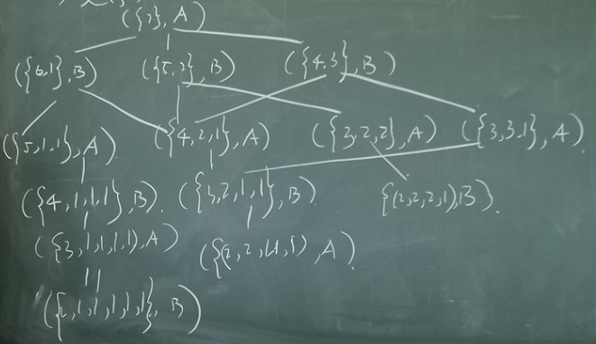
            
        -   标注
        
            -   根据问题标注可解 (用好对偶): 设可解为A赢，不可解为B赢
            -   根据问题标注结点是与还是或
            -   由底向上标注: 得到根结点不可解，则A必输
    
-   一般分析

    -   背景: 巨大的搜索空间，可能搜索不到叶结点

    -   方案

        -   完全的博弈树的标注，不需要
        -   完美的评价函数，$\hat f = f$
        -   限制的时空条件，不精确的代价函数
            -   思想: 折中(tarde-off)
            -   假设: 演化过后，评价函数更精确

    -   步骤

        1.  先向搜索法 (因为假设)
        2.  评估叶结点
        3.  倒推
            -   按极小极大过程倒推: 根据利益关系，交叉取极大或极小 (零和)
            -   求解: $\hat f(n)$: 表示n节点对假设对象的利益
            -   与或层差异: 与层取和，或层取极值
        
        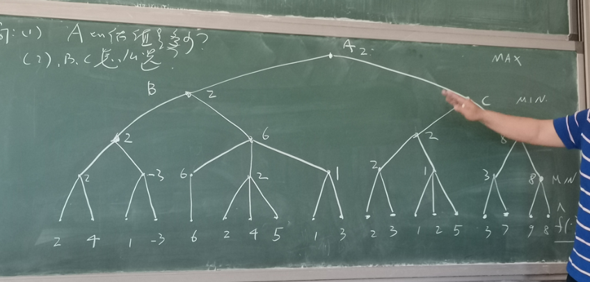
        
    -   注：零和博弈，$f_B(n)=-f_A(n)$，A的利益和B的相反

- $\alpha-\beta $剪枝 (pruning)
  - 是否充分地利用了问题的结构
  - 深度优先(剪枝)
  - 只要不能得到更大的利益，则进行剪枝
  - 评估
      - 比较 剪枝前后 状态空间的生成结点个数 和 评估结点(叶结点)个数
      - 在相同时空下，搜索深度平均增加一倍

## 约束满足问题

csp: constraint satisfaction problem

-   问题
    -   搜索：状态空间
    -   规约：问题空间 (与/或图搜索)
    -   搜索是归约的特例
-   博弈问题: 归约是极小极大的特例 (设置为0、1)

-   **观点**：以**数据模型**来表示问题
-   csp问题定义：$p=<x, c>$
    -   $x$：变量的集合，$x_i$的值域为$D_i$(有限)
    -   $c_i$：约束的集合，涉及的变量关系称为模式，$scheme(c_i)$
        -   $scheme(c_i)=\{x_{i1}, x_{i2}, ... , x_{ik}\}$
        -   $c_i \subseteq D_{i1} × ... × D_{ik}$
    -   目标: 找到一组x的赋值，满足所有约束
-   d
    -   DB：查询优化 (如，存储、运算顺序) (约束的自然连接)
    -   人工智能 赋值-回溯
        -   赋值次序
        -   回跳点
        -   理论
    -   eg：四皇后问题

# 逻辑与推理

## 概述

-   推理以逻辑为基础
-   经典逻辑
    -   形式逻辑
    -   数理逻辑
-   非经典逻辑
    -   模态逻辑：用模态（如“可能”，“一定”等限定）的句子的逻辑
    -   归纳逻辑
    -   模糊逻辑
        -   隶属度函数：用来处理模糊集和模糊关系
        -   模糊集：用一个函数（隶属度函数）表示模糊集
    -   知道逻辑：是一种模态逻辑
    -   非单调逻辑
        -   H：前提
        -   C：结论($H \subseteq C$)
        -   $|H|$越大，$|C|$不一定越大

## 命题逻辑

以命题为原子的逻辑

演算规则

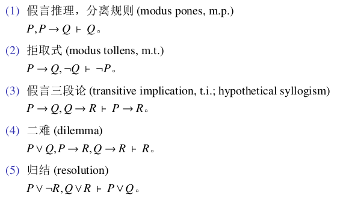

- PS：所有其他的都可以用归结得到：

    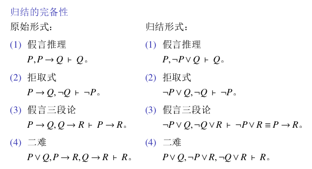\

## 谓词逻辑

谓词逻辑进一步将句子分解为主词和谓词：句子 = 主词 + 谓词

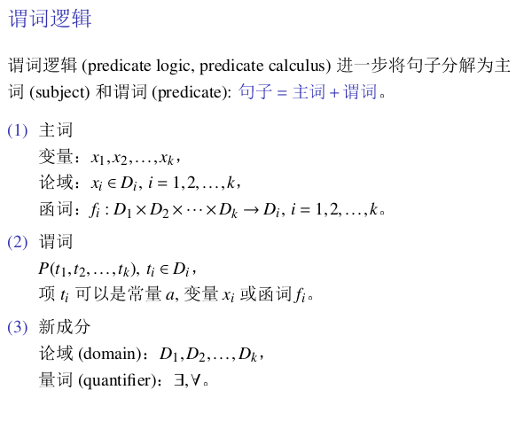

## 归结原理

-   子句和子句集

    -   文字: 原子谓词公式及其否定统称为文字
    -   子句: 文字的析取
    -   空子句NIL: 不含任何文字的子句，永假(不含任何文字，所以不能被任何解释所满足)
    -   子句集: 由子句或空子句所构成的集合

-   化简成子句集

    -   消去连接词$\rightarrow$和$\leftrightarrow$

        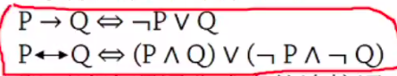

    -   减小否定符号的辖域

        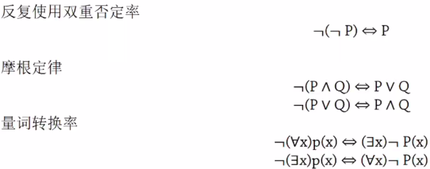

    -   对变元标准化: 让不同量词约束的变元有不同的名字

        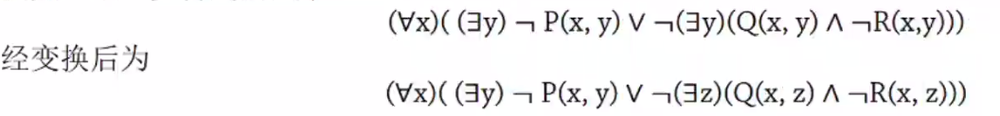

    -   化为前束范式: 所有量词移到最左边

        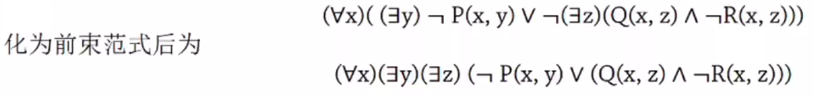

    -   消去存在量词

        -   如果存在量词不在全称量词辖域内: 用一个新的个体常量代替该存在量词的变元

        -   如果存在量词在全称量词的辖域内

            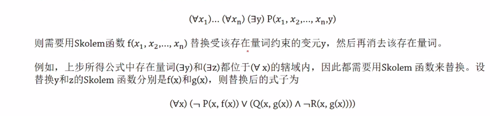

    -   化为Skolem标准型: 合取形式(用分配率)

        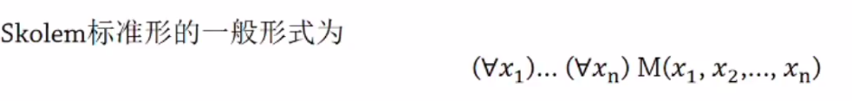

        前面的公式变成: 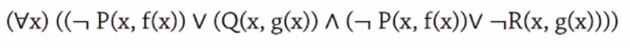

    -   消去全称量词

        由于全部变元都受全称量词约束，所以可以省略

        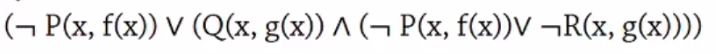

    -   消去合取词，得到子句集

        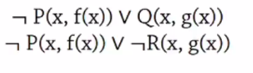

    -   更换变量名称

        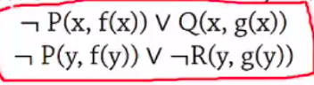

-   子句集的应用

    -   标准子句集不唯一 (Skolem函数不同)
    -   子句之间是合取，所以只要有一个永假，则整个子句集永假
    -   当原谓词公式非永假时，它与标准子句集不等价
    -   当原谓词公式永假时，标准子句集一定永假 (即Skolem化不影响原谓词公式永假性)
    -   定理: 谓词公式F永假 <=> 其标准子句集永假

-   鲁滨逊归结原理

    -   基本思想

        -   先把想证明的问题否定，并加入子句集，得到一个扩充的子句集S'
        -   然后设法得到一个空子句，证明子句集永假
        -   如果没有空子句，就继续归结

    -   命题逻辑

        -   归结式
            -   如果P是原子谓词公式，则称 P 和 非P 为互补文字
            -   归结: 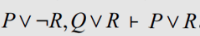(消去!!!)
            -   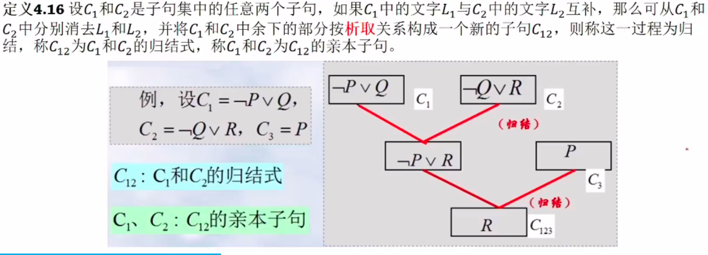
        -   定理
            -   归结式$C_{12}$是其亲本子句$C_1$和$C_2$的逻辑结论
            -   用归结后的结果代替原来的子句，得到的子句集的不可满足性 <=> 原来的不可满足性
            -   归结原理是完备的: 子句集S是不可满足的 <=> 存在一个从S到空子句的归结过程
            -   归结原理: 证明$F\rightarrow G$ 转化为 $F\and 非G$的不可满足
            -   归结反演: 用归结原理证明定理的过程

        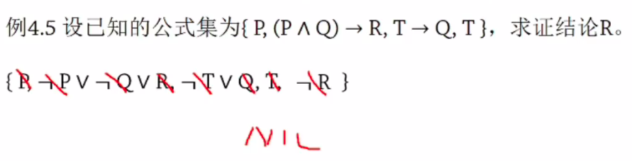

    -   谓词逻辑

        -   由于谓词一般有变元，所以不能直接消去文字，而需要先用最一般合一对变元进行代换

            -   最一般合一：通过置换和合一，找出`mgu`

                -   置换

                    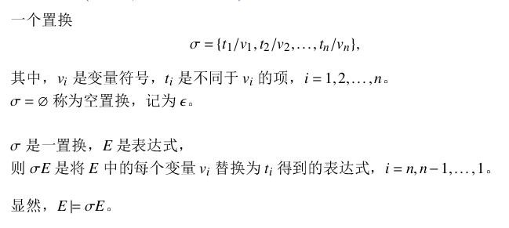

                    -   $t_i$不能循环出现在其他$t$

                -   合一：$\theta$ 是合一 <==> $\theta E_1 = \theta E_2$（E是两个表达式）

                -   最一般合一`gmu`：$\sigma$ 是两个表达式的最一般合一 <==> 对任意的合一$\exist \lambda(\theta = \lambda o \sigma)$

        -   归结式

            -   定义

                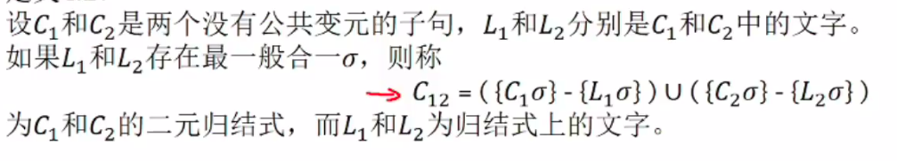

            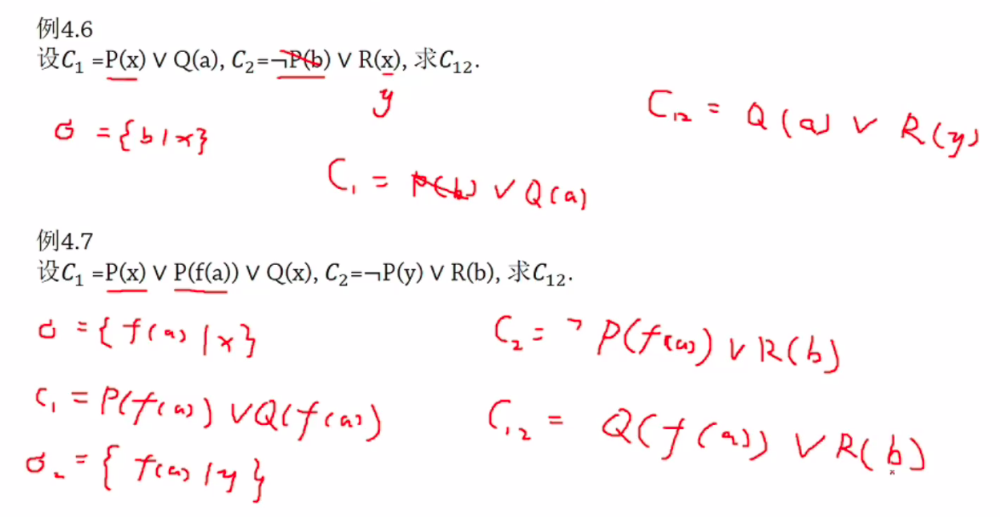

        -   定理

            -   归结式$C_{12}$是其亲本子句$C_1$和$C_2$的逻辑结论
            -   用归结后的结果代替原来的子句，得到的子句集的不可满足性 <=> 原来的不可满足性

-   理论依据
    -   $T |= T的gmu$
    -   公式集T 可满足 <==> T的斯科伦范式 可满足
    -   归结反演是完备的

-   设计谓词
-   问题表示
-   变成字句集

## 逻辑程序设计

# 机器学习

## 基本界定

-   ML：机器学习,研究agents【①增长知识，②提高性能，③学习学习】的一般原理和计算模型的学科
    -   增长知识: eg: 回归问题
    -   提高性能: eg: 产生式系统
    -   学习学习: eg: 冲突消解 & 元学习
-   AI：人工智能

## 基本分类

-   知识表示
-   应用领域
-   学习策略
-   映射类型
    -   基本概念: 实例，类别
    -   归纳: 实例->类别
    -   演绎: 类别->实例
    -   类比: 类别->类别
    -   转导: 实例->实例
-    反馈类型
    -   有监督学习
        -   分类
        -   回归
    -   无监督学习
        -   聚类
        -   关联规则
    -   再励学习
        -   奖赏
        -   惩罚
    -   半监督学习
        -   部分数据有标注
        -   部分数据无标注

## 基本问题

- 可学习性问题：机器学习学科的基本问题和理论基础

  - 可表示
    - 表示语言
    - 有限表示
    - 可压缩性
  - 可行性
    - 可计算
    - 有效的
    - 可靠的
- 适用性问题：机器学习应用的基本问题和应用前提
- 罗生门: 好模型的多样性，好模型准则:
    - 奥卡姆剃刀
    - 多解释原理
- 理论基础
- 技术支持

## 经典方法

-   版本空间

-   决策树

    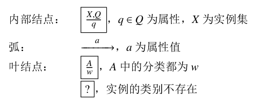

    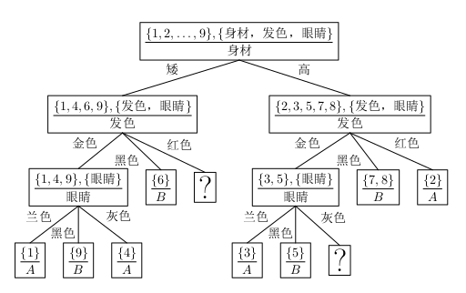

    -   熵

        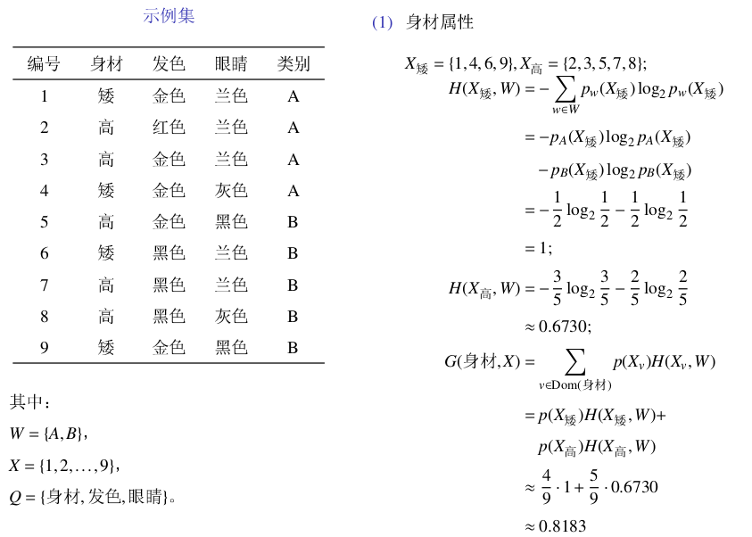

-   贝叶斯

-   线性机

## 贝叶斯学习基础

-   公理引入的必要性
-   大弃赌定理：若一agent违背了概率公理，则对他存在大弃赌

-   基本概念
    -   概率
        -   客观主义
        -   频率主义
        -   主观主义
-   贝叶斯公式

# 智能主体 agent

## 概述

-   Agent

    -   定义：为达到目的，能够做出独立的或自主的行动的实体
    -   其他界定：具有BDI的对象：信念，愿望，意图

-   多Agent系统 MAS

    -   定义：一组相互交互的agents组成的系统，交互包括
        -   协调：管理行动之间的相互依赖
        -   协作：为共同目标，组成团队工作
        -   协商：为共同利益，达成一致
        
    -   研究的主要内容

        -   Agent的理论模型
            -   BDI模型
            -   理性与智能
            -   开放信息系统语义
            -   博弈论与经济学方法
        -   合作机制和组织
        -   实现工具和应用系统
            -   实现工具：实验测试床，黑板框架，OBCP（基于对象的并发程序设计），AOP（面向agent的程序设计）
            -   应用系统：语言处理，空中交通控制，分布传感和解释，监控以及机器人，智能网络与agent和MAS的结合


## Agent 模型

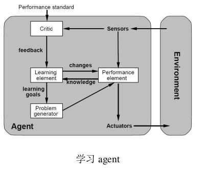

## Agent 组织

-   多agent系统
    -   分层递阶
    -   自由平等
-   nash平衡
    -   有界闭凸集，的连续映射必定有，不动点


# 计科

## 基础理论篇

## 知识以及知识表示

### 基本概念

-   基本概念

    -   认识与经验的抽象体，是人们在认识客观世界与改造客观世界，解决实际问题的过程中形成的认识与经验并经抽象而成
    -   由符号组成，同时包括符号语义。从形式上看，知识是一种带有语义的符号体系

-   分类

    -   按层次：对象，事实，规则，元知识

        ```mermaid
        graph LR
            对象 --> 事实 --> 规则 --> 元知识
        ```

    -   按内容

        -   常识性知识
        -   领域性知识：按学科，门类划分

    -   按确定性

        -   确定性知识：可以确定真假
        -   非确定性知识

-   知识模型：分类中的，都是知识的基本单元，通过一定结构方式组成一个模型来表示复杂大量的知识

### 知识表示

用形式化、规范化的方式对知识的描述。包括事实、规则、控制性知识及知识模型

-   产生式表示法

    -   知识组成

        -   产生式表示法的知识由事实与规则组成
        -   事实表示：
            -   对象性质表示：三元组 (对象，属性，值)
            -   对象间关系表示：三元组 (关系，对象1，对象2)
        -   规则表示：if P then Q

    -   产生式表示法与知识

        -   产生式表示中的对象：知识中的对象
        -   产生式表示中的事实：知识中的事实
        -   产生式表示中的规则操作：知识中的规则
        -   产生式表示中的知识可设置约束：知识中的元知识

    -   eg

        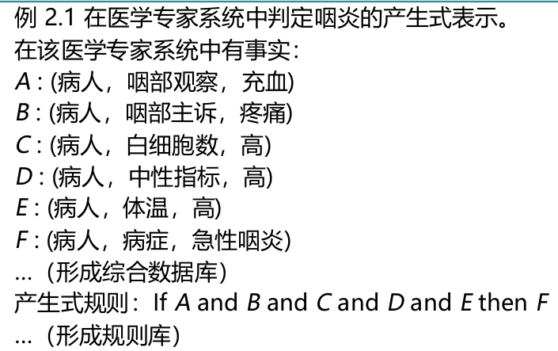

    -   优缺点

        -   优点：知识表示完整；表示规则简单、方便使用
        -   缺点：无法表示复杂知识；仅限于演绎性规则

-   状态空间表示法

    -   表示汇编
        -   状态分量表示知识中对象
        -   用"状态"表示事实：S表示状态，每个状态有n个分量，称为状态变量
        -   用"操作"(算符)表示规则：一种状态变换为另一种状态
        -   状态与操作设置约束表示元知识
        -   "状态空间"表示知识模型：描述一个问题的all状态，以及状态间的相互关系，三元组(S, F, G)
            -   S: 初始状态的集合
            -   F: 算子的集合
            -   G: 目标状态的集合
    -   优缺点
        -   优点：知识表示完整；表示规则简单、方便使用
        -   缺点：适合知识获取中的搜索策略，无法表示复杂知识；仅限于演绎规则

-   谓词逻辑表示法

    -   基本概念

        -   个体：客观世界独立存在的物体。个体的变量范围为个体域
        -   函数：个体可以转化为另一个个体，这种转换称为函数
        -   项：个体和函数生成的个体组成的集合
        -   谓词：表示个体间的关系
        -   量词：（任意，存在）谓词的值不确定，加上量词后谓词的值确定
        -   命题
        -   命题联结词：交并非，->, <->

    -   公式

        -   原子公式：$P(t1, t2...)$是原子公式，$ti$是项；命题也是原子公式

        -   谓词逻辑公式：

            1.  原子公式是公式
            2.  公式用联结词后是公式
            3.  用量词后是
            4.  有限次123

        -   公式的解释

            -   公式是一个符号串，必须给具体的解释
            -   指定一个具体的个体域D，个体常量指定个体域中的一个具体个体，对n元函数f指定映射，对命题R指定E={F,T}中的值，对m元谓词P指定D^m到{T,F}的映射
            -   解释后才有具体意义，即可确定真假

            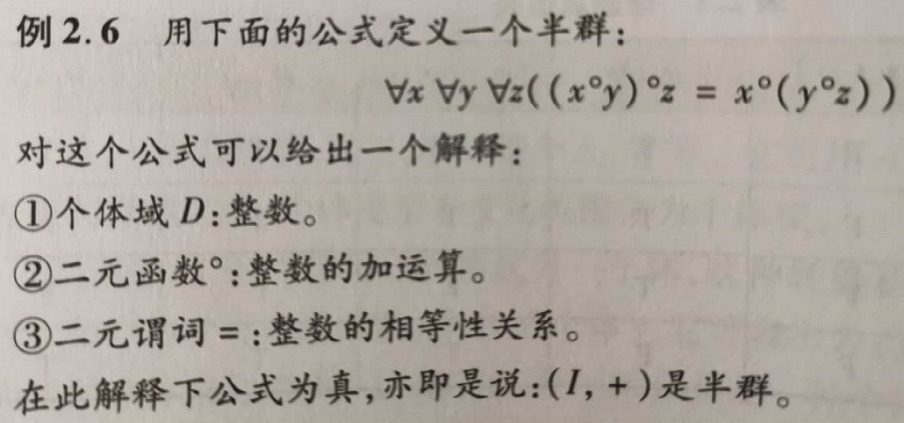

        -   永真公式

            -   永真公式：在all解释下都为真
            -   永假公式
            -   可满足的：至少有一种解释下为真
            -   有22个

    -   推理：$|-$

    -   用谓词逻辑表示知识

        -   对象：谓词公式中的个体和项
        -   事实：用带解释的谓词公式，表示个体性质及个体间关系
        -   规则：用推理表示，共有18条规则，而由普通蕴含公式在局部范围为真所得到的推理为领域性规则

    -   优缺点

        -   优点：完整性，形式化与符号化（有高度逻辑上的严密性与正确性）
        -   缺点：确定性知识；演绎性规则

-   知识图谱表示法

    -   表示：
        -   基本单元：实体
        -   实体间有关系与属性
        -   可以三元组表示

## 知识组织管理—知识库介绍

## 知识获取之搜索策略方法

## 知识获取之推理方法

## 知识获取之机器学习方法
