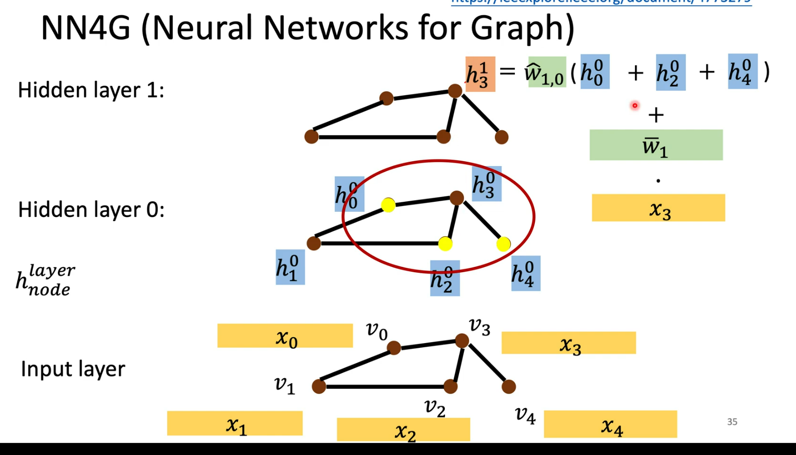
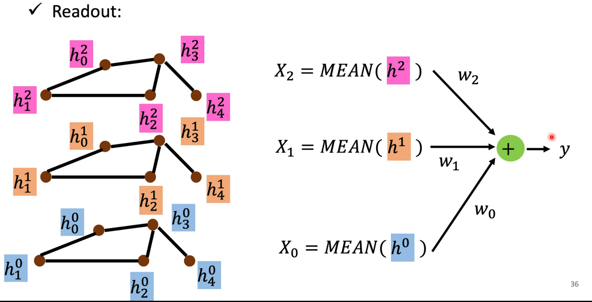
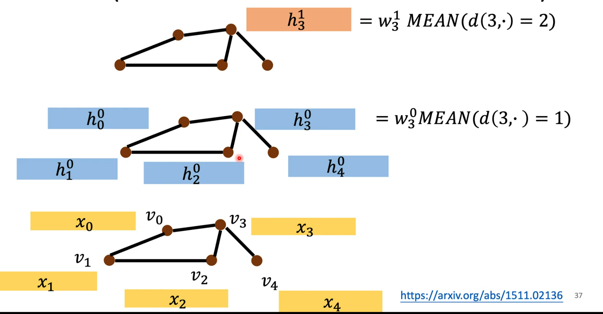
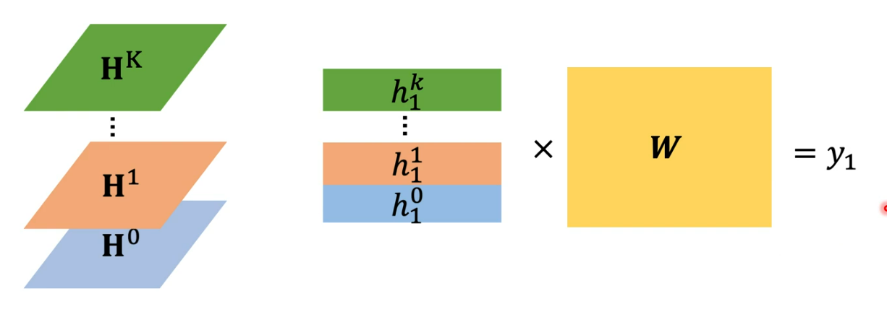
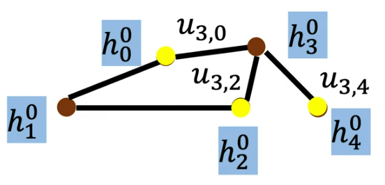
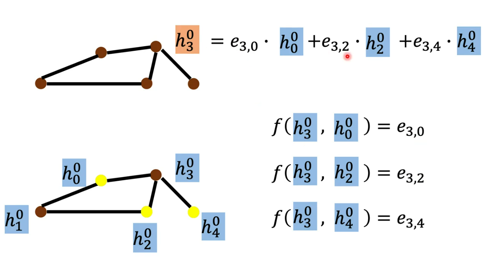

# 基础知识

-   子图
-   联通分量：极大联通子图（有路径）
-   有向图连通信
    -   强连接图：任意两个点相互可达
    -   弱联通图：无向图化后联通
-   度中心性：一个点的度 / (节点数 - 1)

# 卷积

-   卷积：先内积，然后求和

-   `Spatial-based`

    -   基本流程

        -   `aggregate`：临接的点卷积（相当于一般的卷积，对邻居进行推广（矩阵元素->点））
        -   `Readout`：把所有nodes的特征集合

    -   `NN4G (Neural Network for Graph)`

        -   `embedding`：文本->数字

            -   $h_3^0 = w_0 * x_3$

        -   `aggregate`：很多层

            

        -   `Readout`：

            

    -   `DCNN (Diffusion-Convolution Neural Network)`

        -   `embedding`：文本->数字

            -   $h_3^0 = w_3^0 MEAN(d(3,·)=1)$
            -   $d(3,·)$：距离是1的点

        -   `aggregate`：很多层

            -   

        -   `Readout`：

            

        -   `DGC (Diffusion Graph Convolution)`

            -   和`DCNN`类似，只是最后的`Readout`是直接把`H`加起来
            -   所以无法考虑由于边而带来的权重

        -   `MoNET (Mixture Mode Networks)`

            -   设置权重
            -   
                -   边的距离：$u(x, y) = (\frac1{deg(x)}, \frac1{deg(y)})^T$
                -   $deg(x)$：x的度
            -   `aggregate`：$h_3^1 = w(u(3,0))*h_0^0 + ...$

        -   `GraphSAGE`

        -   `GAT (Graph Attention Networks)`

            

        -   `GIN (Graph Isomorphism Network)`

            -   $h_v^k = MLP^k(qwq^k * h_v^{k-1} + \sum_{u∈N(v)}h_u^{k-1})$
            -   用`sum`，不用`max`, `mean`

-   `Spectral-based`

    -   `GCN`

-   `DCNN`

    -   距离是x的加起来

1.  把论文的几种模型复现，大概的模型评测相同

2.  查文献：google 学术 

    -   引用GIN那个文献的文献  （找新的模型）

    -   找新的模型，进行评测（可能会进行pytorch和tensorflow的转换），稍加修改然后提交

         -    不改模型，在数据表示、数据类型上改

         -    弄新的模型，more expressive

              

论文重点：

	- 临的邻居的信息（1跳）
	- 跳的数量和边的数量是指数关系，所以跳数不会太多
	- virtual screen ？ virtual node ？anneal调参