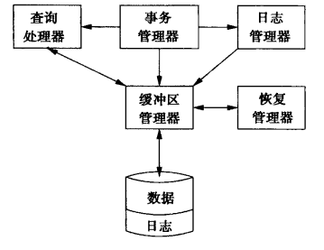

-   数据库管理系统DBMS
-   三大标志性事件
    -   层次数据模型：IMS系统 1966
    -   网状数据模型：DBTG报告 1969
    -   关系数据模型：Codd发表论文 1970
-   事务ACID： 

    -   A(atomic) 原子性（事务要么执行，要么都不执行）
    -   C(consistant) 一致性（事务开始和结束之间数据库都完整性）
    -   I(isolated) 隔离性（多用户）
    -   D(durable) 持久性（事务处理之后，修改就是永久的，即使故障）

# 关系数据模型

Relational Data Model

-   Data Model 组成
    -   结构 Structure of the data：关系数据模型的：关系
    -   操作 Operations on the data：关系数据模型的：关系代数
    -   约束 Constraints on the data：关系数据模型的：键等
-   概念
    -   关系 relation: a set of tuple(表)
    -   属性 attribute
    -   模式 schema: 表头head
    -   元组 tuple: 一行关系，对于每个属性有个实例
    -   Domain 域：数据类型
        -   字符
            -   CHAR(n)，VARCHAR(n)
            -   BIT(n)，BIT VARYING(n)
        -   布尔：BOOLEAN：TRUE, FALSE, UNKNOWN
        -   数
            -   INT or INTEGER，SMALLINT
            -   FLOAT or REAL
            -   DOUBLE PRECISION
            -   DECIMAL(n, d)
        -   时间
            -   DATE ‘1948-05-14’
            -   TIME ’15:00:02.5’
    -   键 key
        -   实体完整性: 主键
        -   参照完整性: 外键

# 关系数据库语言

## 关系代数

-   操作 operations

    -   集合操作: union, intersection(交), difference(差)

    -   查询: selection, projection(投影)

        -   selection: $\sigma_c(R)$ (其中C为条件)
        -   projection: $\pi_{A_1, A_2, ..., A_n}(R)$ (其中$A_i$均为属性)

    -   连接: Cartesian product(笛卡尔积), join

        -   笛卡尔积: $R × S$
        -   自然连接: $R \bowtie S$
        -   $\theta-$连接: $R\bowtie_c S$

    -   重命名: rename

        -   给关系和属性重命名: $\rho_{s(A_1, A_2, ..., A_n)}(R)$ 相当于得到一个新的关系，名字是S，属性是$A_i$
        -   只给关系重命名: $\rho_s(R)$

    -   上面的operation有一定的冗余，例如:

        

-   查询 queries

## 结构化查询语言

-   SQL(Structured Query Language): 结构化查询语言
    -   DDL: 数据定义语言
    -   DML: 数据操作语言
    -   DCL: 数据控制语言
    
-   基本关系代数

    -   from类似Cartesian product,    where类似selection,    select类似projection

    -   集合操作

        -   并: union

            ```sql
            (SELECT * FROM R) UNION (SELECT * FROM S);
            ```

        -   交: intersect

            ```sql
            (SELECT * FROM R) INTERSECT (SELECT * FROM S);
            ```

        -   差: except

            ```sql
            (SELECT * FROM R) EXCEPT (SELECT * FROM S);
            ```

    -   在一个表上操作

        -   π：投影

            ```sql
            SELECT <distinct> title, year, length  -- distinct去重复
            FROM movies;
            ```

        -   $\sigma$：选择

            ```sql
            SELECT *
            FROM movies
            WHERE length >= 100;
            ```

    -   在多个表上的操作

        -   笛卡尔积 $R × S$

            ```sql
            SELECT *
            FROM R CROSS JOIN S; -- 或 FROM R, S;
            ```

        -   自然连接 $R \bowtie S$：连接公共的部分

            ```sql
            SELECT *
            FROM R NATURAL JOIN S; 或 FROM U NATURAL INNER JOIN V;
            ```

        -   $\theta -连接$：

            ```sql
            SELECT * FROM U INNER JOIN V ON A < D;
            SELECT * FROM U INNER JOIN V ON A < D WHERE U.B <> V.B;
            ```

    -   重命名: as

        ```sql
        SELECT * FROM R CROSS JOIN (SELECT B AS X, C, D FROM S) AS SS;
        ```

-   更多sql知识

    -   NULL

    -   is: 如 is null

    -   三个值的truth-value: true(1), false(0), unknown(1/2)

        -   and操作: max(truth-value)
        -   or操作: min(truth-value)
        -   ~操作: 1-(truth-value)

    -   order by

        ```sql
        select * from qwq order by index, year;
        ```

    -   in, exists, all, any

        ```sql
        select * from qwq where index in (select index from qwq where ...)
        ```

-   子查询 subquery

    -   一个查询是另一个的一部分

    -   子查询可以返回: constant(用于where), relations(用于where), 出现在from

        -   标量:

            ```sql
            select * from qwq where index = 1;
            ```

        -   只有一个tuple的一元关系(相当于标量):

            ```sql
            select * from qwq where index =	(select index from qwq where ...);
            ```

        -   返回关系

            ```sql
            select * from qwq where index in (select index from qwq where ...)
            ```

        -   出现在from:

            ```sql
            select * from qwq, (select * from qwq2 where ...)qwq3
            where qwq.index= qwq3.index;
            ```

    -   correlated subquery 相关子查询 (子查询和外面相关)

        例如：**找一个被两个或以上movies用的tiles**:

        ```sql
        select title from movies, old
        where year < any (select year from movies where title=old.title)
        ```

-   分组与聚合 group and aggregation

    -   distinct

    -   aggregation 聚合

        sum, avg, min, max, count (遇到NULL时，只有count处理)

    -   group by

        ```sql
        select name, sum(length) from movies group by name;
        ```

        -   `group by 属性`
        -   出现在select后面的列，要么是group by后面的分组列，要么是其他列用聚合函数

    -   having clauses

        ```sql
        select name, sum(length) from moives, qwq
        where qwq.index = moives.index
        group by name
        having min(year) < 1930;		# 会去掉不满足条件的分组
        ```

        -   `having 分组条件`

-   更新 modification

    -   insert

        ```sql
        insert into R(A1,...) values(v1,...);	# 直接value
        insert into R(A1,...) select ...;		# 插入查询结果
        ```

    -   delete

        ```sql
        delete from R where 条件;
        ```

    -   update

        ```sql
        update R set 新值 where 条件;
        ```

## 典型查询题

-   两个not exist

-   列出平均成绩大于80的课程的编号名称及平均成绩，按课程编号排序

```sql
select course.cno, cname, AVG(Score)
from course, sc
where course.cno = sc.cno
group by cno, cname
having avg(score) > 80
odrer by cno;
```

-   查询演出了两个电影的影星

# 关系数据库设计

## 函数依赖

-   定义：functional dependencies
    -   泛化的键
    -   键：一个属性集（如果集合只有一个元素则改为元素）
    -   主键：其中一个键
    -   超键：不一定满足键的最小化

-   函数依赖的规则
    -   函数依赖的推导
        -   等价
        -   推断 follows:    FD集合S 从 FD集合T 中 推断   <=>    FD集合T 的实例也满足 S中的
    -   分解/组合规则
        -   分解: 分解成->右边只有一个属性
        -   组合: 左边相同的FD，->右边合并起来
-   **平凡FD**：右边是左边的子集
    -   平凡依赖规则：从右边 除去 左边出现的属性 来对FD进行简化
-   **属性的闭包算法**
    -   重复地把新的可以被函数决定的属性加入
-   传递规则 armstrong公理 (自反律，增广律，传递律)
-   **最小基本集**
    -   S：一个FD集合
    -   S的**基本集**：任何与S等价的FD集合
    -   S的**最小化基本集**：满足下面条件的FD集合
        -   FD右边为一个属性
        -   删除一个FD后，不再是基本集
        -   从左边删除一个属性后，不再是基本集
-   **投影函数依赖算法**
    -   FD集合S的投影：
        -   从S中推断而来
        -   $R_1$的属性值是原来属性集合$R$的子集
    -   算法
        1.  对$R_1$的属性集合的每个子集X求闭包，然后对于所有在闭包中且在$R_1$中的属性A，把X->A加入T
        2.  然后T就是基本集了，但是不一定是最小基本集
        3.  得到最小基本集
            1.  如果T中某个FD能从其他的推断，则删除这个FD
            2.  设Y->B是T的一个FD，从Y中删除一个属性后的FD能被推断，用新的FD代替Y->B
            3.  重复1，2

## 关系分解

-   异常: 冗余，更新异常，删除异常
-   分解关系：一般用分解关系消除异常
-   **BC范式（BCNF）**: 如果非平凡FD成立，则左边是超键

    -   定理: **任意一个二元关系属于BCNF**
    -   **分解为BCNF的算法**
        -   找到BCNF违例FD，X->Y，分解为两个关系：
            -   $X^+$
            -   包含X，以及不在$X^+$中的属性
        -   递归地按上面的方法分解

-   分解应有的性质

    1.  消除异常

    2.  信息的可恢复

        -   **无损连接**：不丢失信息（分解后的关系自然连接后还是原来的关系），用chase检验

        -   **chase检验**：

            -   三个性质

                -   自然连接 满足 结合律和交换律
                -   原始关系的任意元组 $\in$ 分解后的关系自然连接
                -   分解后的关系自然连接 = 原始关系 <==> 连接结果中每个元组都 $\in$ 原始关系

            -   图例法

                -   假设关系R(A, B, C, D)被分解为三个关系：AD, AC, BCD，图例如下：

                    -   说明：第一行是AD的，第二行是AC，第三行是BCD

                    | A     | B     | C     | D     |
                    | ----- | ----- | ----- | ----- |
                    | $a$   | $b_1$ | $c_1$ | $d$   |
                    | $a$   | $b_2$ | $c$   | $d_2$ |
                    | $a_3$ | $b$   | $c$   | $d$   |

                -   通过FD推出上面**有一行不带下标**即可

    3.  **依赖的保持**（解决异常操作）：如果FD的投影在分解后的关系上成立，能确保对分解后的关系连接后重新得到的原始关系仍然满足原来的FD

        

-   BCNF可以保证1、2

## 第三范式

-   **第一范式**：每个元组的分量是原子值
-   **第二范式**：①是第一范式，②非主属性取决于超键（无部分函数依赖）
-   **第三范式**：
    -   第一种定义：①是2NF，②非主属性只取决于超键（无传递依赖）
    -   第二种定义：对于每个非平凡FD，要么右边都是主属性，要么左边是超键
    -   性质：**既无损连接，又保持依赖**
    -   **算法**
        1.  找出函数依赖集F的一个最小基本集，记为G
        2.  对于G中每个FD X->A，将 (X, A) 作为一个分解后的关系
        3.  若2中得到的关系，均不包含R的超键，加一个关系：任意一个键


## 多值依赖

-   多值依赖: MVD:    $A_1A_2...A_n \rightarrow \rightarrow B_1B_2...B_m$
    -   意义: 右边的属性的值，独立于R中，既不属于A也不属于B的属性集合 的值
    -   大概意思: 知道了左边，就知道了右边的值的集合
    -   每个FD都是个MVD，只不过右边的值的集合改成了一个值
-   **第四范式**
    -   每个非平凡MVD，都是左边为超键的FD


# ER模型

## ER模型

|                Elements                | Nodes |
| :------------------------------------: | :---: |
|               entity set               | 矩形  |
|               attributes               | 椭圆  |
| relationships 联系(这个表的属性是实体) | 菱形  |


-   箭头表示指向的唯一

## ER模型->关系模型

-   一个实体对应一张表
-   一个“一对一”联系，可以分配到实体表中
-   一个“一对多”联系，即可以分配到实体表中（要分配到“多”的实体表），也可以用单独的关系表实现
-   一个“多对多”联系，必须用单独的关系表实现：两个表的主键合起来作关系表的主键

# 约束

-   用关系代数表示约束

    -   R = 空集
    -   R 是 S 的子集

## 键约束

-   外键约束引用完整性约束（参照完整性）
-   主键约束（实体完整性）

## 在属性和元组上的约束

-   基本约束和创建方式
    -   not null
    -   check

    ```sql
    create table qwq (
    	index int	not null,
        check (index > 100)
    )
    ```

    ```sql
    ALTER TABLE relationName ADD CONSTRAINT constraintName check(...);
    ALTER TABLE relationName drop CONSTRAINT constraintName
    ```

-   延迟约束检查

    -   原因：插入时，由于主键约束，插入不了（插入顺序，循环约束）

    -   方法

        -   将多个插入操作组成一共单一事务
        -   让数据库等整个事务完成并提交后再执行检查

    -   SQL

        ```sql
        NOT deferrable				    -- 默认
        -- 可以随时开启关闭的
        deferrable initially deferred	-- 推迟到整个事务提交之后
        deferrable initially immediate	-- 每个语句执行之后，与NOT DEFERABLE在效果上一样，使用上不同
        
        SET constraint 约束名 deferred/immediate	-- 修改延迟约束
        ```
        
        -   事务: 如果执行失败，整个事务回滚；执行成功则提交
        
            ```sql
            begin;
            	语句s;
            commit;
            ```

## 断言和触发器

-   断言assertions：不同于constraint，assertion可以独立于表存在，但是会增加负担（每次更改都会检查所有assertion）

    ```sql
    CREATE ASSERTION 名字
    	check 条件;
    	
    drop assertion 名字;
    ```

-   触发器trigger

    -   事件：被事件激活
    -   条件：激活后，检查条件
    -   动作：条件满足则执行

    ```sql
    CREATE TRIGGER NetWorthTrigger
    AFTER UPDATE netWorth ON MovieExec
    REFERENCING
        OLD ROW AS OldTuple,
        NEW ROW AS NewTuple
    FOR EACH ROW
    WHEN (OldTuple.netWorth > NewTuple.netWorth)
    UPDATE MovieExec SET netWorth = OldTuple.netWorth
    WHERE cert = NewTuple.cert;
    ```

# 视图和索引

## 视图

-   创建和删除

    ```sql
    CREATE VIEW ParamountMovies AS
        SELECT title, year
        FROM Movies
        WHERE studioName = 'Paramount';
        
    DORP VIEW ParamountMovies;
    ```

-   可更新视图

    -   如果使用该视图可以insertion, deletion, updagte，则是可更新视图
    -   因为一些视图只有原来表的某些列，所以无法update
    -   解决方式
        -   视图多一些列
        -   触发器!!!

-   物化视图

    -   创建和删除

        ```sql
        CREATE MATERIALIZED VIEW MovieProd AS
            SELECT title,year,name
            FROM Movies, MovieExec
            WHERE producerC = cert;
        ```

## 索引

-   B-tree

-   创建和删除

    ```sql
    CREATE INDEX KeyIndex ON Movies(title, year);
    DROP INDEX KeyIndex;
    ```

-   最重要的索引: 键

# 服务器SQL

## 三层体系结构

-   三层体系结构
    -   Web服务器: 和user直接交互
    -   应用服务器: 事务逻辑
    -   数据库服务器: DBMS

-   SQL环境
    -   cluster > catalog > schema

    -   模式：

        ```sql
        create schema 模式名 元素声明;
        ```

    -   目录

        ```sql
        create catalog 目录名;
        ```

    -   连接

        ```sql
        connect to 服务器名 as 连接名 authorization 名字和密码
        set connection 连接名;				-- 切换连接(一个时间可以有多个连接，但是只能有一个有效)
        disconnect 连接名;					-- 断开连接
        ```

    -   会话

## 存储过程PSM

-   创建

    ```sql
    create procedure 名字 (参数)
    	局部声明
    	过程体;
    ```

    ```sql
    create function 名字 (参数)	returns 类型
    	局部声明
    	函数体;
    ```
    
-   参数类型

    -   IN
    -   OUT
    -   INOUT

-   一些语句

    -   if

        ```sql
        IF <condition> THEN
        	<statements(s)>
        ELSEIF <condition> THEN
        	<statements(s)>
        ELSE
        	<statements(s)>
        END IF;
        ```

    -   loop

        ```sql
        LOOP
            <statements>
            LEAVE <loop name>;
        END LOOP;
        ```

-   游标 cursors

    -   创建

        ```sql
        DECLARE c CURSOR FOR <query>;
        ```

    -   使用

        ```sql
        open c;
        FETCH FROM c INTO x 1 , x 2 ,…,x n ;
        close c;
        ```

    -   cursorloop

        ```sql
        OPEN c;
        cursorLoop(循环名): LOOP
            …
            FETCH c INTO … ;
            IF NotFound THEN LEAVE cursorLoop;
            END IF;
            …
        END LOOP;
        CLOSE c;
        ```

    


## 权限

-   权限
    -   `select, insert, delete, update`
    -   `reference, usage, trigger, execute, under`

-   授予权限：`grant`：`grant <权限名的列表> on <数据库元素> to <用户列表>`
    -   `with grant option`：能继续授权
-   收回权限：`revoke`：`revoke <权限名的列表> on <数据库元素> from <用户列表>`
    -   授予权限是独立的，如果A, B都授予了C权限，A收回后，由于B，C还有权限
    -   选项：`cascade`：级联收回权限，`restrict`：不级联收回，而是返回警告，不收回权限
-   **授权图**
    -   结点：用户+权限
    -   一个`*`：有授权的权限
    -   两个`*`：权限拥有者

# 数据库恢复

-   数据必须通过日志来保护

-   failure modes

    -   Erroneous Data entry：写约束或触发器
    -   media failues：磁盘冗余
    -   catastrophic failues：冗余
    -   system failures

-   事务

    -   transaction = 涉及到查询(query)或修改(modification)数据库的process

    -   两种形式

        -   显式

            ```sql
            begin transaction
            	sql1;
            	sql2;
            commit -- 或rollback
            ```

        -   隐式：每个查询或修改语句是一个事务

    -   两种结果

        -   commit
        -   rollback

    -   特性 ACID： 

        -   A(atomic) 原子性（事务要么执行，要么都不执行）
        -   C(consistant) 一致性（事务开始和结束之间数据库都完整性）
        -   I(isolated) 隔离性（多用户）
        -   D(durable) 持久性（事务处理之后，修改就是永久的，即使故障）

    

-   元素elements：事务的组成成分

-   **正确性原理**(correctness principle)

    -   state：一个DB有一个状态，是他的元素的每个值
    -   consistent state：满足all约束的某个状态
    -   correct principle：如果事务在没有其他任何事务和系统错误的情况下执行，并且开始的时候处于一致性state，那么最后DB也应该处于consistent state

-   三种地址空间

    

-   原语（磁盘X，主存缓冲区X，局部变量t）
    -   INPUT(X)： 将数据库元素X，磁盘 -> 主存缓冲区
    -   READ(X, t)： 将数据库元素X拷贝到局部变量t（可能需要隐含地先执行INPUT）
    -   WRITE(X, t)： 将局部变量 t 拷贝到主存缓冲区中的数据库元素X
    -   OUTPUT(X)： 将包含X的缓冲区中的块拷贝回硬盘
    
    

## log

-   `<start T>`
-   `<commit T>`
-   `<abort T>`

## undo log

-   增加了一个**三元组**：`<T, X, v>`：`事务, 变量, 旧值`
-   反映的是主存中的，不是磁盘(所以是**对write记录**，而不是output)
-   **规则**：先写日志后提交 flush log; output; commit
    -   $U1$： $<T, X, v>$日志 必须 在 X的新值写到磁盘 之前 写入磁盘
        -   `FLUSH LOG`：显式地将log强制写入磁盘
    -   $U2$： $COMMIT$ 日志必须在 数据库元素都output之后，但是要尽快


-   **恢复**
    1.  往上每扫描到一个没完成的记录 $<T, X, v>$，如果T没有`COMMIT`，将X的值改为t
    2.  给T写一个记录：$<ABORT T>$

-   **检查点**

    -   目的：恢复时避免检查整个log

    -   解决方式：周期性地添加检查点

    -   **普通检查点**

        -   到检查点时
            1.  停止接受新的事务
            2.  等待所有当前事务`commit`或`abort`
            3.  将`log`刷新到磁盘
            4.  写入日志记录**`<ckpt>`**，并再次刷新日志
            5.  重新开始接受新事务
        -   恢复：不需要再扫描之前`ckpt`之前的

    -   **非静止检查点**

        -   步骤
            1.  写入日志记录`<start ckpt(T1, ..., Tk)>`并flush log(`Ti`是当前所有活跃的事务)
            2.  等待`Ti`全部`commit`或`abort`，同时允许新事务到来
            3.  当`Ti`都完成后，写入`end ckpt`并flush log
        -   恢复
            -   如果先遇到`<end ckpt>`，需要扫描到到上一次`<start ckpt>`

                -   知道对应的start之前的任务都完成了
                -   只恢复start之后来的新事务

            -   如果先遇到`<start ckpt>`，需要扫描到到上一次`<start ckpt>`

                -   知道上一个的start之前的任务都完成了，而上一个start之后的，commit的完成了

                -   恢复没有`commit`的事务，到上一次`<start ckpt>`停止

## redo log

-   `undo log`的问题：output前不能`commit`，慢(IO太多)
-   **规则**：先写日志  commit; flush log; output
    -   $R1$：修改磁盘中一个变量X前，要保证X的之前的修改，包括`<T, X, v(新值)>`和`<commit T>`，都在磁盘上


-   **恢复**
    -   对`commit`了的，重新做一遍
    -   对没`commit`的，`<abort T>`
-   **检查点**
    -   **步骤**
        -   写一个start ckpt(Ti)，并flush log
        -   output那些，在start ckpt时，已经commit的事务修改的元素，同时也接受新事务
        -   写一个end ckpt，并且flush log
    -   **恢复**
        -   先看到`end ckpt`
            -   则其对应的`start ckpt`前提交的事务已经写到了磁盘
        -   如果先看到`start ckpt`
            -   还是要找到前面的一个`end ckpt`，和与其对应的`start ckpt`

## undo/redo log

-   redo log缺点：增加了内存负担
-   **四元组**：`<Ti, X, v, w>`：`事务, 变量, 旧值，新值`
-   **规则**: flush log; output;
    -   $UR_1$: 修改磁盘的数据库元素前，四元组必须在磁盘上
    -   commit T日志相对于磁盘修改的顺序随便 (建议的是先commit后紧跟一个flush log)
-   **恢复**
    -   redo重做已经commit的事务
    -   undo撤销没commit的事务
-   **检查点**

## media failures

# 并发控制

concurrency control

-   I：独立性/隔离性


## 串行调度

serial schedules 串行调度

-   完了一个事务再做另一个事务 transaction

## 可串行化调度

serialzable schedules 可串行调度 (serializable 可串行的，serializability 可串行性)

-   定义：如果有一个串行调度和该调度效果相同，则他是可串行调度
-   效果：事务可以并发做了
-   两个原子操作
    -   $r_{t_i}(x)$：$read(X, t_i)$，可以简记为$r_i(x)$
    -   $w_{t_i}(x)$：$write(x, t_i)$，可以简记为$w_i(x)$

## 冲突可串行

conflict-serializability

-   **冲突**：两个连续的事务transactions，换了顺序之后，某个事务的结果发生改变（**不同事务对同一元素的读写 / 写写操作**）

-   **冲突等价** conflct-equivalent
    -   通过交换相邻的不冲突的$r或w$交换，得到的调度，和原来的调度冲突等价
    
-   **冲突可串行**
    -   conflict-serializable 冲突-可串行的，conflict-serializability 冲突-可串行性
    -   可以通过交换不冲突的$r或w$操作，变成一个串行调度
    -   一定是可串行化调度，但不是必要条件
    
-   **优先图** preceduce graph
    -   用来判断是不是冲突可串行的调度
    -   node：事务
    -   edge：`i -> j` $iff \space T_i <_s T_j$（优先于，即不能换）
    -   如果无环(cycle)，冲突可串行化（判断有无环：拓扑排序）
    
    ```mermaid
    graph LR
        1-->2
        
    ```
    
    

## 用locks串行化


-   锁调度器
    -   增强conflict-serializability
    -   transaction 必须 request和release locks
    -   特性
        -   事务的一致性：有锁才能读写，锁完要释放
        -   调度的合法性：释放了这个元素后才能锁他

-   普通的锁

    -   $l_i(X)$：$T_i$ request 一个 lock on 数据库元素 X
    -   $u_i(X)$：$T_i$ releases 一个 lock on 数据库元素 X
    -   lock table

-   **两阶段锁** 2PL(2-phase)
    -   所有request 优先于 release（对于每个事务，所有 l 都在 u 之前）
    -   the first phase：获得锁
    -   the second phase：释放锁
    -   特性：冲突可串行，和2PL调度冲突等价的串行调度是 与第一个 u 顺序相同的串行调度
        -   证明：直观感觉：每个调度相当于在第一个u时刻瞬间执行
    -   有死锁的风险

## 多种锁的lock

原来的问题：读也加了锁，并行化低

-   **读写锁**

    -   $sl_i(X)$：共享锁 shared lock（读）

    -   $xl_i(X)$：排他锁 exclusive（写）

    -   $u_i(X)$

    -   仍然是2PL

    -   特性

        -   事务一致性

            -   $r$必须在$sl$或$xl$之前，$w$要在$xl$之前
            -   锁后要$u$

        -   调度合法性 legality of schedules

            -   如果一个元素$xl$有了，不能再有任何锁了
            -   如果一个元素$sl$有了，不能再其他事务有$xl$了

        -   相容性矩阵

            

-   **升级锁 upgrading locks**

    -   对于一个元素，有一个事务有$sl$了，当其他事务没有$sl$时，这个事务可以升级锁为$xl$

-    **update locks（$ul$）**

    -   升级锁仍然有死锁，因此引入 update locks（$ul$）
    -   $ul$锁：给一个事务，对一个元素只能读，不能写，申请后具有排他性
    -   $ul$可以升级，$sl$不能升级

    -   相容性矩阵

    

-   **增量锁 increment locks**

    -   目的：进一步提高并行化

    -   增量锁的定义

        -   $INC(A, c)$意义：$read(A, t); t := t + c; write(A, t)$
        -   $il_i(X)$：$T_i$请求在X的`inc`锁
        -   $inc_i(X)$：同上，但是c是一个const

    -   修改

        -   当获得$il$后，才能$inc$，而且只能有inc操作
        -   任何数量的transaction可以在X上有$il$，但是，如果一个事务已经有了$il$，其他事务不能再有$sl, ul, xl$了

    -   相容性矩阵

        
        =======

