# 计算机启动

- 第一阶段：BIOS

  - 硬件自检POST
  - 启动顺序：BIOS交出控制权给下一阶段的程序
  - BIOS：基本输入输出系统；开机的时候，把控制权交出

- 第二阶段：主引导记录

  - BIOS把控制权给排在第一位的储存设备

  - 读取该设备的第一个扇区，即前512个字节

    作用：告诉它在哪找操作系统

  - 如果第一个扇区的最后两个字节是0x55和0xAA，表明可以启动

    如果不是，该设备不能用于启动，控制权给下一个设备

- 第三阶段：硬盘启动

  - 控制权给硬盘一个分区
  - 读取第一个扇区，叫VBR。作用：加载操作系统到这个分区

- 第四阶段：操作系统

  - 控制权给操作系统，操作系统内核载入内存

# 进程

- 引入进程的目的：描述和实现多个程序的并发执行，以改善资源利用率、提高系统吞吐量
- 两个属性
	- 资源的拥有者。不管系统中是否有线程，进程都是拥有资源的独立单位
	- 调度单位。进程是一个执行轨迹，但不作为调度的基本单位

## 进程的概念

一个进程包括：text section，PC，stack，data section

进程的特征：

- 结构特征：程序段，数据段，进程控制块PCB

  PCB：与进程一一对应。包含：process state（进程状态），PC，CPU reg，CPU scheduling information（CPU调度信息），内存管理信息，记账信息，IO信息

- 动态性

- 并发性

- 独立性

- 异步性：每个进程都以相对独立的，不可预知的速度推进

## 进程的状态

new，running，waiting，ready，terminated

swap带来的：阻塞挂起（在外存） + 就绪挂起（在内存）

进程状态转换：

- 运行 -> 就绪：进程用完了时间片 or 被中断

- 运行 -> 等待：对某资源的访问尚不能进行，IO，等待其他进程输入（IPC）

- 等待 -> 就绪
- 就绪 -> 运行

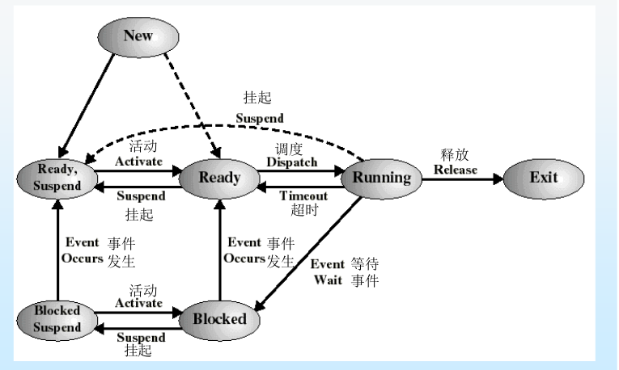

CPU在进程间的切换：

P~0~ -> P~1~：上下文切换（存P~0~状态在PCB~0~，加载PCB~1~），中断或系统调用。（上下文切换是系统的额外开销）

## 进程调度队列

- 作业队列：保存系统中all进程
- 就绪队列
- 设备队列：等待IO设备的进程（每种设备都有自己的设备队列）

- 调度程序
  - 长期调度：选择一个进程进入内存的就绪队列
  - 短期调度（CPU调度）：从就绪队列中选择一个进程，并分配CPU

## 进程的复杂状态

- 问题：

	1. 多个进程竞争内存资源
	2. 无就绪进程，处理机空闲
	3. I/O的速度比处理机慢地多，可能出现all进程等待

- 解决方案：

	swap：将内存中暂时不能运行的进程或暂时不用的数据和程序，换出到外存；把具备运行条件的进程或需要的数据和程序换入内存

	virtual memory（虚拟存储技术）：每个进程只装入一部分程序和数据

## 进程调度

### 进程创建

父进程创建子进程，子进程继续创建

子进程是父进程的复制品，子进程装入另一新程序

- 资源共享：共享all or 子进程共享部分父进程的 or 不共享
- 执行模式：并发 or 父等子终止

### 创建过程

1. 在进程表中增加一项，并从PCB池取一个空白PCB
2. 为新进程分配资源
3. 初始化PCB并分配进程标识符号， 初始化PSW（程序状态字）
4. 加入就绪队列

### 进程终止

- 完成后使用系统调用exit请求操作系统删除自身

- 父进程能终止子

### 进程阻塞

引发事件：请求系统服务，启动某操作，新数据没到，无新工作

### 用户态切换到内核态

每个进程都有自己的内核栈

- 系统调用：进程主动要求切换到内核态
- 异常：eg：缺页异常（硬中断）
- 外围设备中断

## 进程协作

- 独立进程：不能 影响 或 被其他进程影响
- 协作进程：能

进程协作的好处：信息共享，加快计算，模块化，方便

进程间通信（IPC）：两种操作：send，receive

## 进程编程控制

### fork()

- 作用：创建新进程的系统调用
- 库文件：`<sys/types.h>`提供类型pid_t的定义，`<unistd.h>`提供函数的定义
- 返回值：
	- 父进程中：子进程PID
	- 子进程：0
	- 出现错误返回负值（原因：进程数达到上限, errno=EAGAIN or 系统内存不足 ENOMEM）

### wait()

- 作用：阻塞。

	父进程一旦调用就阻塞自己，wait分析当前进程的某个子进程已经退出……

- 库文件：`<sys/types>`，`<sys/wait.h>`

# 线程

## 线程的引入

- 进程的缺点
  - 系统必须完成的操作：创建进程、撤销进程、进程切换
  - 时间空间开销大，限制并发程度的提高

- 目的：减少进程切换和创建开销，提高执行效率，节省资源
- 实现：将进程的资源申请和调度属性分开。（进程作为资源的申请和拥有者，但不作为调度的基本单位）

- 概念：进程中的一个实体，是独立调度和分派的基本单位
- 特点
  - CPU运行的一个基本单元，包括：PC，reg，stack
  - 一个线程与其对等线程共享：代码段，数据段，操作系统资源

- 应用场景
  - 浏览器：接收文本 + 接收数据（图片、音频）
  - 文本编辑器：显示图形 + 读取用户输入 + 拼写和语法检查

## 线程分类

### 用户线程

- 特点

	线程库提供线程的创建、调度、管理，无用户干预

	**内核不知道用户线程的存在，只当是整个进程的行为**

- 缺点

	如果内核是单线程的，任何一个用户级线程阻塞，就会引起整个进程阻塞

- 使用

	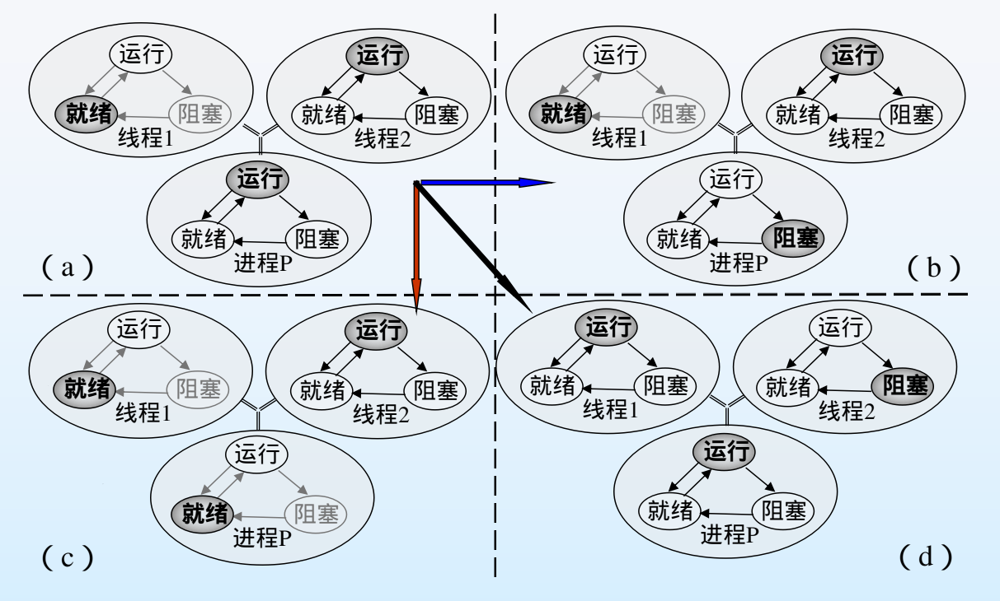

	- (a) -> (b)：

		线程2执行系统调用IO，控制转移到内核，内核启用IO，并切换到另一个进程

		根据线程库维护的数据结构，进程P的线程2仍然是运行状态（注意：线程2的运行态是线程库察觉到它处于运行状态）

	- (a) -> (c)：

		时钟中断把控制传递给内核，内核确定P用完了时间片，将P置于就绪，切换另一进程

		根据线程库的数据结构，P的线程2仍然是运行状态

	- (a) -> (d)：

		线程2需要P的线程1执行一些动作，2进入阻塞，1从就绪->运行，P保留在运行态

### 内核线程

- 操作系统内核负责其创建、调度和管理

  内核直接管理线程：当一个线程阻塞时，内核能调度当前进程内其他线程执行

- 在多处理器下，内核能够在多个处理器上调度不同的线程执行

### 用户级线程和核心级线程的区别

- 线程的调度与切换时间
	- 用户级线程：切换通常在一个进程的多个线程之间，无须通过中断进入内核，切换规则简单，因此切换速度快
	- 核心级线程：相对较慢
- 系统调用
	- 用户级线程：调用系统调用时，内核不知道线程的存在，只当是整个进程的行为，直接阻塞当前进程
	- 核心级线程：以线程为单位调度，当线程调度系统调用时，只阻塞该线程
- 线程执行时间
	- 用户级线程：系统调用以进程为单位进行，但随着进程中线程数目的增加，每个线程得到的执行时间就少
	- 核心级线程：调度以线程为单位，可以获得更良好的执行时间

## 多线程模型

- 多对一：多个用户级线程 映射到 一个内核线程

	- 线程管理由线程库在用户空间中进行，效率高

	- 如果一个线程阻塞，整个进程就会阻塞

	- 任一时刻只有一个线程访问内核，并行性差（多核）
- 一对一：一个用户级线程 映射到 一个内核线程

	- 并行性
	- 开销大
- 多对多：多个用户级线程 映射到 多个内核线程

	- 允许OS创建足够多的内核线程
- 二级模型：与多对多类似，同时也允许一个用户线程绑定到一个内核线程上

## 其他

- 问题：如果程序中的一个线程调用 fork() ,新进程会复制所有线程,还是单个线程?
  - 如果 fork() 之后立即调用 exec() ：没有必要复制所有线程。因为 exec 参数所指定的程序会替换整个进程,此时,应该只复制调用线程。
  - 不调用 exec()：复制所有线程。

- 线程取消
  - 定义：线程结束前终止线程的任务。eg：多线程并发执行搜索数据库,其中一个获取到结果
  - 异步取消：立即终止目标线程
  - 延迟取消：允许目标线程不断地检查它是否应终止，有机会有序终止自己

- 信号处理
  - 信号：用来通知进程 某个特定的事件 发生了。
  - 由特定事件产生，发送到进程。信号必须加以处理
  - 方式：
    - 发送到信号所应用的线程
    - 发送到进程的all线程
    - 发送到进程内的某些固定线程
    - 规定一个线程接受all信号

- 线程池：创建一定数量的线程，放到池中等待工作
  - 通常用现有线程处理请求比等待创建新的线程要快
  - 限制了可用线程的数量

- 线程待定数据：允许每一个线程有自己的数据副本

# CPU调度

## 基本概念

- CPU-I/O 区间周期：进程执行 = CPU执行 + IO等待周期
- CPU调度：从就绪队列中选择一个进程，把CPU分给它

- 调度准则

  - 利用率

  - 吞吐量：一个时间单元内完成进程的数量

  - 周转时间 $T$：一个进程从提交到完成的时间

    带权周转时间 $W = T / R$（$R$ ：实际运行时间）

  - 等待时间：进程在就绪队列中等待总时间

  - 响应时间：进程提交到第一次响应的时间

- 评价指标
  - 周转时间：$T_i=t_{ci}-t_{si}$
  - 平均周转时间：$\overline T = \frac{1}{n} \sum_{i=1}^nT_i$
  - 带权周转时间：$W = \frac T R$    （$R$：实际运行时间）
  - 平均带权周转时间：$\overline W = \frac 1 n \sum_{i=1}^n = \frac 1 n \sum_{i=1}^n \frac{T_i}{R_i}$

## 调度算法

### 先来先服务 FCFS

强调等待时间

缺点：

- 对短作业不利
- 周转时间和响应时间无法保证

### 最短作业优先 SJF

强调运行时间

- 非抢占
- 抢占：**SRT** 剩余时间最短优先

### 最高响应比 HRP

响应比 $R = \frac{W+T}{T} = (1+ \frac W T)$     （$W$：等待时间，$T$：执行时间）

每次都选择在当前状态下$R$最大的

### 轮转法 RR

为进程定义一个时间片，一般有：

$$ T = q × n $$    $T$：系统响应时间，q：时间片，n：就绪队列中的进程数

### 多级反馈轮转法

### 优先级法

每个进程都有一个优先级（越小优先级越高）

- 问题：低优先级饥饿
- 解决：老化——随着时间增加优先级

分类：

- 静态优先级
- 动态

# 同步和互斥

## 概念

- 同步：进程A需要进程B先完成
- 互斥：所需资源互斥

## 同步

定义共享变量：

- 进程间：共享内存
- 线程间：进程内的全局变量

## 互斥 & 临界区

- 临界资源：互斥由这类资源引发
- 临界区：可能对某个共享的数据进行修改的 **一段代码**

## 互斥的实现

#### 临界区三大要求

- 互斥
- 空闲让进
- 有限等待

#### 解决方法

- software approaches（编程解决，但常常忙等待）

	基本思路：在进入区检查和设置一些标志

- 硬件方式（当一个进程进入临界区，屏蔽all中断）

- 信号量

## 信号量

### 信号量S

- 一个整形量
- 除了初始化外，只有原子操作P、V能访问

### P、V操作

- P：`wait()`, 测试
- V：`signal()`，增量

### 忙等形式（自旋锁）

#### P、V定义

```c++
void Wait(){
    while(S<=0) ;
    S--;
}
void Signal() { S++; }
```

缺点：忙等，浪费CPU时钟

当锁只需要保留较短时间时 或 多处理器系统 时 有用

#### 用法

- 实现互斥

	```c++
	do {
	    Wait(mutex);    // mutex为进程间公用信号量，初始为1
	    临界区;
	    Signal(mutex);
	    退出区;
	}while(1);
	```

- 实现同步

	先进程m1，后m2

	进程m1：

	```c++
	do{
	    实施 mi
	    Signal(sem i );
	} while(1);
	```

	进程m2：

	```c++
	do{
	    Wait(sem i );
	    ...
	}while(1);
	```

### 最终实现

#### 信号量S

```c++
typedef struct {
    int value;	// >表示有S个资源，=0表示无资源，<0：|S|表示资源个数
    struct process *L;   //在该信号量中阻塞的进程队列
}semaphore;
```

- S>0：有S个资源
- S=0：无资源
- S<0：|S|表示资源个数

#### P、V定义

```c++
// 发现信号量 S<=0 时,阻塞自己(不是忙等)
void wait(semaphore S){
    S.value--;
    if(S.value<0){
        add this process to S.L;
        block();    //阻塞
    }
}
// 一个进程阻塞且等待信号量 S ,可以在其他进程执行signal 操作之后被重新执行
void signal(semaphore S){
    S.value++;
    if(S.value<=0){
        remove a process P from S.L;
        wakeup(P);    //唤醒
    }
}
```

#### 用法

- 生产者消费者问题

- 哲学家进餐
- 读者/写者问题

### P、V讨论

同步信号量和互斥信号量

- 同步P 和 互斥P：同步P 在 互斥P 前 (互斥信号量永远紧邻临界区)
- 两个 V 操作的顺序无关紧要

## 管程

一种重要的、高级的同步工具。使用需要编程语言的汇编器支持

# 死锁

因竞争资源而相互无限等待

- 原因：
  - 资源不足
  - 进程推进速度不当
  - P操作顺序不当

## 必要条件

- 互斥
- 占有并等待
- 不可抢占
- 循环等待（有环）

## 资源分配图

- 结构
	- 节点：进程节点 $P$ ，资源节点 $R$
	- 边：请求边 $P_1$ -> $R_j$ ，分配边 $R_1$ -> $P_j$
- 性质
	- 没环：不死锁
	- 有环：每类资源单个时死锁，否则不一定

## 处理

### 预防（执行前）

- 环路条件

	给资源编号：申请资源时必须按编号递增进行（如果自己占有了更大的，要先释放）


### 避免（开始执行）

进程首先声明最多需要的资源数

safe state 安全状态：存在一个执行序列，all进程都能完成

- 银行家算法

	- 多种资源，多个实例

	- 数据结构

		|     名称     |                             意义                             |
		| :----------: | :----------------------------------------------------------: |
		| `available`  |                   资源 $R_j$ 有 `av[j]` 个                   |
		|    `max`     |         进程$P_i$ 一共需要 `max[i][j]` 个资源 $R_j$          |
		| `allocation` |          进程$P_i$ 已经有了 `a[i][j]` 个资源 $R_j$           |
		|    `need`    | 进程$P_i$ 还需 `n[i][j]` 个资源 $R_j$<br />`n[i][j] = max[i][j] - a[i][j]` |
		|  `request`   |            进程 $P_i$ 申请 `r[i][j]`的资源 $R_j$             |

	- 资源请求算法

		```c++
	if (r[i] > n[i]) return error;
		if (r[i] > av[i]) wait();
		预分配，修改av, a, n
		if (safe) 分配;
		else wait() && 恢复旧数组
		```
	
	- 安全检测算法

		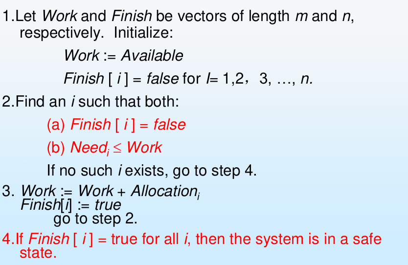

	不足：

	- 预先要声明进程需要的资源量
- 进程执行顺序取决于系统安全，而非进程间的同步
	- 系统必须提供固定数量的资源 给进程使用
	- 检测的系统开销大

### 检测（死锁检测）

定期检查是否安全

### 恢复（死锁恢复）

- 进程终止：一个进程一个进程中断，直到死锁解开（中断顺序）

- 剥夺一些资源

# 内存管理

一维连续地址，是PC所指向的空间

- 内存可分为：
  - 系统区：放操作系统
  - 用户区

## 段式内存保护

把内存分段，每段分化给一个进程

通过一个段基址 base 和段长度 limit 规定段属于某个进程

## 进程的几个阶段

### 地址绑定

指令和数据绑定到 内存地址 可以在三个阶段：

- 编译时期：if内存位置已知，可生成绝对代码；如果开始位置改变，需要重新编译
- 装入时期（load）：如果存储位置在编译时不知道，必须生成可重定位代码
- 执行时期：进程在执行时可以在内存中移动。需要硬件对地址映射的支持（如基址和限长寄存器）

### 地址映射

虚拟地址 -> 内存地址

实现地址重定位的方法：

- 静态地址重定位：load时，由load程序完成地址映射

	缺点：

	1. 重定位后就不能动了
	2. 内存空间必须连续，因而难以共享
- 动态地址重定位

	BR：基地址寄存器

	VR：虚拟地址寄存器

	内存地址MA = (BR) + (VR)

	**MMU**：地址映射装置：将虚拟地址映射为内存地址

### 动态加载

例程(子程序)在调用之前并不加载

### 链接

- 静态链接
  - 时间：在生成可执行文件的时候
  - load程序把.o链接成一个可执行的目标程序
  - 问题：花费时间，浪费空间

- 动态链接

  - 时间：推迟到执行时

    在程序开始运行时，只将主程序段装配好并调入内存

    其它各段的装配是在主程序段的运行过程中逐步完成（每当需要调用一个新段时,再将这个新段装
    配好,并与主程序段链接）

## 存储管理方案

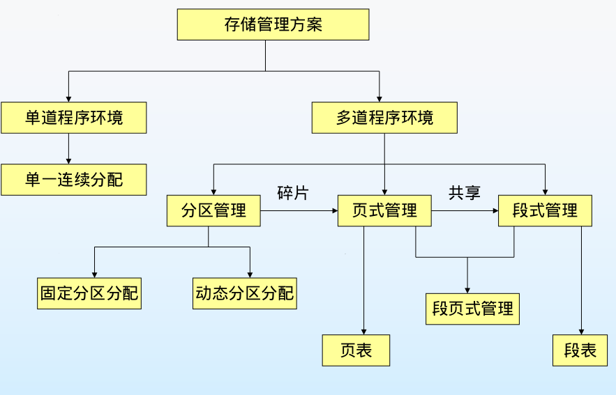

### 单道程序环境

#### 单一连续分配

内存中只驻留一道作业，连续存放

系统区在内存低端，用户进程在高端

### 多道程序环境

#### 分区管理

把内存划分成若干个大小不等的区域

- 固定分区法

- **动态分区法**

	- 数据结构

		- 可用分区表

			每个表目 = 区号 + 地址 + 长度

		- 可用分区自由链

			每个空闲块的头几个空间 = 本空闲区大小 + 下一个的地址

	- 分配和回收

		动态分区算法：

		|    算法     |   内容   |           优点           |               缺点               |
		| :---------: | :------: | :----------------------: | :------------------------------: |
		| first - fit | 最先找到 | 算法简单，对大作业比较好 |             留下碎片             |
		| best - fit  |  最小的  |       对大作业友好       | 每次要sort；留下无法利用的小碎片 |
		| worst - fit |  最大的  | 避免留下无法利用的小碎片 |       每次要sort；算法复杂       |

		- 检索速度上：first最好
		- 回收速度上：first最好
		- 空闲区利用上：best-fit最好，但内存碎片较多；worst-fit碎片最少，但对大作用不利

	- 回收与拼接

		- 外碎片：在分配块外

			利用**紧缩**解决外碎片：移动内存内容，空闲区合并（只有重定位是动态时可以用）

		- 内碎片：内

#### 分页

- 动态分区是为了解决存储器零头问题的一种尝试,但仍然没有解决该问题（例如带来了开销问题）
- 分页：进程的物理地址空间可以是非连续的

- 地址 = 页号 + 页内偏移

- 帧和页
	- 帧：将物理内存分为固定大小的块
	- 页：将逻辑内存分为同样大小的块

- 页表

	PTBR：页表基址寄存器

	PTLR：页表长度寄存器

	一个条目 = 物理页号 + 有效位

- TLB：相联存储器 / 转换表缓冲区

- 倒排页表法

  - 页表不再从虚拟页号->物理页号，而是反过来
  - 建立一个`hash`表，输入是PID和虚拟页号，输出倒排页表的索引

- 共享页

	共享代码：进程之间的共享只读代码，只有一份拷贝

	私有代码和数据：每个进程为这些代码和数据保存一份独立的拷贝

#### 分段

- 基本思想

	1. 把程序按内容或者过程关系分成段
	2. 映射于一个二维线性虚拟空间
	3. 以段为单位分配内存，通过段表 虚拟 addr  ->  物理 addr

- 逻辑地址 = 段号 + 段内偏移

- 段表

	STBR：段表基址寄存器

	STLR：段表长度寄存器

	一个条目 = base段基址 + limit段界限

- 共享段

	原因：许多子程序和应用程序是被多个用户所使用的

	特点：只留一个副本，不能修改

- 优缺点

	- 优点
		- 方便编程
		- 便于实现共享和保护
		- 动态链接方便
		- 能适应数据动态增长的情况
	- 缺点
		- 硬件支持
		- 碎片
		- 允许段的动态增长带来的难度和开销
		- 每个段的长度受内存可用区的限制

#### 段式和页式比较

|       段       |       页       |
| :------------: | :------------: |
| 信息的逻辑单位 | 信息的物理单位 |
|   大小不固定   |    大小固定    |
|  二维地址空间  |  一维地址空间  |
| 便于保护和共享 |                |

#### 段页式

- 地址 = 段号 + 页号 + 页内偏移

- 至少三次访问内存：段表+页表+数据

	优化：快速联想寄存器

### 虚拟内存系统

- 传统的管理方式的缺点

  - 一次性：作业要一次性装入
  - 驻留性：作业要一直驻留在内存中

- 虚拟内存：基于局部性原理

- 虚拟内存的实现
  - 动态页式管理（按需调页 / 请求分页存储管理）

    好处：更少的IO，更少的内存空间，更快的响应，更多的用户

    实现需要解决的问题

    - 发现虚页不在内存（页错误）

    - 处理虚页不在内存

      置换策略：局部分配策略与全局分配策略

      置换算法：缺页率：$f = F / A$。$F$：缺页次数；$A$：访问次数

      - FIFO：先进先出（Belady 现象）

      - OPT：在访问串中将来再也不出现的或者是在离当前最远的位置上出现的页

      - LRU：最久没有使用

        实现：每个页表项 加一个 计数器，存放上次访问的时钟

        近似算法：

        - 引用位：初始为0，被引用时，置1

        - 附加引用位：

          - 8位 表示 引用信息，最高位 = 引用位

          - 每个周期：右移1位

          - 置换最小的

        - 二次机会算法

          - 按FIFO找

          - 如果引用位是0，置换

          - 如果引用位是1，设置为0

      - 页缓冲算法

        空闲帧缓冲池：牺牲帧换出后，放入缓冲池

        已修改页列表：没有修改的不用换出

        空闲帧池：换出的帧在重用前进空闲帧池,如果这段时间内再次使用,无需换入

  - 按需调段（请求分段存储管理）

  - 请求段页式存储管理


题目：虚拟存储器只受外存容量的限制

错。虚拟空间最大容量 = $min(外存容量,2^N)$ ($N$为计算机的地址总线的长度)

# 文件系统

## 功能

- 方便用户使用信息
- 提供用户共享信息的手段
- 提高信息安全程序
- 分配磁盘的存储空间
- 文件操作和使用

## 组成

### 文件

#### 分类

- 文件分类
  - 无结构文件 / 流式文件
  - 有结构文件 / 记录式文件：元素是记录
- 文件类型
  - 普通文件，目录文件，特殊文件（对设备的抽象）

#### 组成

- 文件属性：所有文件信息保存在目录中

- 文件组成：文件 = 文件说明 + 文件体

  - 文件说明：FCB文件控制块（文件说明组成目录文件）


#### 文件操作

- 打开文件表（同一文件可以同时被多个用户名下的多个进程打开）

  - 系统公用的文件列表：包含与进程无关的内容：位置，大小，一个文件被打开的计数等

  - 每进程一个独立的文件列表

    一个表项：表示一个已经被该进程打开的文件，内容包括：

    1. 指向 系统公用文件列表 某条表项的 指针
    2. 下一个读写的位置
- 打开文件锁

  - 操作系统和文件系统提供：共享锁,专用锁
  - 强制或建议
    - 强制：一个进程获得该锁后，其他进程不能访问
    - 建议：进程能够发现锁的状态并决定怎么做

- 常用的存取方法

  - 顺序存取法
    - 按照文件的逻辑地址顺序存取
    - 通常提供操作：读/写下一个记录，前/后跳n个，跳到文件头
  - 随机存取法（直接存取法）
    - 通常提供操作：顺序的 加 跳/读/写 第n个记录
  - 按键存取法
    - 根据文件记录中的关键字

### 目录

一个包含all文件信息的节点的集合

#### 文件组织

- 分区：逻辑的虚拟的磁盘
- 目录：分区上all文件的名字，位置，大小，类型等信息

- 文件目录：FCB的有序集合
- 目录项：FCB
- 目录文件：通常将文件目录以文件的形式保存在外存，为目录文件

#### 目录逻辑结构

- 单层目录：一个目录对应all用户（不同用户 对 不同文件 还要取名不同）
- 双层目录
  1. 主目录MFD：元素指向UFD
  2. 用户文件目录UFD：FCB集合
- 树状结构目录
  - 用户总时在当前目录，局部地使用文件
  - 路径：绝对 or 相对
  - 好处：有效搜索，支持分组
- 无环图目录
  - 类似树状，但是一个子节点可能有两个父节点
  - 文件可能有多个绝对路径名
  - 问题：磁盘利用率计算，备份，删除（类似C++的软拷贝）

### 保护

- 访问的类型：r, w, exe, 扩展, delete, 显示列表
- 用户：u, g, o

## 结构

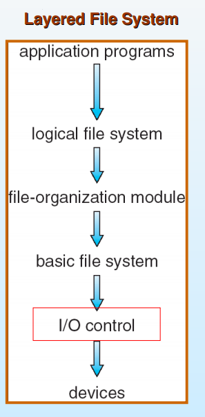

- 逻辑文件系统

  - 管理 文件系统 元数据（元数据：文件系统all结构数据，不包括文件内容）

  - 通过FCB维护文件结构

- 文件组织模块

  - 知道文件的逻辑块和物理块，可以 逻辑地址->物理地址
  - 包含空闲管理模块

- 基本文件系统

  - 完成以物理块为单位的数据读写。磁盘地址的表示：eg：驱动器1, 柱面73，磁道3，扇区10，组合起来
  
- 对IO设备的控制

  - 设备驱动 + 中断处理程序
  - 提供基本的块访问命令接口

## 文件系统的实现

虚拟文件系统VFS：提供一套统一的文件系统访问接口

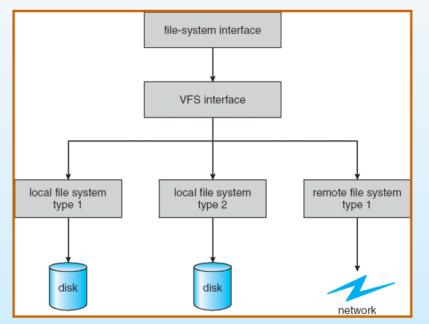

## 文件空间分配

- 连续空间分配

  - 文件分配表：文件名 + 起始块号 + 文件长度

- 链接式分配

  - 文件分配表：文件名 + 起始块号 + 末尾块号
  - 每个block留出一个指针位置，进行块间链接
  - 缺点：不能随机访问

- 索引分配

  - 文件的信息存放在若干不连续的物理块中

  - 一个文件对应一个索引表（索引节点`inode`，占一个块），每个表项是指向物理块的指针

  - 缺点：

    - 存取文件至少访问外存2次。改进：操作前，索引表调入内存

    - 一个块可能放不下索引表。改进：间接索引 / 多重索引


## 文件存储空间分配

空闲块的组织和管理

- 空闲空间表

  - 表项：第一个空闲快号 + 连续空闲块个数
  - 适合于：连续分配
  - 不足：占用辅存空间大

- 空闲块链

  - 把all空闲块链接

  - 链接方法

    - 按空闲区大小顺序

    - 按释放先后顺序

    - 成组链接法

      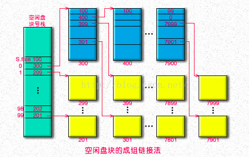

      - 概述

        - 首先把all空闲快按100块划分为一组（划分从后往前）
        - 每组第一块 存放 前一组中各块快号和总块数

      - 绿色

        第一组（唯一进入内存的一组）

        - `S.free`表示栈中有的空闲块数目，兼有栈顶指针的作用

        - `S.free`以下：
          - 第0块：指向后面一组
          - 第1+快：指向空闲块

        ∵栈是临界资源，∴需要锁

      - 蓝色

        和绿色功能类似

        - 100：表示有100个
        - 400：指向下一个绿色块
        - 后面：指向空闲块

      - 黄色：真正可用的空闲块

      - 使用

        - 空闲块的分配
          - 使文件资源表中放最后一组空闲快块号 和 总块数 的堆栈进入内存
          - 当堆栈中只剩下最后一个空闲块号时，取下一组进行分配
        - 空闲块的回收
          - 回收的物理块 的号 放入 当前指针指向的位置
          - 如果到了100，表示已经满了。Ptr = 1，另起一个数组
        - 空闲块的分配和释放必须互斥

  - 适合于：非连续存储文件

  - 不足：工作量大（每次释放要完成拉链工作）

- 位示图

  - bit位为0：空闲，1：被占用
  - 尺寸固定
  - 不足：慢（需要扫描0，物理块号需要进一步的计算得到）

# 磁盘调度

磁盘带宽：传递的总字节数 / 服务请求开始到最后传递结束的总时间

传输速度：驱动器和计算机的数据传输（通过IO总线相连）

## 磁盘调度算法

|     算法     |                             内容                             |
| :----------: | :----------------------------------------------------------: |
|     FCFS     |                          先来先服务                          |
|     SSTF     |                           选最近的                           |
| SCAN电梯算法 | 磁臂 从磁盘一端向另一端移动<br />到另一端尽头的时候，改变方向处理 |
|     LOOK     |                     SCAN的改进，不走到头                     |
|    C-SCAN    |      磁臂 从磁盘一端向另一端移动<br />返回的时候不处理       |
|    C-LOOK    |                         C-SCAN的改进                         |

一般用SSTF或LOOK

**旋转优化**：对同一磁道上的连续读 写信息进行合理分布

## RAID 磁盘冗余阵列

定义：多个独立的物理硬盘按不同方式组合 成 一个虚拟的硬盘

优势：

- 容量：灵活的容量扩展

- 管理：虚拟化 增强 可管理性

- 性能：磁盘分块 带来 性能提高

- 可靠性和可用性：冗余技术和热换提升了可靠性

  热换：不影响系统正常运行的情况下，用正常的物理磁盘 替换RAID阵列中的 失效磁盘

存取数据基本方式：

- 并行存取方式：大型的、以长时间顺序访问
- 独立存取方式：数据存取频繁，每笔存取数据量较小

### 冗余

镜像冗余：

- 每个I/O操作都会在两个磁盘上执行，看起来像一个磁盘一样
- 能提高读性能

检验冗余：

- 根据冗余算法 计算阵列中成员磁盘上数据的校验信息，将校验信息保存在other磁盘（XOR算法）
- 保证数据可靠性
- 比镜像冗余 开销小

冗余级别：

- RAID0（性能最好）：

  - 条带方式均匀分布

    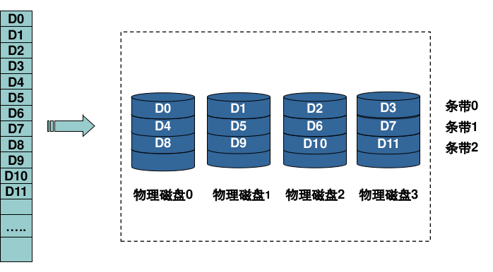

  - 优点：不用校验，设计简单，读写效率高
  - 缺点：无冗余，不能用于对数据安全性高的环境
  - 适用于：需要大传输带宽的操作

- RAID1（冗余程度最高,相同容量下，1和10开销最高）：

  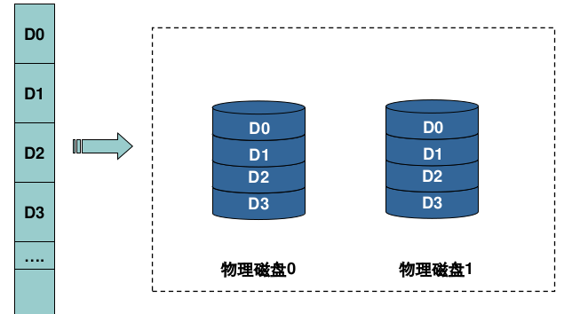

  - 优点：安全，设计和使用简单，理论上读效率 * 2
  - 缺点：空间利用率 / 2，写性能提升不大

- RAID2：

  - 采用检验冗余：

    数据分散为块，加入校验码，间隔写入到磁盘阵列的每个磁盘

    在成员磁盘上的地址都一样

  - 并行存取

  - 花费大，成本高

- RAID3：

  - 数据被分为更小的块 并行传输到 各个成员磁盘

    同时把xor检验数据存在专门的校验磁盘

    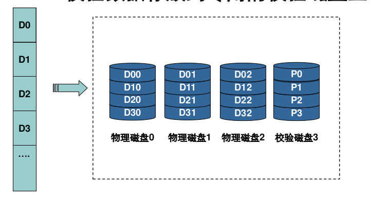

  - 优点：读写性能都好；磁盘损坏时，对整体吞吐量影响较小；开销较小

  - 缺点：控制器设计复杂；检验磁盘的写性能有瓶颈；并行存取，主轴同步时吞吐量没有提高

  - 适用于：高吞吐量的环境

- RAID4：

  - 数据被分为更大的块 并行传输到 各个成员磁盘

    同时把xor检验数据存在专门的校验磁盘

    与3的不同：采用独立存取方式；将条带由RAID3的小数据块改为更大的数据块

    

  - 优点：检验更快，读取速度更快

  - 缺点：写入速度极差；控制器设计更复杂

- RAID5（选学）：

  - 相较于4，校验信息被均匀分布在各个磁盘

    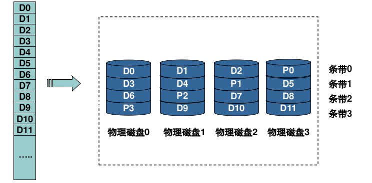

  - 优点：读性能好；写性能中等；检验信息的分布式存取，避免写操作瓶颈

  - 缺点：控制器设计复杂；磁盘重建复杂

  - 适用于：服务器，数据库

- RAID6：

  - 两种分布存储的检验信息的磁盘阵列，用了二种奇偶校验（就是比5多一个校验的盘，然后分布在各个盘里）
  - 适用于：数据绝对不能出错的场景

- RAID10（相同容量下，1和10开销最高）：

  - 结合0和1

    

# IO系统

## 基本概念

### 设备分类

- 按使用特性
  - 存储设备：磁盘
  - 输入输出设备
  - 终端设备：通用终端，专用终端，虚终端
  - 脱机设备
- 按传输速率
  - 低速：键盘
  - 中速：激光打印机
  - 高速：磁盘机
- 按传输交换单位
  - 字符设备
  - 块设备：传输以块为单位。eg：磁盘
- 按共享属性
  - 独占设备：一段时间内只允许一个进程访问
  - 共享设备
  - 虚拟设备：将独占设备变换成可以共享的逻辑设备（spooling技术）

### 主要任务

1. 选择和分配输入输出设备以便进行数据传输操作
2. 控制输入输出设备 和 CPU（或内存）之间交换数据
3. 提供友好的透明接口，屏蔽设备硬件特性
4. 实现操作系统的最佳效率：提高设备之 间、 CPU 和设备之间以及进程间的并行操作度

### 主要功能

1. 提供和进程管理系统的接口：当进程要求设备资源时，该接口将进程要求传递给设备管理程序
2. 进行设备分配：按照设备类型及分配算法把相关设备分配给请求进程，未能获得分配的进程放入等待队列
3. 实现设备之间、CPU和设备之间的并行操作：需要硬件支持
4. 进行缓冲区管理：解决外设和 CPU（或内存）的速度问题

## 数据传输控制方式

- 程序直接控制方式

  - 由用户进程来直接控制。CPU 直接与 I/O 设备(设备控制器)进行通信
  - 优点：简单
  - 缺点：CPU利用率低下
  
- 中断控制方式

  - 目的
    - 减少程序直接控制方式中 CPU等待时间
    - 提高系统的并行工作程度
  - 条件
    - CPU 与设备(控制器)之间有相应的中断请求线
    - 设备控制器的控制状态寄存器中 有相应的中断允许位
    - 设备控制器中：中断请求触发器，中断屏蔽触发器
    - CPU 的 PSW 寄存器中：中断允许位
  - 思想
    - 没有输入就先把cpu给别的就绪进程
    - 输入后，cpu中断回来
  - 优点：能支持并行；cpu利用率提高；有实时响应能力
  - 缺点：①控制器数据缓冲寄存器小，一次IO可能多次中断；②设备间并行，中断次数急剧增加，造成cpu无法相应中断，出现数据丢失现象

- DMA方式 / 直接存取方式

  - 基本思想：在外围设备和内存之间开辟直接的数据交换通路

  - I/O 控制器：原本的（控制状态寄存器 + 数据缓冲寄存器） + 新加的（传送字节数 + 内存地址寄存器）

  - DMA控制器

    - 代替cpu 控制 内存和设备之间的 数据交换
    - 不再频繁干涉cpu（除了：在数据传送开始时，需要 CPU 的启动指令；结束时需发中断通知 CPU）

  - 优点：cpu不干预数据传输；速度快；cpu与外设并行，比中断控制方式并行行高

  - 局限性：

    - DMA方式外围设备的管理和某些操作仍由cpu控制
    - 多个DMA控制器的同时使用会引起内存地址的冲突，更加复杂

    - 贵

- 通道方式

  - 一个功能单纯的处理机：专门用于处理 I/0 操作
  - 有自己的运控部件 + 指令系统，但没有内存，通过周期窃取方式与主机共享内存
  - 
  - 一条通道指令可以传送一组数据，一个通道程序可以传送多组数据
  - cpu只需给通道发一条IO指令
  - 一个通道程序执行完毕后，才向cpu发出一次 中断

- 通道和DMA的区别

  |                      DMA                      |                             通道                             |
  | :-------------------------------------------: | :----------------------------------------------------------: |
  |    数据的传输方向，内存地址长度：由cpu控制    |                        由通道进行控制                        |
  |           一个设备至少一个DMA控制器           |            一个通道可以控制多个设备，增加了并行性            |
  | CPU每发出一条指令，只能读或写一个连续的数据块 | cpu只需给通道发一条IO指令，给出通道程序的首地址以及要访问的设备 |

## 中断技术

### 定义

- 中断源：引起中断发生的事件
- 中断请求：中断源向 CPU 发出的请求中断处理信号
- 中断响应

### 禁止中断 / 关中断 & 开中断

- 关中断：如果cpu内部的处理机状态字PSW中断允许已被清除，不允许cpu响应中断
- 开中断：PSW中断允许位的设置
- 中断请求，开关中断都由硬件实现

### 中断屏蔽

- 用软件方式，有选择地封锁部分中断，其余中断能被响应

- 中断优先级

  - cpu的处理机状态字PSW中也有设置优先级。如果中断源的优先级 > PSW的：响应

  - 各中断源的优先级固定

  - 处理机的优先级根据执行情况由系统程序动态设定

- 中断分类

  - 硬中断
    - 外中断 / 中断：与当前执行指令无关。eg：ctrl+c，CPU时钟中断
      - 处理：硬件中断隐指令保存PC，操作系统保存通用寄存器
    - 内中断 / 陷阱：通常与当前执行指令有关（大部分都转化成软中断处理）
  - 软中断：通信进程之间 模拟硬中断

## 缓冲技术

利用空间来换取时间。磁盘->缓冲区->用户进程

缓冲器是临界资源，互斥

### 缓冲区大小

- 块设备的缓冲区：1块
- 字符设备的缓冲区大小：一般一行

### 分类

- 单缓冲

  单缓冲区总时间=(磁盘写入缓冲区时间+缓冲区读出时间)*块数+CPU处理最后一块数据的时间

- 双缓冲：解决两台外设、打印机和终端之间的并行操作问题

  双缓冲总时间=磁盘写入缓冲区时间*块数+读出最后一块数据时间+CPU分析最后一块数据时间

- 多缓冲：多个缓冲区连接起来组成两部分：一部分输入，一部分输出

  环形缓冲区 ∈ 多缓冲

- 缓冲池：把多个缓冲区连接起来统一管理。既可输入，也可输出

## spooling技术

- 目的：独占设备 -> 可并发使用的虚拟设备
- 思想：利用一台可共享的，高速大容量的设备（**磁盘**），模拟 独占设备操作
- 特点：
  - 提高了IO速度
  - 独占->共享：设备不分配给进程，分配给进程的是一个存储区和建立一张IO请求表
  - 实现了虚拟设备功能