-   数字逻辑电路：一个可以处理离散值变量的网络，包括

    -   一个或多个离散值的输入、输出端

    -   描述输入和输出关系的功能规范

    -   描述当前输入改变时输出响应延迟的时序规范

        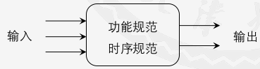

-   结点和模块

    -   电路由 结点nodes + 模块elements 组成
    -   结点：一段导线，通过电压传递离散值变量
    -   模块：本身就是一个电路

-   数字逻辑电路分类

    -   组合逻辑电路
    -   时序逻辑电路

# 组合逻辑设计

-   组合逻辑电路(用C、L重叠写的一个符号表示组合逻辑)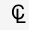
    -   每个电路结点：或者是电路的输入，或者只连接电路模块的一个输出端
    -   每个电路模块都是一个组合逻辑电路
    -   电路中无回路

## 布尔代数

-   基本概念
-   公理和定理
    -   公理
    -   对偶规则：把等式A中的+和-互换，0和1互换，得到B，则如果A等号成立，则B也
    -   单变量定理，多变量定理
    -   蕴含项、最小项和最大项
    -   标准或与式和标准与或式
    -   真值表
    -   使用定理化简表达式

## 逻辑门

-   单输入逻辑门

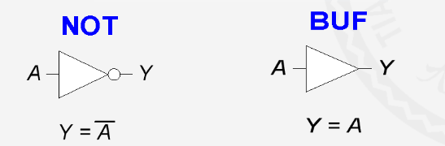

-   两输入逻辑门

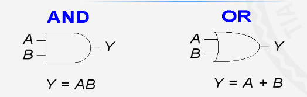

-   两输入门

    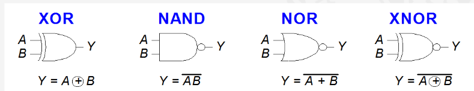

-   多输入门

-   CMOS晶体管

    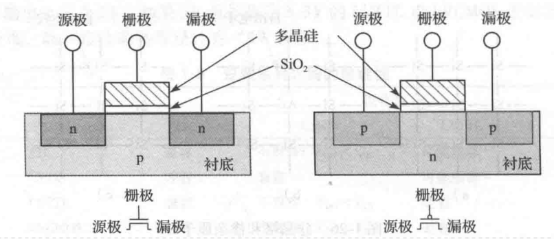

    -   pMOS型硅：栅极0时导通，1时截止

    -   nMOS：栅极是0时截止，1时导通

    -   CMOS非门

        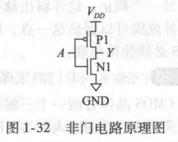

    -   其他cMOS门

        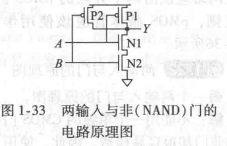

    -   功耗
        -   动态功耗
            -   信号在0、1变化过程中电容充电消耗的能量
            -   电容 $C$ ，用电压 $V_{DD}$ 充电，需要能量 $CV_{DD}^2$
            -   电压切换频率 $f$
            -   动态功耗 $P_{dynamic}=\frac{1}{2}CV^2_{DD}f$
        -   静态功耗
            -   信号不变时，系统处于空闲状态的功耗
            -   晶体管会泄露电流，$I_{DD}$
            -   静态功耗 $P_static=I_{DD}V_{DD}$

## 多级组合逻辑

-   减少硬件
-   推气泡

## X和Z

-   非法值X
    -   竞争：电路结点同时被0和1驱动

-   无关项X
    -   简化真值表
    -   表示不需要考虑的输入（不影响输出）

-   浮空值Z：没被驱动
    -   浮空不等于逻辑0

        -   电压表不能判断哪个电路结点浮空
        -   断路和接地点的电压用电压表测都是0

    -   输入浮空时，输出不稳定。可能0，1，中间禁止区

    -   常见原因是忘记将电压连接到输入，浮空不一定电路出错

    -   **三态缓冲器**

        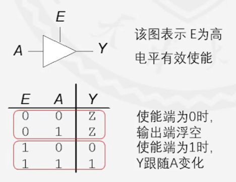

        -   E为0：Z浮空
        -   E为1：看A

## 卡诺图

-   消去
    -   相邻的只有一个变量不同，可以消去一个变量（物理相邻 + 对称相邻）
    -   四个相邻的可以消去两个变量（同一行或列 + 田）
    -   对于n个变量的：$2^i$ 个相邻的可以消去 $i$ 个
-   卡诺图化简
    1.  先圈孤立的1
    2.  质主蕴含项
    3.  剩下的，圈最大最少

## 组合逻辑电路设计

-   问题建模，确定输入和输出
-   真值表（无关项）
-   布尔表达式，画卡诺图
-   化简
-   原理图

## 组合逻辑模块

-   译码器

    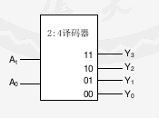

    -   n个输入，$2^n$ 个输出

    -   每一种输入对应某个特性的输出信号

    -   输出是独热的：同一时刻只能输出一个有效信号
        -   有效可以指高电平有效，也可以是低电平有效
        
    -   实现：两层逻辑（不非和非 + 与门）

        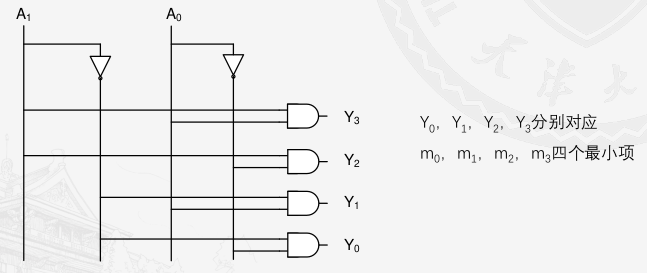

    -   用译码器实现复杂逻辑
        -   每个输入对应一个最小项
        -   译码器 + 或门
        
    -   8421BCD译码器：4输入，10输出

-   多路选择器（复用器，数据选择器）

    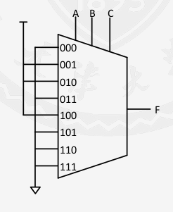

    -   从N个可能的输入中选择一个作为输出

    -   需要 $\log_2 N$ 位选择信号，根据选择信号选要哪个输入

    -   实现：4种方式

        -   门电路（真值表）

        -   三态门：N输入的选择器，使用N个三态门

        -   译码器

            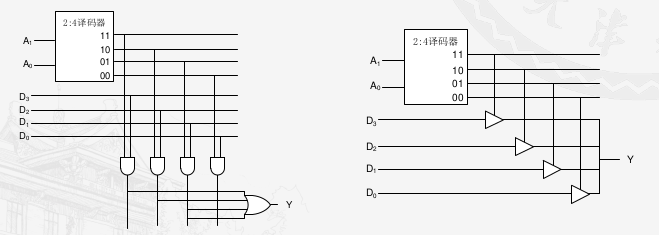

        -   多个更少输入的多路选择器

-   74系列继承电路芯片

    -   74LS138（3-8二进制译码器）

        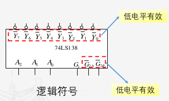

        -   使能端
            -   G1：是1时有效
            -   G2：都是0时有效
            -   Yn：输出中只有一个是0，其他都是1（低电平有效）
        -   实现复杂逻辑
            -   每个输入对应一个最小项的非
            -   74LS138 + 与门
            
            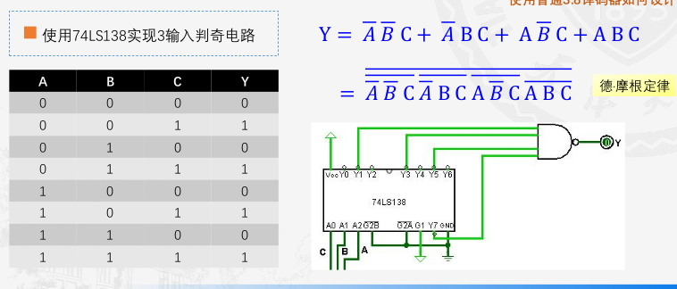

## 组合逻辑中的时序问题

-   传播延迟和最小延迟

    -   延迟：输出响应输入的改变需要一定时间

        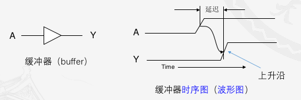

    -   传播延迟$t_{pd}$：输入改变直到一个或多个输出改变为最终值所经历的最长时间延迟

    -   最小延迟$t_{cd}$：输入发生变化直到任何一个输出开始改变的最短时间

    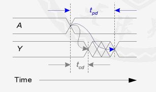

    -   关键路径：信号传输最慢的路径
    -   最短路径：信号通过最快的路径

    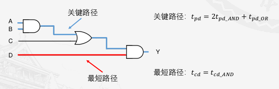

-   毛刺（冒险）：一个输入改变引起输出的多次变化

    -   原因：不同路径速度不同

    -   当信号变化 穿过卡诺图的 圈的时候

        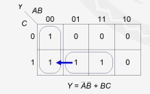

    -   避免毛刺：加冗余的圈

        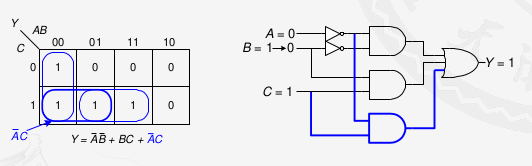

# 硬件描述语言HDL

## verilog基础

-   起源

    -   HDL：硬件描述语言
    -   信号连接，时序信息，抽象层次，并行特性
    -   verilog，systemverilog

-   综合与仿真

    -   逻辑综合

        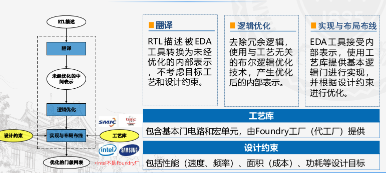

    -   仿真验证：测试程序，人工或自动判断输入的正确性

-   程序基本结构

    -   模块

        ```verilog
        module 模块名(端口1, 端口2);
        	端口类型说明;
        	内部变量说明;
        	逻辑功能，顺序任意
        endmodule
        ```

    -   声明部分

        -   端口定义4要素：方向，类型，位宽，名字

            ```verilog
            input/output 类型 <位宽> 名;
            input	logic	[15 : 0]	qwq;
            ```

        -   端口类型

            -   默认wire类型
            -   logic: reg类型的改进，编译器自动判断是wire还是reg
            -   输入端口：由wire和reg驱动
            -   输入端口类型只能是wire
            -   建议：输入端口用默认声明，输出端口声明为logic

        -   内部变量

            ```verilog
            类型 位宽 名;
            logic	[15 : 0]	qwq;
            ```

-   语法要素

    -   间隔符：`空格符\b, \t, \n, 换页符号`

    -   注释：和c一样

    -   标识符：c的标识符 + `$`，标识符开头要求和c一样

    -   关键字

    -   逻辑值

        | 逻辑值 |  逻辑状态  |
        | :----: | :--------: |
        |   0    |     0      |
        |   1    |     1      |
        |  x/X   | 不确定的值 |
        |  z/Z   |   高阻态   |

    -   常量

        -   整数型（只有这种可以综合）
            -   `<+/-><位宽>'<进制>数值`
            -   符号：负数按有符号补码处理
            -   如果是二进制，数值可以是0, 1, x, z
        -   实数型
        -   字符串型

    -   运算符

        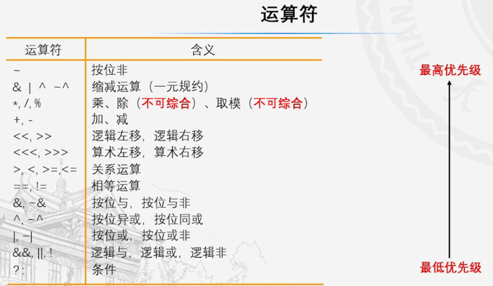

    -   位拼接和复制

        ```verilog
        {信号1[n:m], 信号2[a:b], n{信号3}}
        ```

## 数字逻辑电路建模方法

-   行为建模
    -   持续赋值语句：用于实现组合逻辑电路

        ```verilog
        assign <#延迟量> 信号名 = 表达式
        ```

        -   延迟量：赋值要多久之后(有无延迟量得到的电路完全相同，知识仿真结果不同)

    -   过程块语句

        ```verilog
        always_comb begin
        	过程赋值语句
        	高级语言结构：if等
        end
        ```

        -   过程赋值语句

            ```verilog
            <#延迟量> 信号名 = 表达式
            ```

            -   阻塞赋值：`=`：用于组合逻辑电路
            -   非阻塞赋值：`<=`：用于时序逻辑电路
                -   如果有多条阻塞赋值语句，前面的没赋值好后面的不会赋值

        -   高级语句结构

            -   控制：if, case
            -   循环
                -   for：没有自增运算符
                -   repeat：`repeat(循环次数) 语句块`
                -   while
                -   forever：`forever 语句块`

-   结构化建模
    -   模块实例化

        ```verilog
        模块名 实例名(接口);
        ```

-   参数化建模

    ```verilog
    `define 常量名 8			// 通常在模块外部，全局变量
    
    module 名 #(parameter 常量名 = 8) (
    	端口;	
    	);
        localparam OR   = 4'b0110;
        逻辑;
    endmodule
    ```

## 测试程序

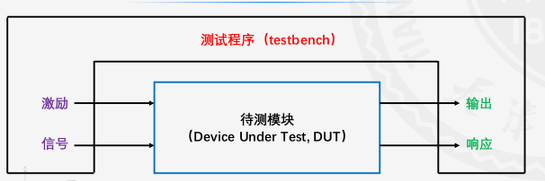

```verilog
module 名();
    信号定义;
    模块实例化;
    激励信号;
    显示输出;
endmodule
```

-   激励信号
    -   `initial`：线性激励
    -   `always`：循环激励
    -   文件
-   显示输出

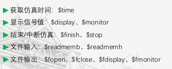

## 常见组合逻辑电路模块的设计

-   复用器（有一个使能端的多路选择器）
-   译码器和编码器（译码器的逆运算）
-   算术电路
    -   加法
        -   半加器：两输入AB，两输出S和Cout（和，进位）
        -   全加器：加了一个进位输入Cin
        -   多位加法器
            -   行波进位加法器（慢速）：N个全加器串联
            -   先行进位加法器（快速）
            -   前缀加法器（更快速）
    -   减法：a - b = a + (~b + 1)
    -   比较器
        -   相等比较器：异或 + 与
        -   量值比较器：计算A-B，然后看符号位
    -   算术逻辑单元ALU

## 逻辑阵列

-   `FPGA`：基于查找表的，而不是逻辑门的，组合逻辑电路的高度可重构阵列(直接存真值表)
-   结构
    -   CLB：可配置逻辑块
    -   BRAM：块存储器
    -   DCM：时钟管理单元
    -   专用IP：处理器，DSP模块，总线模块
    -   IOB：输入输出

# 时序逻辑电路

-   同步时序逻辑电路
    - 状态机：Moore，Mealy
    - 流水线：主要用于改善计算吞吐率
-   异步时序逻辑电路：状态改变不受统一时钟控制

## 锁存器和触发器

-   双稳态电路：两个门，互相激励

    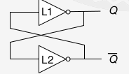

    -   可以存下两种状态
    -   但是没输入

-   SR锁存器

    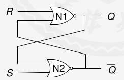

    |  S   |  R   |       Q        |
    | :--: | :--: | :------------: |
    |  1   |  0   |   置位：Q=1    |
    |  0   |  1   |   复位：Q=0    |
    |  0   |  0   |      Q=Q       |
    |  1   |  1   | 不允许，无意义 |

-   D锁存器

    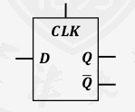

    - 时钟输入：CLK
    - 数据输入D

    | CLK  |  Q   |
    | :--: | :--: |
    |  1   | Q=D  |
    |  0   | Q=Q  |

    -   避免了SR锁存器里同时1的情况

    -   实现

        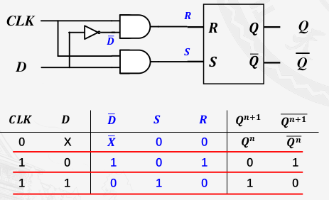

-   D触发器

    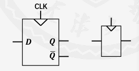

    |  CLK   |  Q   |
    | :----: | :--: |
    | 上升沿 | Q=D  |
    |  其他  | Q=Q  |

    -   带使能的D触发器：EN=0时，Q=Q

    -   带复位功能的D触发器：reset=1，Q=0；reset=0，触发器正常工作

        -   同步复位：只在CLK上升沿复位
        -   异步复位：任何时候都可以

    -   实现

        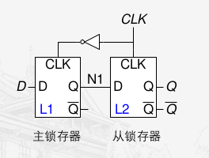

-   T触发器（CLK=1时）

    |  T   |  Q   |
    | :--: | :--: |
    |  0   | Q=D  |
    |  1   | Q=~D |

-   JK触发器（CLK=1时）

    |  J   |  K   |  Q   |
    | :--: | :--: | :--: |
    |  0   |  0   | Q=Q  |
    |  0   |  1   | Q=0  |
    |  1   |  0   | Q=1  |
    |  1   |  1   | Q=~Q |

-   寄存器

    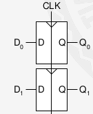

    -   一个N位的寄存器：一个共享的CLK + N个D触发器

## 同步逻辑设计

- 同步时序电路（状态同步于时钟信号）：在反馈电路中插入寄存器/触发器
    - 现态，次态（寄存器包含了系统的状态）
    - 组成规则
        - 电路中的模块：寄存器 or 组合逻辑电路
        - 至少有一个寄存器，所有寄存器都共用一个时钟信号
        - 如果有环路，上面至少有一个寄存器
    - 两类同步时序逻辑电路
        - 有限状态机FSM
        - 流水线
- 异步时序逻辑电路

## 有限状态机

-   分类
    -   Moore型：输出仅由当前时刻状态所决定
    -   Mealy型：输出有当前时刻状态和输入共同决定
-   有限状态机设计
    -   状态转换图
    -   状态转换表现态(状态 + 输入 + 次态) + 对状态编码（二进制/one-hot） + 次态方程
    -   输出表 + 对输出编码 + 输出方程
    -   原理图
-   由电路图导出状态机
    -   看电路，标明输入输出和状态位
    -   写次态和输出方程
    -   状态表 + 输出表
    -   简化状态表（删除不可达状态）
    -   反编码，重写状态表和输出表
    -   状态转换图
    -   描述功能

## 时序逻辑中的时序问题

-   动态约束：输入必须在时钟有效边沿附近的孔径时间内保持稳定（在时钟有效边沿到达 前，至少稳定$t_{setup}$，在时钟有效边沿到达 后，至少稳定$t_{hold}$）

    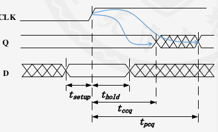

    -   目的：赋值Q的时候，保证D稳定了
    -   输入时序约束
        -   建立时间$t_{setup}$：时钟有效边沿到来 前 输入信号所需要的稳定时间
        -   保持时间$t_{hold}$：时钟有效边沿到来 后 输入信号所需要的稳定时间
        -   孔径时间$t_{a}=t_{setup}+t_{hold}$
    -   输出时序约束
        -   传播延迟$t_{pcq}$：时钟有效边沿到达后到𝑄 最终稳定 所需的最长时间
        -   最小延迟$t_{ccq}$：时钟有效边沿到达后到𝑄 开始改变 所需的最短时间

-   系统时序

    -   $T_c$：两个时钟上升沿之间的间隔，$f_c$：频率

    -   $t_{pcq}$：寄存器的传播延迟，$t_{pd}$：组合逻辑电路的传播延迟

    -   最小时钟周期（主频）：$$T_c>=t_{pcq}+t_{pd}+t_{setup}$$

    -   建立时间约束：$t_{pd}<=T_c-(t_{pcq}+t_{setup})$

        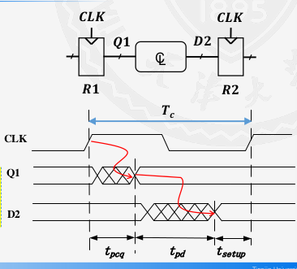

    -   保持时间约束：$t_{hold}<=t_{ccq}+t_{cd}$，$t_{cd}>=t_{hold}-t_{ccq}$

        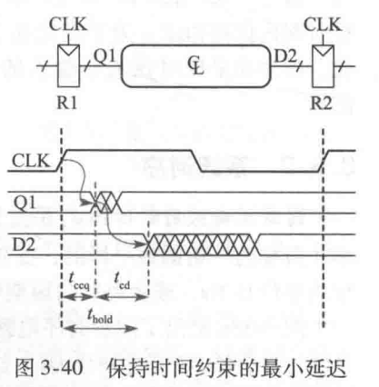

## 时序逻辑模块

-   计数器

    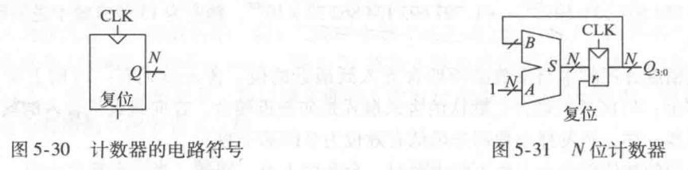

-   移位寄存器（串行到并行转换器）

    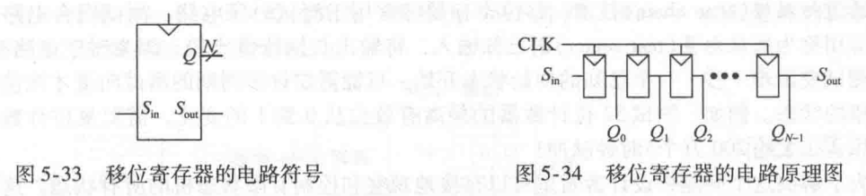

-   并行到串行转换器

    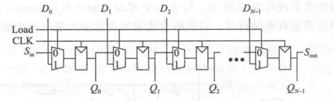

-   有限状态机建模：三段式
    -   状态转换（时序逻辑）
    -   次态计算（组合逻辑）
    -   输出逻辑（组合或时序）

## 存储器阵列

-   位单元：存储一位数据，与一个字线和一个位线相连

    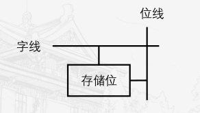

    -   写：先用字线选中存储位，然后用位线传输
    -   读：先用字线选中存储位，然后用位先传输读取的（字线为1的，位线是z）
    -   字线：与使能端类似，控制一行的读写

    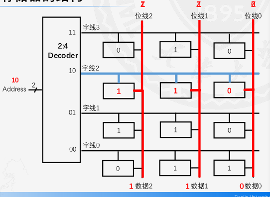

-   存储器的结构

    -   存储器分类

        -   随机访问存储器RAM(易失)

            -   DRAM 动态随机访问存储器：计算机的主存
            -   SRAM 静态随机访问存储器：CPU的高速缓存

            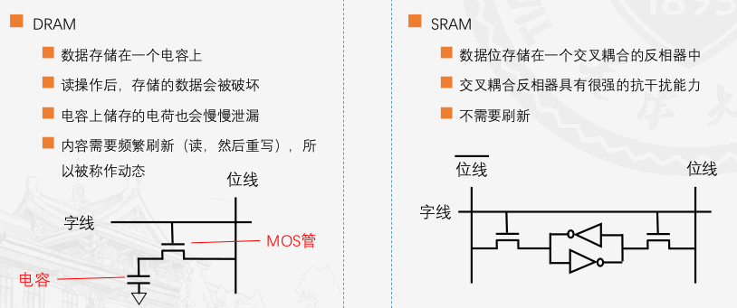

        -   只读存储器ROM(不易失，现在的ROM可以写)

            -   用晶体管的存在与否在存一位

                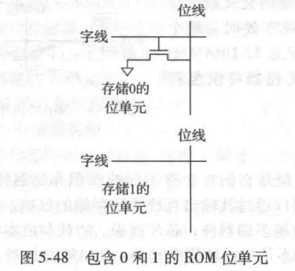

            -   可编程ROM

                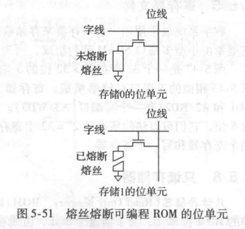

            -   可擦除PROM

    -   寄存器文件

        -   小型多端口SRAM阵列
        -   有两个读端口（A1/RD1和A2/RD2），一个写端口（A3/WD3）
        -   A：地址
        -   可以同时是读两个寄存器和写一个寄存器
        -   异步读，同步写

# 体系结构

## 汇编

-   指令
    
    -   加法：`add a, b, c`，`a = b + c`
    -   减法：`sub a, b, c`，`a = b - c`
    
-   操作数
    -   寄存器
    
        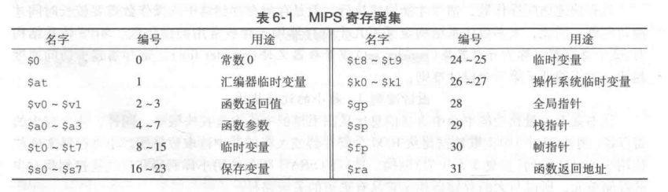
    
    -   存储器
        -   存储器地址32位，字的长度也是32位
        -   大端小端
        -   读：`lw $s3 1($0)`
        -   写：`sw $s7 5($0)`
        
        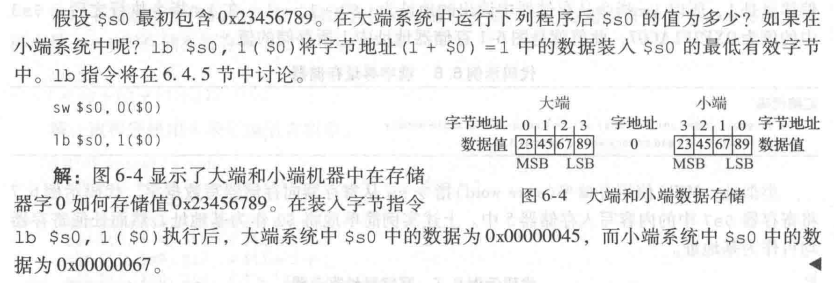
        
    -   常数
    
        -   加法：`addi $s0, $0, 4`，`a = a + 4`
        -   减法：`addi $1, $0, -12`，`b = a - 12`

## 机器语言

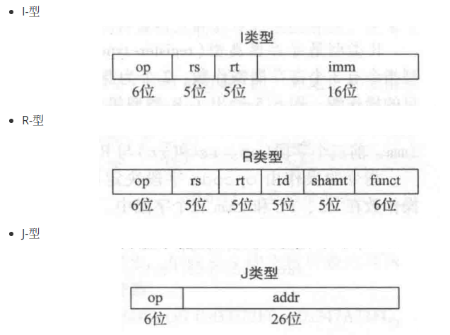

## 编程

-   算术/逻辑指令：逻辑指令，移位指令，生成常数，乘法和除法指令
-   分支：条件分支(beq, bne)，跳转指令(jump)
-   条件语句：if, case如何实现
-   循环：while, for如何实现，量值比较
-   数组
-   函数
    -   调用：`jal`；返回`jr`
    -   参数：`$a0~$a3`
    -   返回值：`$v0~$v1`
    -   栈
    -   受保护寄存器
    -   附加参数和局部变量

## 寻址方式

-   寄存器寻址
-   立即数寻址
-   基地址寻址
-   PC相对寻址（条件分支：使用PC相对寻址确定PC的新值）
-   伪直接寻址（J型）
