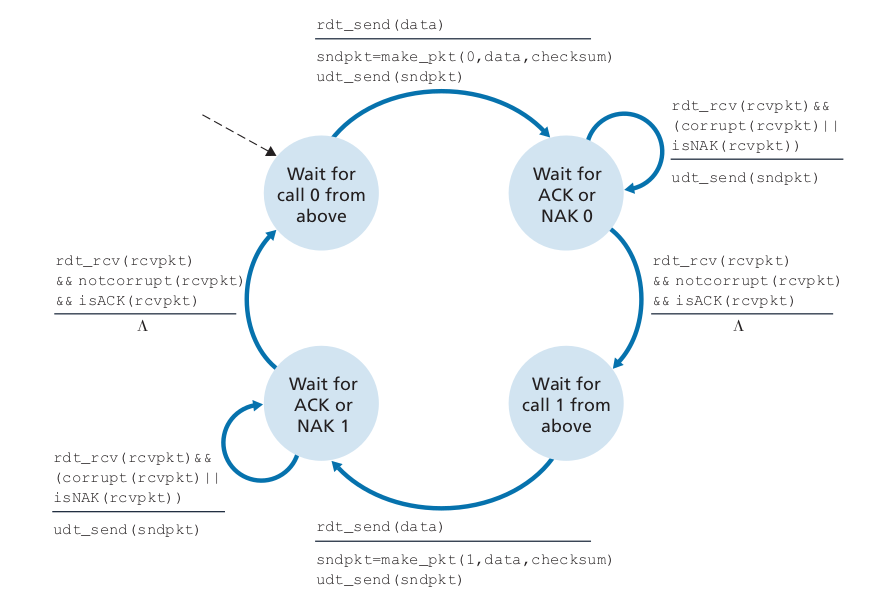
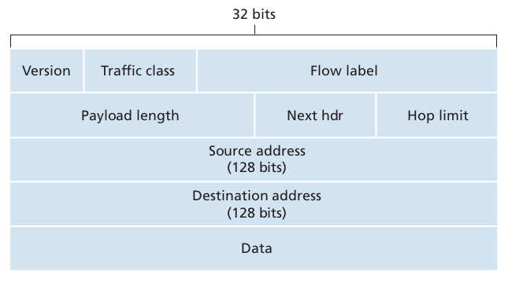

压力测试网址: https://locust.io/

# 绪论

-   Computer Network VS Internet
-   Internet构成
    -   协议protocol：TCP连接请求 + 回应 + get + return

## 网络边缘

-   网络边缘 Network edge
    -   hosts 主机
    -   servers 服务器
-   接入点 access networks：路由器
-   网络核心 Network core：ISP：Internet Service Provider
-   host发数据包
    -   取信息
    -   分成小的数据块packets
    -   发包
-   数据 switch 方式
    -   电路交换：早期
        -   实现：信道划分
            -   FDM频率划分，将带宽划分为多份（从而每个用户性能降低）
            -   TDM时间划分：并发
    -   分组交换：共享
        -   实现：交换机先储存，然后发送

## internet结构


-   ISP（Internet Service Provider）：中心
-   IXP（Internet Exchange Point）：各个中心数据交汇的地方
-   用户

## 网络性能

-   packets queue：交换机比包来的慢时，产生packets queue

-   packets loss：交换机满了or服务器or等

-   总时延 $d_{nodal} = d_{proc} + d_{queue} + d_{trans} +d_{prop} $

    -   $d_{proc}$：处理时延 switch delats：检查错误，决定从哪里出去
    -   $d_{queue}$：排队时延 queuing delays
    -   $d_{trans} = L/R$ ：传输时延，发生在交换机处理速度。L：包长度；R：link transmission
    -   $d_{prop} = d/s $：传播时延：发生在交换机到交换机的传播。d：物理距离；s：传播速度propagation spead

-   流量强度 = $L*a / R$

    -   a：到达率
    -   R：传输速率
    -   接近0：排队延迟小
    -   接近1：排队延迟大
    -   大于1：

-   Troughput

    

## 安全

## 协议

-   应用层 application：http, IMAP, SMTP, DNS
-   传输层 transport：TCP, UDP
-   网络层 network：IP, routing protocols
-   链路层 link：Ethernet以太网, 802.11(WiFi), PPP
-   物理层 physical

## 历史

# 应用层

## 网络应用原则

-   应用模式
    -   Client-server paradigm 客户-服务器模式
        -   服务器：总是在线，固定IP，中心化
        -   客户
    -   Peer-Peer architecture P2P模式：没有总是在线的server
    
-   进程通信
    -   Sockets 套接字：两台主机上的进程通信
    -   Addressing processes 进程寻址：IP + port
    
-   应用层协议 需要定义: 
    -   交换的消息 的 类型
    -   message syntax 消息语法
    -   message semantics 消息语义
    -   规则
    
-   传输服务要求
    -   可靠数据传输
    -   定时
    -   吞吐量 throughput
    -   安全性
    
-   传输协议服务

    |                 TCP                  |    UDP     |
    | :----------------------------------: | :--------: |
    |                 可靠                 |   不可靠   |
    |    流控制(接收端不会被发送端淹没)    |   不提供   |
    |        拥塞控制(当网络拥堵时)        |   不提供   |
    |               面向连接               |            |
    | 不提供: 定时，最小化吞吐量保证，安全 | 也都不提供 |

## Web & HTTP

-   网址
    -    由 objects 组成
    -   hostname + pathname
    
-   HTTP: 超文本传输协议

    -   用TCP
    -   无状态：不保存客户的任何信息系统
    -   RTT：包从客户端到服务器再返回的时间

    -   两种类型

        -   非持续性：最多传输一个object通过TCP
            1.  HTTP客户端 启动对 HTTP服务端 的TCP连接
            2.  服务端接受连接，通知客户端
            3.  客户端发送HTTP请求 (包含url)
            4.  服务端接受请求，形成响应信息
            5.  服务端关闭TCP连接
            6.  客户端接受响应并解析

        -   持续性：TCP连接打开后，可以传很多object，然后再关闭

-   HTTP报文

    -   请求报文(CR 回车 LF 换行)

        

        -   请求行
            -   method: GET, POST, HEAD, PUT, DELETE
            -   url
            -   version
        -   首部行
            -   首部字段名 + 值

    -   响应报文

        

        -   statue codes: 200OK, 301, 400, 404, 505HTTP版本不支持

-   cookies: 保持 用户/服务器 状态

    -   4个组件
        -   响应报文有一个cookie首部行
        -   请求报文也有
        -   用户端保留一个cookie文件，由浏览器管理
        -   web站点的一个后端数据库

-   Web caches (web缓存器 / 代理服务器)
    -   client 和 server之间加一个 Web cache
    -   请求步骤
        -   客户端向 代理 创建TCP连接，发送HTTP请求
        -   代理进行检查，查看是否存储了该对象副本，如果有返回
        -   如果没有，向初始服务器请求
    -   Conditional GET：缓存问server有没有变
        -   缓存器发送的里面有一个首部行: If-modified-since，值是上次修改的日期
        -   如果修改了，服务器发送对象
        -   如果没修改，服务器发送一个空body的响应

## E-mail & SMTP/IMAP

-   成分
    -   用户代理 user agents
    -   邮件服务器 mail servers
    -   简单邮件传输协议 SMTP
    
-   过程

    -   发送: 发送方的用户代理 -> 发送方的邮件服务器 -> 接受方的邮件服务器 -> 接受方的邮箱
        -   如果发送方服务器不能成功交付，会放在**报文队列**，一直尝试，如果一直不行，就丢弃并通知发送方
    -   读取: 邮件服务器识别用户，然后给接收方

-   SMIP

    -   基于TCP的 持续连接
    -   推协议
    -   要求body是7比特ASCII码(需要编码)，而且所有报文对象都放在一个报文里
    -   基本操作
        -   发送方 调用 邮件代理程序，指示用户代理，发送报文
        -   发送方的用户代理 -> 发送方的邮件服务器，被放在报文队列
        -   发送方的邮件服务器发现了 报文队列 中的这个报文，创建一个到接收方邮件服务器的TCP连接
        -   经过一些SMTP握手后，发送报文
        -   接收端服务器接受报文，然后放入接受方的邮箱
        -   接收方调用用户代理阅读报文
    -   不使用中间邮件服务器

    -   报文格式

        -   首部

            |  首部内容  |  意义  |
            | :--------: | :----: |
            | From首部行 | 必须有 |
            |     To     | 必须有 |
            |  Subject   |        |

        -   body

-   邮件访问协议

    -   SMIP是一个推协议，不能用于邮件访问 (代理和服务器的分离)
    -   POP3
        -   authorization: 用用户名和密码鉴定
            -   用户发送命令后，服务器有两种回应: +OK, -ERR
            -   主要命令
                -   user 用户名
                -   pass 密码
        -   事务处理: 用户代理取回报文，对报文做删除标记，取消报文删除标记等
            -   主要命令
                -   list
                -   retr
                -   dele
        -   更新: 客户发送quit命令后，结束POP3会话，此时，邮件服务器删除被标记删除的邮件
    -   IMAP
        -   虽然POP3文件在服务器上，但是文件夹在本地
        -   IMAP把每个报文和一个文件夹联系起来
    -   HTTP

## DNS

-   是应用层协议

    -   使用客户-服务器模型，运行在通信的端到端之间
    -   使用端到端运输协议来传送DNS报文

-   提供的服务

    -   在UDP上，53端口

    -   主机名->IP地址 步骤

        -   浏览器从url中抽取主机名，传给DNS客户端
        -   DNS客户端向DNS服务器发送包含主机名的一个请求
        -   DNS客户端收到IP地址
        -   浏览器访问

    -   额外服务

        -   主机别名
        -   邮件服务器别名
        -   负载分配：多个服务器有相同的别名

-   DNS域名系统是

    -   一个分层的DNS服务器实现的分布式数据库

        

        -   结构

            -   Root name servers: 13个逻辑 root name servers
            -   Top level Domain servers (TLD sever)
            -   authoritative DNS servers

        -   查询方式

            -   还有一类重要的DNS服务器: **本地DNS服务器**（也是服务器，不在真的本地）
        
            -   迭代查询
        
                
        
            -   递归查询
        
                
        
            -   实践中，同上面的第一个图，即: 从主机到local DNS server是递归的，其他的是迭代的
        
    -   一个使得主机能够查询的应用层协议
    
-   DNS 缓存
    -   本地服务器可以缓存一些IP地址
    -   本地服务器也可以缓存一些TLD服务器的IP地址 (绕过rootDNS服务器)
    -   TTL：缓存经过一段时间后失效（一般为2天）

-   DNS 记录

    -   DNS服务器存储了 **资源记录**(RR)，RR提供了主机名到IP的映射
    -   **资源记录四元组**
        -   `(name, value, type, TTL)`
        -   `type=A`：`name`是hostname, `value`是ip
        -   `type=NS`：`name`是域名，`value`是能够查询这个域下的权威DNS服务器的hostname
        -   `type=CHAME`：`name`是别名，`value`是真名(规范主机名)
        -   `type=MX`：`name`是邮件服务器，`value`是规范主机名
    -   向DNS数据库中插入记录: 注册登记机构
    
-   DNS报文

    -   查询和响应报文格式相同

    

    -   首部区域 (前12字节)
        -   标识符 identification: 标识该查询(匹配请求和回答)
        -   标志 flags
            -   查询/回答标志位: 0查询报文，1回答报文
            -   权威标志为: 查询的主机名是权威服务器时，回答报文中置1
            -   希望递归标志位: 查询报文中置1
            -   递归可用标志位: 回答报文中置1
    -   问题区域: 名字字段(主机名) + 类型字段(查询类型A or MX...)
    -   回答区域: 资源记录RR，可能有多条(一个主机名多个IP)
    -   权威区域: 其他权威服务器的记录
    -   附加区域: 可能有帮助的记录，如查询MX时，也回答了A

-   **nslookup**命令可以查询DNS

-   DNS 安全
    -   DDoS 攻击
        -   向每个rootDNS服务器发送大量分组，使大多数合法DNS请求得不到回答(但是有分组过滤保护，而且大部分DNS请求绕过了rootDNS服务器)
        -   向TLD发送大量分组
    -   Spoofing 攻击: 拦截DNS请求，返回假回答

## P2P应用

-   几个概念
    -   $u_s$: 服务器接入链路的上载速率
    -   $u_i$: 第i对等方接入链路的上载速率
    -   $d_i$: 第i对等方接入链路的下载速率
    -   $F$: 文件长度
    -   $N$: 要获得该文件副本的对等方的数量
    -   分发时间: 所有$N$个对等方得到该文件副本需要的时间
-   客户-服务器结构的分发时间$D_{cs}$
    -   $D_{cs} \geq max\{\frac{NF}{u_s},\frac{F}{d_{min}}\}$
-   P2P模式的分发时间$D_{P2P}$
    -   $D_{cs} \geq max\{\frac{F}{u_s},\frac{F}{d_{min}},\frac{NF}{u_s+\sum_{i=1}^Nu_i}\}$
    -   第三项为系统总文件量 / 总文件上传速率
-   然后上面的$\geq$变成=
-   BitTorrent协议

# 传输层

-   提供服务: 进程之间网络通信
    -   实现在端系统中，而不是路由器
    -   传输信息单位：segments 报文段

-   报文

    

-   套接字

    -   无连接的多路复用和多路分解: UDP套接字，用一个二元组 (目的IP, 目的端口号) 唯一标识
    -   面向连接的多路复用和多路分解: TCP套接字，用一个四元组 (源IP地址, 源端口号, 目的IP地址, 目的端口号) 唯一标识

-   多路复用和多路分解 (运输层协议至少要提供的服务)

    ```mermaid
    graph LR;
    	1(网络层)
    	2(套接字)
        1 -- 多路分解 --> 2;
        2 -- 多路复用 --> 1;
    ```

    -   多路复用: 发送端，主机从不同套接字中收集数据块，并封装上首部信息(用于分解)，交给网络
    -   多路分解: 接受端，将运输层报文段中的数据交给正确的套接字

-   端口扫描: nmap

-   web服务器和TCP: 通常并非一个进程对应一个套接字，可以让客户连接线程

## UDP协议

-   无连接的 (发送报文前，不会握手)

-   特点

    -   不可靠，不按顺序传输，只是对"best-effort" IP的一个包装
    -   延迟和带宽不能保证

-   许多应用适合UDP的原因

    -   发送数据以及何时发送的控制更精细 (无拥塞控制)
    -   不需要连接建立
    -   无连接状态
    -   分组首部开销小 (8字节)

-   报文

    

    -   length: 首部 + 数据
    -   checksum
        -   发送方制作: 数据每16bit 求和 (回卷，环形溢出)，然后对和求反码
        -   接收方检验: 把数据没16bit求和，然后+checksum，如果都是1则正确

## 可靠数据传输

-   经典可靠数据传输RDT

    -   rdt1.0 经完全可靠信道的可靠数据传输

        

    -   经过有比特差错信道的可靠数据传输

        -   自动重传请求(ARQ)协议: 基于肯定确认和否定确认的协议

            -   差错检测: checksum
            -   接收方反馈: 用1bit，ACK 1, NAK 0
            -   重传

        -   RDT2.0

            

            -   但是，RDT2.0，不能解决ACK包出错的问题
            -   这样的协议被称为 **停等协议** stop-and-wait

        -   RDT2.1

            -   解决ACK包出错的方式
                -   对数据分组进行编号
                -   但是这里没有对ACK和NAK编号
            -   差错检测: NCK, 冗余ACK

            

            

        -   RDT2.2: 与RDT2.1的唯一区别就是，把ACK编号，用错误编号的ACK代替NCK

    -   RDT3.0: 经有比特差错的丢包信道的可靠数据传输

        -   比特交替协议ABP: 分组的序号在0和1之间交替
        -   实现
            -   计时器: 如果时间到了没收到ACK，计时器中断，重新发
            -   RDT2.1已经可以处理冗余分组

        

-   并行RDT协议 (流水线可靠数据传输协议)

    -   RTT3.0性能分析

        -   大部分时间都在传播，停等很慢
        -   $RTT$: 端到端传播延迟
        -   $R$: 发送速率
        -   $L$: 分组长度
        -   $t_{trans} = \frac LR$: 分组进入链路需要的时间
        -   停等协议的发送方利用率: $U_{sender}=\frac{L/R}{RTT+L/R}$

    -   实现流水线需要: 增加序号范围，需要缓存分组

    -   Go-Back-N: 回退N步 GBN
    
        -   序号范围
    
        -   维护一个window
    
            
    
            -   已发没确认 + 发了没确认 + 没发
            -   窗口不断右移

        -   发送方利用率: $U_{sender}=\frac{N*L/R}{RTT+L/R}$
    
        -   对几种事件的响应
    
            -   上层调用
                -   如果满了，不发
                -   如果没满，如果这是目前窗口第一个包，开始计时器，然后发送，nextseqnum++
            -   收到一个ACK: 如果全收完了，停止计时；否则，重新开始计时
            -   超时: 重新发送窗口内的所有分组，然后重新开始计时
    
    -   SR: 选择重传
    
        -   发送方
            -   计时器成了一个分组有一个逻辑计时器，因为超时后只发一个分组
            -   收到ACK后，如果ACK的那个分组序号是base，窗口向右移动到最小序号的没确认的分组处
        -   接受方
            -   如果发来rcv_base左边的分组(已经有确认过的)，给发送方发一个ACK
            -   如果发来rcv_base右边的分组，发送相应的ACK，如果失序，则缓存；如果顺序好了，一起交付给上层

## TCP

-   特点
    -   可靠，按顺序传输
    -   面向连接 (需要三次握手)
    -   拥塞控制
    -   流量控制
    -   延迟和带宽不能保证
    -   分组首部开销大 (20字节)

-   最大报文段长度: MSS (应用层数据的最大长度): 一般根据 最大链路层帧长度 (最大传输单元) MTU来设置

-   报文

    

    -   序号，确认号: 用于实现可靠数据传输
    
        -   序号
    
            
    
            -   对应报文段首字节的字节流编号 (即序号建立在 字节流 上)
    
        -   确认号
    
            -   主机A填入的确认号 = 主机A **期望** 从 对方收到的下一个字节的序号
            -   累计确认，捎带确认
    
    -   16bit接收窗口字段 rwnd: 用于流量控制
    
    -   4bit首部长度: 没有选项字段的话，是20B，所以是可变的
    
    -   选项字段
    
    -   6bit标志字段
        
        -   ACK
        -   RST, SYN, FIN: 用于连接建立和拆除
        -   PSH: 被置位时，指示接收方应该将数据交给上层
        -   URG: 指示这是紧急数据
    
-   往返时间的估计与超时

    -   **估计往返时间**
        -   SampleRTT: 样本RTT (只抽样那些一遍就传输成功的报文)
        -   EstimatedRTT: 维护的样本RTT均值
        -   更新: EstimatedRTT = (1 - a) \* EstimatedRTT + a \* SampleRTT (a通常取0.125) (这种更新通常称为 指数加权移动平均)
        -   测量RTT的变化: DevRTT = (1 - β)  \* DevRTT + β \* |sampleRTT - EstimatedRTT| (β通常取0.25)
    -   **设置和管理超时重传间隔**
        -   TimeoutInterval = EstimatedRTT + 4 \* DevRTT
        -   推荐初始为1s，出现超时就加倍，然后只要成功收到了，就用上面的公式
    
-   **快速重传**: 一旦收到3个冗余ACK，就重新传 (不等超时了)

-   **流量控制**

    -   目的: 接受方有缓存，防止接受方缓存溢出 (发的太快，接收方读取慢)

    -   发送方维护一个接受窗口

        

        -   LastByteRead: 主机B从缓存中读出的数据流的最后一个字节的编号
        -   LastByteRcvd: 从网络中到达并已经进入B的缓存的最后一个字节的编号
        -   接收窗口 rwnd = RcvBuffer - ( LastByteRcvd - LastByteRead )
        -   流量控制: 发送方的LastByteSent - LastByteAcked <= rwnd

-   **连接管理**

    -   建立连接
        -   客户端发送一个 SYN报文段
            -   不包含应用层数据
            -   SYN置1
            -   随机选一个初始序号
        -   服务器响应一个 SYNACK报文段
            -   服务器分配TCP缓存和变量
            -   SYN置1
            -   确认号为发送端的初始序号+1
            -   服务器也弄一个初始序号
        -   客户端响应
            -   客户端分配缓存和变量
            -   发送另一个报文段
            -   SYN置0
            -   而且可以有应用层数据了

## 拥塞控制

不同于流量控制，说的是因为IP网络拥塞的控制

-   拥塞原因
-   拥塞控制方法
    -   端到端拥塞控制
    -   网络辅助的拥塞控制
-   TCP拥塞控制
    -   拥塞窗口 cwnd
    -   LastByteSent - LastByteAcked <= {cwnd, rwnd}
    -   **慢启动**
        -   cwnd初始设置为一个MSS的较小值，因而初始发送速率大约只有MSS/RTT
        -   每过一个RTT，发送速率翻倍
        -   当出现超时丢包事件时，TCP发送方将cwnd设置为1，把ssthresh设置为cwnd/2，重新开始慢启动，当慢启动到ssthresh时，就停止，转移到拥塞避免模式
        -   当出现快速重传时，进入快速恢复状态
    -   **拥塞避免**: 每个RTT只将cwnd的值增加一个MSS (线性增长)
    -   **快速恢复**: ssthresh = cwnd / 2; cwnd = ssthreash + 冗余ACK数量 * MSS，进入拥塞避免模式

# 网络层

主机之间网络通信

-   网络层的两个重要功能
    -   转发: 一个分组进入路由器输入链路后，路由器需要移动到适当的输出链路，在数据平面唯一实现的功能
    -   路由选择: 决定分组采用的路径，在控制平面实现
-   尽力而为服务

## 数据平面

### 路由器内部结构


-   基本结构
    -   输入端口
        -   左边第一个方框: 终结物理链路的物理层功能
        -   第二个方框: 与入链路远端的数据链路层交互，执行数据链路层功能
        -   第三个方框: **查找功能**，通过查询**转发表**决定输出端口
    -   交换结构: 分组通过中间的交换结构转发到输出端口
    -   输出端口
    -   路由选择处理器: 执行控制平面功能。在传统路由器中，执行路由选择协议，计算转发表；在SDN路由器中，负责与远程控制器通信

-   输入端口处理和基于目的地转发

    

    -   线路端接
    -   数据链路处理 (协议，拆封)
    -   查找，转发，排队
        -   查找: 看转发表，**最长前缀匹配规则**
            -   **转发表**: 存 IP前缀匹配 + 链路端口
        -   排队: 一旦查找到了，就可以进入交换结构，但是，有时需要排队

-   交换，有多种方式

    -   经内存交换: 分组从输入端口复制到内存中，路由选择处理器从首部提取目的地址，然后复制到输出端口的缓存中
    -   经总线交换: 经一根共享总线将分组直接传送给输出端口
    -   经互联网络交换: 使用一个更加复杂的互联网络

-   输出端口处理

    

    -   排队(缓存管理): 如果缓存满了，会丢包
        -   分组调度: 排队的分组如何经过: ①先进先出FIFO，优先级排队，循环排队规则，加权公平排队
    -   数据链路处理 (协议，封装)
    -   线路端接

### IP协议

-   IPv4格式

    

    -   版本，首部长度(无选项的20B)，服务类型，数据报长度(首部+数据)
    -   标识，标志，片偏移(而IPv6不允许路由器上对分组分片)
    -   寿命TTL: 确保数据报不会永远在网络中循环，每经过一个路由器，寿命减1
    -   协议: 到达目的地时才用，要交付给运输层哪个协议
    -   首部检验和: 每两个字节当一个数，求和后求反码 (只对首部)
    -   源和目标IP
    -   选项
    -   数据 (运输层报文)

-   IPv4数据报分片

    -   MTU 最大传送单元: 一个链路层帧能承载的最大数据量
    -   当数据报比MTU大时，分片fragment
    -   为了减小复杂性和对路由器性能的影响，对片的重新组装工作交给端系统 (通过将标识，标志和片偏移字段)
        -   标识: 一个数据报一个标识(发送主机给的，逐渐+1，分片的片的标识是一样的)
        -   标志: 最后一个片标志为0，其他为1
        -   偏移字段: 用于让目的主机确认是否丢了一个片

-   IPv4编址

    -   点分十进制记法
    -   **CIDR**: 无类别域间路由选择: 给子网分配空间
    -   **子网**(主机接口 + 路由器接口)，子网掩码: 223.1.1.0/24 (标识最左侧24位定义了子网地址)
    -   一个路由器接口有一个IP，主机有一个IP
    -   **设备获取地址 DHCP**
        -   获取一块地址: 为一个子网获取一块IP地址
        -   获取主机地址: 动态主机配置协议DHCP: 允许主机自动获取一个IP地址 (每个子网中需要有一个DHCP服务器，或DHCP中继代理)
            -   步骤如下
                -   主机发现一个DHCP，可以通过**DHCP发现报文**(目的地址为广播地址，源地址为0.0.0.0) 来实现
                -   DHCP服务器发送**DHCP提供报文**(目的地址为广播地址)
                -   DHCP请求: 客户从一个或多个服务器中选择一个，并向选中的的服务器发送**DHCP请求报文**
                -   DHCP ACK: 服务器用**DHCP ACK报文**对DHCP请求报文响应
            -   DHCP的问题: 节点在子网间移动时，一旦到新子网，就会得到新的IP，就不能维持远程的TCP连接

-   网络地址翻译NAT

    -   NAT路由器 对外界 就如同一个具有单一IP地址的单一设备
    -   **NAT转换表**: WAN端的IP和端口 (共有) + LAN端的IP和端口 (私有)
    -   外界发送来数据后，路由器通过NAT转发表，将公网IP和端口重写

-   IPv6

    -   IPv6报文

        

        -   40B定长首部
        -   版本，流量类型，流标签 (20bit，用于标识一条数据报的流，对一条流中的某些数据给优先权)
        -   有效载荷长度: 16bit无符号整数，首部后面的字节数量
        -   下一个首部: 要给那个运输层协议
        -   跳限制: 类似寿命
        -   更大的地址容量128bit

    -   对比IPv4的几个消失的字段

        -   分片: 不让路由器分片，只能在源和目的执行 (如果太大，路由器直接丢，然后给发送方发送一个"分组太大"的ICMP)
        -   首部检验和 (①多余功能，②每次TTL要变，就需要重新计算，慢)
        -   选项

    -   IPv4到6的迁移: 隧道: 将一个IPv6的数据报放在一个IPv4的数据报里发送

-   通用转发和SDN

## 控制平面

-   传统路由选择: 每路由器控制

    

-   SDN控制器: 逻辑集中式控制

    

### 路由选择算法

-   **链路状态路由选择算法**LS

    `Dijkstra`算法

    -   数据结构
        -   `D(v)`：当前，源点 -> v的最小lost
        -   `p(v)`：从源 -> v沿着最小lost路径的前一结点
        -   `N'`：结点子集
    -   思路
        -   找不在`N'`中的，`D`最小的，加入`N'`，并更新

-   **距离向量算法**DV
    
    -   **路由选择表**: 一行是自己和邻居的一个距离向量
    -   特点
        -   好消息传播快
        -   坏消息传的慢: 其他的间接路线是一点一点变大(可能出现振荡)

### internet路由协议

-   自治系统 AS: 自治系统，一个ISP中的路由器以及互联他们的链路

-   自治系统内部路由选择

    -   OSPF 开放最短路优先：用链路状态协议
        -   每个路由器都有整个AS的完整图，运行Dijkstra算法，以确定以自身为根节点到所有子网的最短路径图
        -   安全: 能够鉴别OSPF路由器之间的交换 (OSPF报文用MD5)
        -   多条相同开销的路径
        -   对单播与多播路由选择的综合支持
        -   支持在单个AS中的层次结构
            -   一个AS能分成多个区域，每个区域运行自己的OSPF链路状态路由选择算法
            -   区域内，路由器互相广播链路状态
            -   AS中，只有一个OSPF区域配置成主干区域，主干区域包括: 所有区域边界路由器 + 可能的一些非边界路由器
            -   跨区域的路由选择: 先到区域边界路由器，然后通过主干区域到目的区域，再到目的地
    -   RIP: 距离向量

-   AS外部通信(必须要求运行相同的AS间路由选择协议): BGP ：边界网关协议

    -   功能
        -   从邻居AS获得前缀的可达性信息
        -   确定到该前缀的最好路由
    -   网关路由器: eBGP连接
    -   内部路由器: iBGP连接
    -   BGP中，分组不说到一个具体的IP地址，而是到一个前缀。转发表项: (x, I)，x是一个IP前缀，I是该路由器接口之一的接口号

    -   BGP属性: 当路由器通过BGP连接通告前缀时，在前缀中包括一些属性
        -   AS-PATH：要经过的路径
        -   NEXT-HOP：AS-PATH起始的路由器接口的IP地址
        -   本地偏好
    -   传递过程
        -   BGP协议负责AS间路由信息的更新
        -   AS之间根据BGP更新路由信息，边界路由使用eBGP，内部使用iBGP
        -   AS内部路由转发使用OSPF协议
    -   热土豆路由: 选择到NETX-HOP开销最小的路由 (尽快地把热土豆送出去)
    -   路由选择算法: 现代BGP策略
        + 首选本地偏好
        + 如果有一样的，其次最短AS-PATH：距离向量算法(最少的AS跳数)
        + 其次热土豆
        + 其次其他

-   SDN 软件定义网络
    -   链路状态路由选择算法
    -   架构
        -   控制应用
        -   SDN
            -   与控制应用的接口（北向接口）
            -   网络范围状态管理层
            -   通信层（南向接口）（OpenFlow协议）
        -   数字平面：路由器
    
-   开源的控制器: ODL，ONOS

### ICMP: 因特网控制报文协议

-   传输层协议，但是通常被认为是IP协议的一部分
-   功能: 主机和路由器用来彼此沟通网络层信息

-   `ping`: 发送一个ICMP类型8编码0的报文(看到回显请求)给目的主机，目的主机发回一个类型0编码0的ICMP回显回答
-   源抑制报文: ICMP类型4编码0: 拥塞控制，但是现在很少用了
-   `traceroute`: 测到目标主机的路由器数量和标识，以及两台主机之间的往返时延
    -   向目标主机发送一系列普通的IP数据报，里面都是UDP报文，都是到一个不可达的端口号
    -   这些报文的TTL，从1开始，逐渐+1
    -   当TTL是n的报文到达第n台路由器时，刚好过期，被丢弃，此时，路由器回给源主机发送一个ICMP警告报文(类型11编码0)，该报文包含了路由器的名字和其IP地址
    -   到TTL是m的报文到达目的地时，由于端口不可达，所以返回一个端口不可达ICMP报文(类型3编码3)，主机收到后，停止发送探测分组

# 链路层和局域网

-   物理上连接的两个结点的传输
-   一些概念
    -   nodes：运行链路层协议的任何设备，主机、路由器、交换机等
    -   links 链路: 连接相邻结点的通信信道
    -   fframe 链路层帧：这一层的数据包
-   服务
    -   成帧
    -   链路接入: 媒体访问控制协议MAC规定了帧在链路上传输的规则
    -   可靠交付: 保证无差错地经过链路层移动每个网络层数据报，通过确认和重传实现
    -   flow控制
    -   错误检测，错误恢复
    -   工作方式：半buplex，全buplex
-   在网络适配器 / 网卡NIC 实现

## 差错检测

EDC：差错检验和修正比特

-   奇偶校验: 单个奇偶校验，二维奇偶校验(前向纠错)
-   检验和
-   循环冗余检测

## MAC协议

-   两种类型的链路

    -   点对点链路
    -   广播链路

-   多路访问协议MAC

    -   冲突：2个或更多结点同时传送

    -   信道划分协议

        -   TDM 时分多路复用: 将时间划分为时间帧，并进一步分为多个时隙

            

            每个时隙分给N个结点中的一个，每个节点在自己的时隙内传输分组比特

        -   FDM 频分多路复用

            

        -   CDMA 码分多址: 给每个结点分配一种不同的编码

    -   随机接入协议

        -   特点: 每个节点都直接按最大速率发；如果同时发送，检测冲突，并恢复
        -   Slotted ALOHA 时隙ALOHA
            -   强假设：①所有帧大小相同，②时间划分，③每个划分正好传输一个帧，④结点正好在每个时间片开始传输，⑤结点同步，⑥结点能检测碰撞
            -   操作: 如果没有冲突，直接发；如果有冲突，在下一个时间片里，以概率p，重新传
        -   Pure ALOHA
            -   不要求节点都是同时传输
            -   当一个帧首次到达，结点立刻传输到广播信道
            -   如果与其他帧碰撞，这个节点在完全传输完它的碰撞帧之后，立即以概率p重传该帧，否则等待一个帧传输时间，然后再以概率p发
        -   CSMA 载波侦听多路访问: 载波侦听：传输前先听信道，等空闲了（但是有信道传播时延，所以不能避免碰撞）
        -   CSMA / CD 具有碰撞检测的CSMA
            -   碰撞检测：传输时一直侦听该信道，如果有另一结点正在传输，随机等待一段时间
                -   二进制指数后退：n次碰撞后，随机从[0, 2^n - 1]中选择一个K
            -   CSMA / CD 效率：侦在无碰撞传输的时间 / 总时间
        -   现在用IEEE 802.11 CSMA/CA

    -   轮流协议

        -   轮询协议(eg: 蓝牙协议)：有一个主结点，主结点轮询每个结点
        -   令牌传递协议：没有主结点，令牌token（一个小特殊帧），有令牌的时候可以发

## 有线局域网Ethernet LAN

-   MAC地址

    -   主机或路由器的适配器，即网络接口，有链路层地址
    -   其他名称: LAN地址，物理地址
    -   长度: 6B，eg: 1A-23-F9-00-CD-12
    -   被设计为是永久的，但是也可以用软件改，但是现在假设是固定的
    -   没有两块适配器有相同的地址
    -   MAC广播地址: FF-FF-FF-FF-FF-FF

-   ARP: 地址解析协议

    -   功能: IP和MAC地址的转换
    -   每台主机或路由器在内存中维护一个ARP表: IP地址 + MAC地址 + TTL(从表中删除映射的时间，通常的过期时间是20min)
    -   子网内的发送数据报
        -   主机A向它的适配器传递一个 **ARP查询分组**，并让适配器用 MAC广播地址 发送分组
        -   适配器在链路层帧中封装这个分组，并传输进**子网**
        -   子网中所有适配器都收到，都向上传递给ARP模块
        -   收到的主机在ARP模块中检查它自己的IP地址是否和分组中的目的IP匹配。匹配的给查询主机发送一个 **响应ARP分组**
        -   主机A收到响应后，更新ARP表，并开始发送IP数据报
    -   发送数据报到子网外
        -   主机只有一个IP地址和一个适配器，但是一个路由器的每个接口都有一个IP、ARP和一个适配器
        -   发送主机A发给路由器接口
        -   路由器查询转发表，转发给响应的接口，送入子网给接受方

-   **交换机**

    -   转发和过滤

        -   过滤: 决定一个帧是应该转发到某个接口还是应该丢弃

        -   转发: 决定一个帧应该导向哪个接口

        -   **交换机表**: MAC地址 + 接口 + 表项放置在表中的时间

            

        -   **当来了一个帧从接口x进来**

            -   如果表中没有其目的MAC地址，广播
            -   如果有，但是接口就是x，丢
            -   如果有，而且接口y不是x，给y

    -   **自学习过程**

        -   交换机初始为空
        -   对每个接口来的每个帧，在表中存储: 源MAC + 帧到达的接口 + 当前时间
        -   如果有一段时间(老化期)，没有收到这个地址发来的帧，就删除

-   以太网

    -   占具了局域网时长

    -   以太网帧

        
    
        -   前同步码 8B: 前7B都是10101010，最后一个B是10101011.用于同步时钟，唤醒适配器
        -   目的地址，源地址: 6B，MAC地址
        -   类型 2B: 能使用IP之外的网络层协议
    -   数据字段: IP数据报，MTU=1500B，最小长度是46B(小于时，需要填充)
        -   CRC 4B: 循环冗余检测

-   VLAN **虚拟局域网**

    -   尽管局域网是等级结构的(每个部门有自己的交换局域网，经过一个交换机和其他局域网互连)，但是有一些缺点
        -   缺乏流量隔离: 广播流量(没被自学习到时)
        -   交换机的无效使用: 一个局域网太小时
        -   管理用户: 如果一个雇员改变组，或者属于多个组
    -   支持VLAN的交换机 允许 定义多个虚拟局域网。基于端口的VLAN中，交换机的接口被划分为组，一个组构成一个VLAN，每个VLAN中的端口形成一个广播域

    

## 无线局域网WLAN

IEEE 802.11无限LAN(WiFi)，使用CSMA/CA

-   CSMA/CA与以太网的CSMA/CD类似，区别如下
    -   CSMA/CA是碰撞避免而非碰撞检测
    -   由于无线信道有相对较高的错误几率，所以使用链路层ARQ方案(确认/重传)
-   链路层确认
    -   目的站点 (站点: 无线设备或AP(接入点) ) 收到一个通过CRC校验的帧后，等待一个 **短帧间间隔SIFS**，发回一个确认帧
    -   发送站点如果在规定时间内没有收到确认帧，就重传，使用CSMA/CA协议访问该信道
    -   如果几次重传后都不行，发送站点就丢弃放弃
-   一个站点A发送帧的过程
    -   如果监听到信道空闲，等待一个 **分布式帧间间隔DIFS**，然后发送帧
    -   否则，A随机选一个回退值，在侦听信道空闲时递减，信道忙时不变
    -   回退值变成0时，发送整个数据帧，并等待确认
    -   如果收到确认，随机选一个回退值，发送第二个帧；如果没有，在一个更大范围内随机选一个回退值，重新发送
-   避免碰撞
    -   空闲时，不立即发送的原因: 防止两个发送方等待完另一个发送后，突然同时发送
    -   但是，仍然有可能出现碰撞: 两个站点互相是隐藏的，或选了接近的随机值
-   处理**隐藏终端**: RTS和CTS
    -   隐藏终端问题: 由于衰减，无线信号的传播有局限性，有时，每个无线站点对AP不是隐藏的，但是两者却可能相互隐藏
    -   对访问信道进行预约 (虽然RTS和CTS也可能碰撞，但是这两个帧很短，碰撞持续时间短)
        -   短请求发送RTS
        -   短允许发送CTS
    -   过程
        -   发送方要发送一个DATA帧时，先向AP发送一个RTS帧，指示传输DATA帧和确认ACK帧需要的总时间
        -   AP收到RTS帧后，广播一个CTS帧，告诉发送方可以发送，并告诉其他发送方在预约期间不要发送
